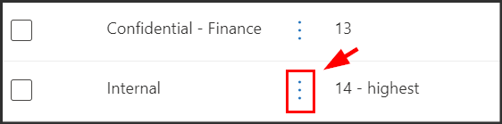

---
lab:
    title: 'Session 1 - Microsoft Purview Information Protection'
    module: 'Learning Objective - Implement Data Loss Prevention in Microsoft Purview'
---

# Demo Lab 2 - Manage Sensitivity Labels

## Task 1 – Create Sensitivity Labels

In this task, your HR department has requested a sensitivity label to apply to HR employee documents. You will create a sensitivity label for Internal documents and a sublabel for the HR department.

1. You should still be logged into Client 1 VM (LON-CL1) as the **lon-cl1\admin** account.

1. In **Microsoft Edge**, navigate to **https://compliance.microsoft.com** and log into the Microsoft Purview portal as **MOD Admin** admin@WWLxZZZZZZ.onmicrosoft.com (where ZZZZZZ is your unique tenant ID provided by your lab hosting provider).  Admin's password should be provided by your lab hosting provider.

1. In the Microsoft Purview portal, on the left navigation pane, expand **Information protection** then select **Labels**.

1. On the **Labels** page select **+ Create a label**.

1. The **New sensitivity label** wizard will start. On the **Name and create a tooltip for your label** page for the **Name**, **Description for admins** and **Description for users**, enter the following information:

    - **Name**: Internal
    - **Display name**: Internal
    - **Description for users**: Internal sensitivity label.
    - **Description for admins**: Internal sensitivity label for Contoso.

1. Select **Next**.

1. On the **Define the scope for this label** page, select **Items** and select **Files** and **Emails**. If any other options on this page are selected, deselect those options.

1. Select **Next**.

1. On the **Choose protection settings for labeled items** page, select **Next**.

1. On the **Auto-labeling for files and emails** page, select **Next**.

1. On the **Define protection settings for groups and sites** page, select **Next**.

1. On the **Auto-labeling for schematized data assets (preview)** page, select **Next**.

1. On the **Review your settings and finish** page, select **Create label**.

1. Once the label has been created the **Your sensitivity label was created** page will be displayed.

1. Select **Don't create a policy yet** and then select **Done**.

1. On the Information protection page, highlight (without selecting) the newly created **Internal** label and select the vertical **...**

    

1. Select the **+ Create sublabel** from the drop-down menu.

1. The **New sensitivity label** wizard will start. On the **Name and create a tooltip for your label** page for the **Name**, **Display Name**, **Description for admins** and **Description for users**, enter the following information:

   - **Name**: Employee data (HR)
   - **Display name**: Employee data (HR)
   - **Description for users**: This HR label is the default label for all specified documents in the HR Department.
   - **Description for admins**: This label is created in consultation with Ms. Jones (Head of HR department). Contact her, when you want to change settings of the label.

1. Select **Next**.

1. On the **Define the scope for this label** page, select the option **Items** and select **Files** and **Emails**.

1. Select **Next**.

1. On the **Choose protection settings for labeled items** page, select the **Apply or remove encryption** option.

1. Select **Next**.

1. On the **Encryption** page select **Configure encryption settings**.

1. Enter the following information into the encryption settings:

   - **Assign permissions now or let users decide?**: Assign permissions now
   - **User access to content expires**: Never
   - **Allow offline access**: Only for a number of days
   - **Users have offline access to the content for this many days**: 15

1. Select the **Assign permissions** link,

1. On the Assign permissions side menu, select the **+ Add any authenticated users**.

1. Select **Save**.

1. On the **Encryption** page, select **Next**.

1. On the **Auto-labeling for files and emails** page, select **Next**.

1. On the **Define protection settings for groups and sites** page, select **Next**.

1. On the **Auto-labeling for schematized data assets (preview)** page, select **Next**.

1. On the **Review your settings and finish** page, select **Create label**.

1. The label will be created and when complete a message will display **Your sensitivity label was created**.

1. Select **Don't create a policy yet** and then select **Done**.

You have successfully created a sensitivity label for your organizations internal policies and a sensitivity sublabel for the Human Resources (HR) department.

## Task 2 – Publish Sensitivity Labels

You will now publish the Internal and HR sensitivity label so that the published sensitivity labels will be available for the HR users to apply to their HR documents.

1. You should still be logged into Client 1 VM (LON-CL1) as the **lon-cl1\admin** account, and you should be logged into Microsoft 365 as **MOD Admin**.  Sign in as admin@WWLxZZZZZZ.onmicrosoft.com (where ZZZZZZ is your unique tenant ID provided by your lab hosting provider).  Admin's password should be provided by your lab hosting provider.

1. In **Microsoft Edge**, the Microsoft Purview portal tab should still be open. If so, select it and proceed to the next step. If you closed it, then in a new tab, navigate to **https://compliance.microsoft.com**.

1. In the Microsoft Purview portal, on the left navigation pane, expand **Information protection** then select **Labels**.

1. On the Labels page select **Publish label**.

1. The publish sensitivity labels wizard will start.

1. On the **Choose sensitivity labels to publish** page, select the **Choose sensitivity labels to publish** link.

1. The **Sensitivity labels to publish** pane will appear on the right.

1. Select the **Internal** and **Internal/Employee Data (HR)** checkboxes.

1. Select **Add**.

1. On the **Choose sensitivity labels to publish** page, select **Next**.

1. On the **Assign admin units (preview)** page, select **Next**

1. On the **Publish to users and groups** page, select **Next**.

1. On the **Policy settings** page, select **Next**.

1. On the **Default settings for documents** select **Next**.

1. On the **Default settings for emails** select **Next**.

1. On the **Default settings for meetings and calendar events** select **Next**.

1. On the **Default settings for Power BI Content** select **Next**.

1. On the **Name your policy** page, enter the following information:

   - **Name**: Internal HR employee data
   - **Enter a description for your sensitivity label policy**: This HR label is to be applied to internal HR employee data.

1. Select **Next**.

1. On the **Review and finish** page, select **Submit**.

1. On the **New policy created**, select **Done** to finish publishing your label policy.

You have successfully published the Internal and HR sensitivity labels. Note that it can take up to 24 hours for changes to replicate to all users and services.

## Task 3 – Work with Sensitivity Labels

In this task, you will create sensitivity labels in Word and Outlook emails. The document created will be stored in OneDrive and sent to an HR employee via email.

1. You should still be logged into Client 1 VM (LON-CL1) as the **lon-cl1\admin** account, and you should be logged into Microsoft 365 as **MOD Admin** admin@WWLxZZZZZZ.onmicrosoft.com (where ZZZZZZ is your unique tenant ID provided by your lab hosting provider).  Admin's password should be provided by your lab hosting provider.

1. In **Microsoft Edge**, the Microsoft Purview portal tab should still be open. Select the address bar and navigate to **https://portal.office.com**.

1. Scroll through the Welcome to Microsoft 365 message to close it.

1. Select the Microsoft Word symbol from the left side pane to open Word Online.

1. Select **New blank document** to create a new document.

1. If a **Your privacy options** message is shown, close it with selecting **Close**.

1. Enter the following contents into the word document:

   ``` text
   Important HR employee document.
   ```

1. Select **Sensitivity** from the top pane to open the dropdown menu. Select **Internal > Employee Data (HR)**  to apply the label.

    

    >**Note:** Be aware, the script you ran in task 1 of this exercise activated sensitivity labels in Word for your tenant.  It can sometimes take an hour for that activation to be realized in Microsoft Word online.  If you don't see the Sensitivity label menu in Word, you may need to return to this lab later or make sure you properly completed task 1 of this exercise.

1. Select the **Document - Saved** in the upper left of the window, enter **HR Document** as the File Name and press Enter key.

1. Close the tab to return to the Word Online tab. Select the Outlook symbol from the left side pane to open Outlook on the web.

1. If a welcome message is shown, close it with selecting the **X**.

1. In Outlook on the web, select **New mail** from the upper left of the window.

1. In the To field enter the name: **Allan** and select **Allan Deyoung** from the drop-down list.

1. In the subject field, enter: **Employee data for HR**

1. Within the email message (the large content panel at the bottom of the page), insert the following message:

    ``` text
    Dear Mr. Deyoung, 

    Please find attached the important HR employee document. 

    Kind regards,

    Joni Sherman
    ```

1. Select the paperclip symbol from the top menu to add an attachment. Select the **HR Document.docx** below **Suggested files** to attach the document.

1. Select **Send** to send out the email message with attached document.

1. Leave the browser window open.

You have successfully created an HR Word document with a sensitivity label, which was saved onto your OneDrive. You then emailed to document to an HR staff member where the email was also set with a sensitivity label.

## Task 4 – Configure Auto Labeling

In this task, you will create a Sensitivity Label that will auto label documents and emails found to contain information related to the European General Data Protection Regulation (GPDR).

1. You should still be logged into Client 1 VM (LON-CL1) as the **lon-cl1\admin** account.

1. In **Microsoft Edge**, navigate to **https://compliance.microsoft.com** and log into the Microsoft Purview portal as **MOD Admin**.

1. In the Microsoft Purview portal, on the left navigation pane, expand **Information protection** and then select **Labels**.

1. On the Labels page, highlight (without selecting) the existing **Internal** label, and select the three dots.

1. Select the **+ Create sublabel** menu item.

1. The **New sensitivity label** wizard will start. On the **Name and create a tooltip for your label** page, enter the following information:

   - **Name**: GDPR Germany
   - **Display name**: GDPR Germany
   - **Description for users**: This document or email contains data related to the European General Data Protection Regulation (GPDR) for the region Germany.
   - **Description for admins**: This label is auto applied to German GDPR documents.

1. Select **Next**.

1. On the **Define the scope for this label** page, select the option **Items** and select **Files** and **Emails**.

1. Select **Next**.

1. On the **Choose protection settings for labeled items** page, select **Next**.

1. On the **Auto-labeling for files and emails** page, set the **Auto-labeling for files and emails** to enabled.

1. In the **Detect content that matches these conditions** section, select **+Add condition** then select **Content contains**.

1. In **Content contains** section select the **Add** text then select **Sensitive info types**.

1. A **Sensitive info types** panel will be displayed on the right.

1. In the **Search for sensitive info types** search panel, enter the following information:

    ``` text
    German
    ```

1. Press the enter button, the results will display sensitivity info types related to Germany.

1. Press the **Select all** check box.

1. Select **Add**.

1. Select **Next**.

1. On the **Define protection settings for groups and sites** page, select **Next**.

1. On the **Auto-labeling for schematized data assets (preview)** page, select **Next**.

1. On the **Review your settings and finish** page, select **Create label**.

1. The label will be created and when complete a message will display: **Your sensitivity label was created**.

1. Select **Done**.

1. Once the label has been created the **Your sensitivity label was created** page will be displayed.

1. Select **Don't create a policy yet** and then select **Done**.

1. On the **Labels** page, select **Publish label**.

1. The Publish sensitivity labels wizard will start.

1. On the **Choose sensitivity labels to publish** page, select the **Choose sensitivity labels to publish** link.

1. A side bar called **Sensitivity labels to publish** will appear on the right.

1. Select the **Internal** and **Internal/GDPR Germany** checkbox.

1. Select **Add**.

1. On the **Choose sensitivity labels to publish** page, select **Next**.

1. On the **Assign admin units (preview)** page, select **Next**.

1. On the **Publish to users and groups** page, select **Next**.

1. On the **Policy settings** page, select **Next**.

1. On the **Default settings for documents​** page, select **Next**.

1. On the **Default settings for emails** page, select **Next**.

1. On the **Default settings for meetings and calendar events** page, select **Next**.

1. On the **Default settings for Power BI content** page, select **Next**.

1. On the **Name your policy** page, enter the following information:

   - **Name**: GDPR Germany policy
   - **Enter a description for your sensitivity label policy**: This auto apply sensitivity labels policy is for the GDPR region of Germany.

1. Select **Next**.

1. On the **Review and finish** page, select **Submit**.

1. The policy will be created and when complete a message will display, **New policy created**.

1. Select **Done**.

You have successfully created and published an auto apply sensitivity label for GDPR documents in the region Germany.

Be aware that it can take up to 24 hours for auto applied sensitivity labels to be applied, this duration will be longer when applied to more than 25,000 documents (that is, the daily limit).
