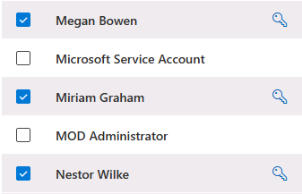

---
lab:
    title: 'Exercise 1 - Manage Compliance Roles'
    module: 'Module 1 - Implement Information Protection'
---
## WWL Tenants - Terms of use

If you are being provided with a tenant as a part of an instructor-led training delivery, please note that the tenant is made available for the purpose of supporting the hands-on labs in the instructor-led training.

Tenants should not be shared or used for purposes outside of hands-on labs. The tenant used in this course is a trial tenant and cannot be used or accessed after the class is over and are not eligible for extension.

Tenants must not be converted to a paid subscription. Tenants obtained as a part of this course remain the property of Microsoft Corporation and we reserve the right to obtain access and repossess at any time.

# Exercise 0 - Setup your lab environment

In this lab you'll configure and prepare your environment for administration tasks.

## Task - Set user passwords for lab exercises

In this task, you'll set passwords for the user accounts needed for the labs.

1. Log into Client 1 VM (LON-CL1) as the **lon-cl1\admin** account. The password should be provided by your lab hosting provider.

1. In **Microsoft Edge**, navigate to **https://admin.microsoft.com** and log into the Microsoft Purview portal as the **MOD Administrator** admin@WWLxZZZZZZ.onmicrosoft.com.

1. On the left navigation pane, expand **Users** then select **Active users**.

1. Select the check box next to **Display name** to select all users.

1. Deselect the check boxes next to **MOD Administrator** and **Microsoft Service Account**.

    >[!alert] Do not change the **MOD Administrator** or **Microsoft Service Account** passwords. This will negatively impact your lab experience.
    >

    > 

1. Select the **Reset password** from the middle action ribbon to open the **Reset password** flyout page on the right.

1. Deselect the options for **Automatically create a password** and **Require these users to change their password when they first sign in**. No options should be selected on the Reset password page.

1. Ensure none of the checkboxes are selected on the **Reset password** flyout page.

1. In the **Password** field, enter the **User Password** from the **Resources** tab from the lab hosting environment. You can also reset the password to a password you can remember for this lab experience.

1. Select the **Reset password** button to reset the users's passwords.

1. On the **Passwords have been reset** page, select the **Close** button to go back to the **Active users** page.
