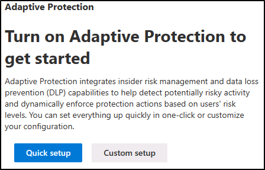
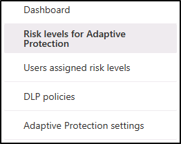
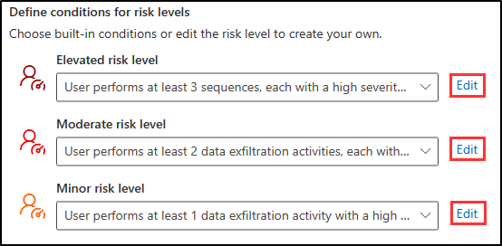
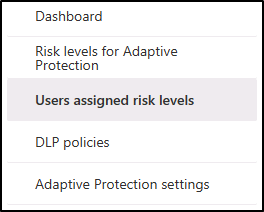
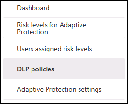
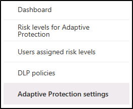

---
lab:
    title: 'Exercise 2 - Configure Insider Risk Management'
    module: 'Module 5 - Manage insider and privacy risk in Microsoft 365'
---

# Exercise 5 - Configure Insider Risk Management

You are Joni Sherman, the Compliance Administrator for Contoso Ltd. Your role involves ensuring regulatory compliance and protecting sensitive information within the organization. Recently, Contoso Ltd. has recognized the need to proactively address insider risks that could potentially harm the company's reputation, compromise data security, or lead to legal issues.

To effectively manage insider risks, you implement Microsoft Purview Insider Risk Management, a comprehensive solution designed to identify, analyze, and respond to potential insider threats.

## Task 1: Assign Insider Risk Management Role

In this exercise, you will assign the Insider Risk Management role to Joni to grant access to perform insider risk tasks in the Microsoft Purview portal.

1. You should still be logged into Client 1 VM (LON-CL1) **lon-cl1\admin** account.

1. In Microsoft Edge, navigate to the Microsoft Purview compliance portal, **https://compliance.microsoft.com**, and sign in as **MOD Administrator** admin@WWLxZZZZZZ.onmicrosoft.com. Admin's password should be provided by your lab hosting provider.

1. Navigate to **Roles & scope**, then select **Permissions** from the dropdown.

1. On the **Permissions** page, under **Microsoft Purview solutions** select **Roles**.

1. On the **Role groups for Microsoft Purview solutions** page select **Insider Risk Management**.

1. Select **Edit** from the **Insider Risk Management** flyout page on the right.

1. On the **Edit members of the role group** page select **+ Choose users**.

1. In the **Choose users** page select the check box next to Joni Sherman then select the **Select** button.

1. On the **Edit members of the role group** page select **Next**.

1. On the **Review the role group and finish** page select **Save**.

1. On the **You successfully updated the role group** page select **Done**.

1. Sign out of the **MOD Administrator** account and close all browser windows.

You have successfully assigned the Insider Risk Management role to Joni Sherman, granting her access to perform insider risk tasks in the Microsoft Purview portal.

## Task 2: Insider Risk Settings Configuration

In this task, you will customize the Insider risk management settings in the Microsoft Purview portal. This will allow Joni Sherman to effectively manage potential insider risks within the organization and ensure the security of sensitive information.

1. In **Microsoft Edge**, navigate to Microsoft Purview compliance portal, **https://compliance.microsoft.com**, and sign in as JoniS@WWLxZZZZZZ.onmicrosoft.com. Joni's password should be provided by your lab hosting provider.

1. Select **Insider risk management** from the left navigation bar.

1. Select the gear icon on the top right for **Settings**. 
1. Explore the settings:

    - **Privacy**: Allows you to select displaying usernames or anonymized versions in alerts and cases.
    - **Policy indicators**: Involves configuring the policy template using specific risk indicators.
    - **Detection groups (preview)**: Customizes risk indicators for specific user sets in an organization
    - **Policy timeframes**: Defines review periods triggered by policy matches based on events and activities.
    - **Intelligent detections**: Controls alert volume, excludes certain entities from risk scoring and allows filtering of Microsoft Defender alerts.
    - **Export alerts**: Exports risk alert information to SIEM and SOAR solutions using Office 365 Management Activity APIs.
    - **Priority user groups**: Determines high-risk users for closer inspection and more sensitive risk scoring.
    - **Priority physical assets (preview)**: Identifies and monitors access to priority physical assets correlating activity to user events.
    - **Power Automate flows (preview)**: Automates insider risk management tasks using Microsoft Power Automate flows.
    - **Microsoft Teams (preview)**: Enables Microsoft Teams for collaboration on insider risk management cases.
    - **Analytics**: Assesses potential insider risks without configuring policies to guide policy creation.
    - **Admin notifications**: Automatically sends email notifications to insider risk management role groups.
    - **Inline alert customization**: Allows policy tuning and threshold adjustment directly from the Alerts dashboard.

1. Select **Privacy** from the Insider risk management settings bar under **General**.

1. Select **Do not show anonymized versions of usernames**.

1. Select **Save** to save this setting.

1. Select **Policy indicators** from the Insider risk management settings bar under **General**.

1. On the **Policy indicators** settings pane, under **Office indicators** select the check box for **Select all**.

1. Scroll down and select **Save**.

1. Select **Priority user groups** from the insider risk management settings bar under **General**.

1. Select **+ Create priority user group** to open the **New priority user group wizard**.

1. On the **Name and describe the priority user group** page enter:

    - **Name**: Finance team
    - **Description**: Team members that manage financial operations, budgeting, and reporting

1. Select **Next**.

1. On the **Choose members** page select **+ Choose members**.

1. On the **Choose members** pane select the check box next to **Lynne Robbins**, **Debra Berger**, and **Megan Bowen** then select **Add** to add 3 members.

1. On the **Choose members** page select **Next**.

1. On the **Choose who can view data involving users in this priority group** select **+ Choose users and role groups**.

1. On the **Choose users and role groups** page select the checkbox next to **Insider Risk Management** to add all members who have the Insider Risk Management role in Microsoft Purview the select **Add**.

1. On the **Choose who can view data involving users in this priority group** select **Next**.

1. On the **Review** page select **Submit**.

1. On the **Created priority user group** page select **Done**. This will take you back to the insider risk management settings page.

1. Select **Insider risk management** to navigate back to the main Insider risk management page.

You have successfully customized the Insider risk management settings. Now, Joni Sherman has the necessary tools and capabilities to proactively identify and mitigate insider risks, safeguarding valuable data in the Microsoft Purview portal.

## Task 3: Insider Risk Policy Creation

In this task, you will configure a policy named 'Financial Data Protection' in Microsoft Purview to monitor and protect sensitive financial data access within the organization.

1. You should still be logged in as Joni in Microsoft Purview.

1. Select **Insider risk management** from the left navigation bar.

1. Select the **Policies** tab from the top navigation bar then select **+ Create policy**.

1. On the **Choose a policy template** page select **Data leaks** then select **Next**.

1. On the **Name your policy page** enter:

    - **Name**: Financial Data Protection
    - **Description**: Sensitive financial data access monitoring

1. Select **Next**.

1. On the **Choose users and groups** page, leave **Include all users and groups** selected, then select **Next**.

1. On the **Decide whether to prioritize content page**, leave only **Sensitive info types** selected then select **Next**.

1. On the **Sensitive info types to prioritize** page select **+ Add or edit sensitive info type**.

1. In the **Add or edit sensitive info types** pane search for _bank_ and select the check box next to **U.S. Bank Account Number** and **International Banking Account Number (IBAN)**. Next search for _credit_ and select the check box next to **Credit Card Number** then select **Add** to add the 3 sensitive info types.

1. Back on the **Sensitive info types to prioritize** select **Next**.

1. On the **Decide whether to score only activity with priority content** page leave **Get alerts for all activity** selected, then select **Next**.

1. On the **Triggers for this policy** page select **User performs an exfiltration activity**.

1. Under **Select which activities will trigger this policy** select:

   - **Downloading content from SharePoint**
   - **Sending email with attachments to recipients outside the organization**
   - **Sharing SharePoint files with people outside the organization**
   - **Download from Microsoft 365 location the exfiltrate**

    >[!note] **Note**: If you are unable to select policy triggers, you may have a tip to Turn on indicators. If this option is available, select **Turn on indicators**. On the **Choose indicators to turn on** pop up, click the check box next to **Select all** for **Office indicators** then select **Save**.

1. Select **Next**.

1. On the **Triggering thresholds for this policy** page select **Use default thresholds (Recommended)** then select **Next**.

1. On the **Indicators** page, select the drop down for **Physical access indicators** and deselect **Physical access after termination or failed access to sensitive asset** if selected then select **Next**.

1. On the **Detection options** page select **Select all** from the **Sequence detection**, **Cumulative exfiltration detection**, and **Risk score boosters** sections, then select **Next**.

1. On the **Decide whether to use default or custom indicator thresholds** page select **Default thresholds** then select **Next**.

1. On the **Review settings and finish** page, select **Submit**.

1. On the **Your policy was created** page select **Done**.

    >[!note] **Note:** As noted on this page, it may take up to 24 hours before policy matches will start showing up in the Alerts tab.

You have successfully created the 'Financial Data Protection' policy, which will help detect and prevent unauthorized access to sensitive financial information. Keep in mind that it may take up to 24 hours for policy matches to appear in the Alerts tab.

## Task 4: Create a Notice template

In this task, you will create a notice template in Microsoft Purview's Insider Risk Management, which allows you to automatically send email messages to users when a case is generated for risk activities, serving as reminders or providing information for compliance training.

1. You should still be logged in as Joni in Microsoft Purview in Insider risk management.

1. From the top navigation tabs, select **Notice template** then select **+ Create notice template**.

1. Fill out the necessary information in **Create a new notice template** flyout page on the right.

    - **Template name**: Data Leak Policy Alert
    - **Send from**: Joni Sherman
    - **Subject**: Potential Data Leak Detected
    - **Message body**:

        ````html
        <!DOCTYPE html>
        <html>
        <body>
        <h2>Alert: Potential Data Leak Detected</h2>
        <p>We detected a potential data leak associated with your account. As part of our Insider Risk Management policy, we are required to investigate any suspicious activity related to data breaches.</p>
        <p>Please review your recent actions, report any unusual behavior, and refer to the Contoso User Code of Conduct training at <a href='https://contoso.com'>https://contoso.com</a> for more information.</p>
        <p>Thank you for your cooperation,</p>
        <p><em>Human Resources</em></p>
        </body>
        </html>
        ````

1. Select **Create**.

You have successfully created the **Data Leak Policy Alert** notice template, enabling automated notifications to be sent to users when potential data leaks are detected, reinforcing security measures and promoting adherence to the Contoso User Code of Conduct.

## Task 5: Explore Adaptive Protection

In this task, you'll explore Adaptive Protection in Microsoft Purview Insider Risk Management. You'll explore Quick and Custom setup options, customizable risk levels, settings for past activity detection, and risk level timeframes. You'll also review tabs that display user-specific risk levels and DLP policies and learn where in the portal to enable or disable the Adaptive Protection feature.

1. You should still be logged in as Joni in Microsoft Purview in Insider risk management.

1. From the top, navigation tabs select **Adaptive protection (preview)**.

1. When you first select the **Adaptive protection (preview)** button from insider risk management, you'll see two options to turn on Adaptive protection:

    

1. There are two options to get started: **Quick setup** or **Custom setup**. Quick setup is the fastest way to get started. You don't need any pre-existing DLP or insider risk management policies to get started. Custom setup gives you more control over your policies and is recommended if you have existing DLP and insider risk management policies. Quick setup takes about 72 hours to get started while custom setup takes about 36 hours.

1. From the left navigation pane within the **Adaptive protection (preview)** window select **Risk levels for Adaptive Protection**.

    

1. Explore the customizable risk levels in Adaptive protection:

    - **Elevated risk level**: Flags users with high-severity alerts or multiple high-risk activities.
    - **Moderate risk level**: Focuses on users with medium-severity alerts or at least two high-risk data exfiltrations.
    - **Minor risk level**: Addresses users with low-severity alerts or a single high-risk data exfiltration.

1. Notice that each risk level has customization options accessible by selecting the **Edit** button next to it.

    

1. Explore the options for **Past activity detection** and **Risk level timeframe**:

    - **Past activity detection**: Specifies the look-back period, between 5 and 30 days, to evaluate if a user's daily actions meet risk level conditions.
    - **Risk level timeframe**: Determines the duration, between 5 and 30 days, a risk level stays assigned to a user before automatic reset.

1. Once you're finished reviewing the options in the **Risk levels for Adaptive Protection** tab, select the **Users assigned risk levels** tab from the left navigation pane.

    

1. When active, the **Users assigned risk levels** tab will show you each user's name or an anonymized version, their current risk level, time since assignment, and days until auto-reset. You can manually expire a risk level without removing existing alerts or cases. The tab also shows the number of current alerts and confirmed cases for each user.

1. Once you're finished exploring the **Users assigned risk levels** tab, select the **DLP policies** tab from the left navigation pane.

    

1. The **DLP policies** page will show each policy's name, current state, location, included risk levels, status, creation date, and last modified date.

1. Once you're finished exploring the **DLP policies** tab, select the **Adaptive Protection settings** tab from the left navigation pane.

    

1. In the **Adaptive Protection settings** tab, you can toggle the feature on or off. Turning it off stops assigning risk levels and resets existing ones, taking up to 6 hours for complete deactivation. Policies aren't automatically deleted.

You have successfully explored Adaptive Protection in Insider Risk Management.
