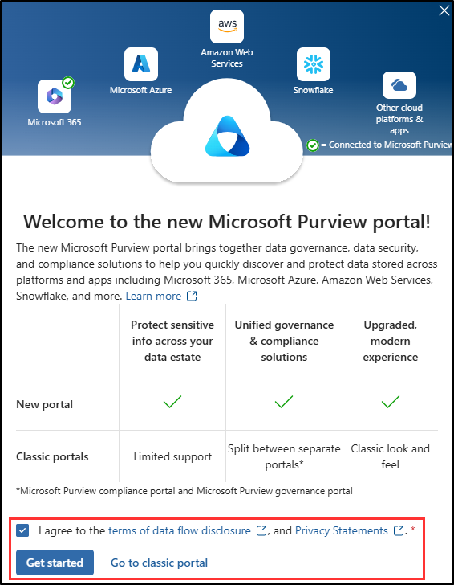
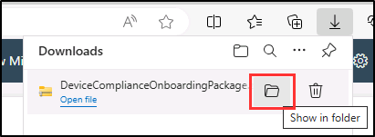
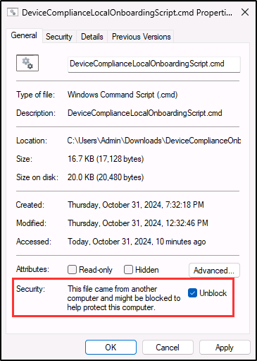

## WWL Tenants - Terms of use

If you are being provided with a tenant as a part of an instructor-led training delivery, please note that the tenant is made available for the purpose of supporting the hands-on labs in the instructor-led training.

Tenants should not be shared or used for purposes outside of hands-on labs. The tenant used in this course is a trial tenant and cannot be used or accessed after the class is over and are not eligible for extension.

Tenants must not be converted to a paid subscription. Tenants obtained as a part of this course remain the property of Microsoft Corporation and we reserve the right to obtain access and repossess at any time.

# Lab Setup: Prepare Your Environment for Compliance Administration

In this exercise, you'll configure and prepare your environment for compliance administration. You'll activate key features, set up administrative permissions, and ensure proper configuration of core elements.

**Tasks:**

1. Enable Audit in the Microsoft Purview portal
1. Enable device onboarding
1. Onboard a device for endpoint DLP

## Task 1 – Enable Audit in the Microsoft Purview portal

In this task, you'll enable audit logging to track activities across Microsoft 365 services.

1. Sign into Client 1 VM (SC-400-CL1) with the **Admin** account. The password should be provided by your lab hosting provider.

1. Open Microsoft Edge and navigate to the Microsoft Purview portal at `https://purview.microsoft.com`.

1. Sign into the Microsoft Purview portal as the MOD Administrator, `admin@WWLxZZZZZZ.onmicrosoft.com` (where ZZZZZZ is your unique tenant ID provided by your lab hosting provider). Admin's password can be found in the **Resources** tab of the lab hosting window.

1. In the **Welcome to the new Microsoft Purview Portal!** window, select the checkbox to agree with the terms and conditions, then select **Get started** to access the portal.

    

1. Select **Solutions** from the left sidebar, then select **Audit**.

1. On the **Search** page, select the **Start recording user and admin activity** bar to enable audit logging.

    

1. Once you select this option, the blue bar will disappear.

You have successfully enabled auditing in Microsoft Purview.

## Task 2 – Enable device onboarding

To support Endpoint DLP policies later in the lab, you'll enable device onboarding in Microsoft Purview.

1. In the Microsoft Purview portal, select **Settings** > **Device onboarding** > **Devices**.

1. On the **Devices** page, select **Turn on device onboarding**.

1. Accept the **Turn on device onboarding** dialog by selecting **OK**.

1. Accept the **Device monitoring is being turned on** dialog by selecting **OK**.

1. Wait for the process to complete. Refresh the page until device onboarding is active.

>[!note]
>This process might take about 5 minutes to complete.

Device onboarding is now enabled, and the environment is prepared for the next steps.

## Task 3 – Onboard a device for endpoint DLP

With device onboarding now complete, the next step is to onboard a Windows 11 device. This ensures the device is ready to apply Endpoint DLP policies and protect sensitive data.

1. In the Microsoft Purview portal, select **Settings** > **Device onboarding** > **Onboarding**.

1. On the **Onboarding** page, ensure **Windows 10** is selected as the operating system and **Local Script (for up to 10 machines)** is selected as the deployment method.

1. Select **Download package**.

1. In the **Downloads** dialog, hover over the download, then select the folder icon to **Show in folder**.

   

1. Extract the **DeviceComplianceOnboardingPackage** zip-file, then open the extracted folder.

1. Right click the **DeviceComplianceLocalOnboardingScript.cmd** file, select **Show more options**, then select **Properties**.

1. Towards the bottom of the **General** tab of the properties window, in the **Security** section, select **Unblock**, then select **OK** to save this setting.

   

1. Right click **DeviceComplianceLocalOnboardingScript.cmd**, then select **Run as administrator**.

1. On the **User Account Control** dialogue, select **Yes**.

1. In the **Command Prompt** screen, enter **Y** to confirm.

1. When the script is complete, you'll get a success message and a prompt to **Press any key to continue**. Press any key to close the command line window. It can take a minute to complete the onboarding.

You've successfully onboarded a Windows 11 device, allowing it to be protected by the endpoint DLP policy.
