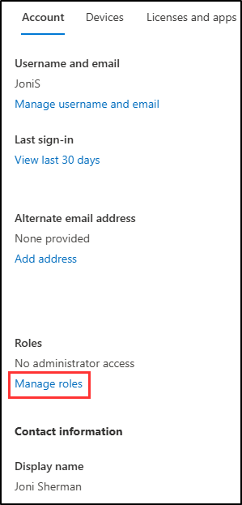

## WWL Tenants - Terms of use

If you are being provided with a tenant as a part of an instructor-led training delivery, please note that the tenant is made available for the purpose of supporting the hands-on labs in the instructor-led training.

Tenants should not be shared or used for purposes outside of hands-on labs. The tenant used in this course is a trial tenant and cannot be used or accessed after the class is over and are not eligible for extension.

Tenants must not be converted to a paid subscription. Tenants obtained as a part of this course remain the property of Microsoft Corporation and we reserve the right to obtain access and repossess at any time.

# Lab Setup: Prepare Your Environment for Compliance Administration

In this exercise, you'll configure and prepare your environment for compliance administration. You'll activate key features, set up administrative permissions, and ensure proper configuration of core elements.

**Tasks:**

- Enable Audit in the Microsoft Purview portal
- Set user passwords for lab exercises
- Assign compliance role
- Explore the Microsoft Purview portal

## Task 1 – Enable Audit in the Microsoft Purview portal

In this task, you'll enable audit logging to track activities across Microsoft 365 services.

1. Sign into Client 1 VM (SC-400-CL1) with the **Admin** account. The password should be provided by your lab hosting provider.

1. Open Microsoft Edge and navigate to the Microsoft Purview portal at `https://purview.microsoft.com`.

1. Sign into the Microsoft Purview portal as the MOD Administrator, `admin@WWLxZZZZZZ.onmicrosoft.com` (where ZZZZZZ is your unique tenant ID provided by your lab hosting provider).

1. In the **Welcome to the new Microsoft Portal!** window, select the checkbox to agree with the terms and conditions, then select **Get started** access the portal.

    

1. Select **Solutions** from the left sidebar, then select **Audit**.

1. On the **Search** page, select the **Start recording user and admin activity** bar to enable audit logging.

    

1. Once you select this option, the blue bar will disappear.

You have successfully enabled auditing in Microsoft Purview.

## Task 2 – Set user passwords for lab exercises

In this task, you'll set passwords for the user accounts used in the lab.

1. In Microsoft Edge, navigate to the **Microsoft 365 admin center** at **`https://admin.microsoft.com`**.

1. From the left navigation pane, expand **Users** then select **Active users**.

1. Find the account for **Joni Sherman** and select the key icon to reset her password.

   You'll use Joni's account in the next exercises.

   

1. In the **Reset Password** flyout page on the right, make sure all options are unchecked, then enter a password you'll remember in the **Password** field.

1. Select **Reset password** at the bottom of the page, then **Close** on the confirmation page.

You have successfully reset Joni’s password for the lab exercises.

## Task 3 – Assign the Compliance Administrator role

In this task, you'll assign the **Compliance Administrator** role to Joni Sherman.

1. In the Microsoft 365 admin center, select Joni's account.

1. In the properties flyout menu for **Joni Sherman**, select **Manage roles**.

    

1. On the **Manage admin roles** flyout, select **Admin center access**, then scroll down to select **Show all by category**.

1. Under **Security & Compliance**, select **Compliance Administrator**.

1. Select **Save changes** at the bottom of the page.

1. Sign out of the MOD Administrator account by selecting the **MA** icon in the top right, then select **Sign out**.

   

You have successfully assigned Joni the Compliance Administrator role, which is required for the upcoming exercises.

## Task 4 – Explore the Microsoft Purview portal

In this task, you'll switch to Joni Sherman's account and explore the Microsoft Purview portal.

1. In **Microsoft Edge**, navigate to the Microsoft Purview portal at **`https://purview.microsoft.com`**.

1. When the **Pick an account** window appears, select **Use another account**.

1. Sign in as `JoniS@WWLxZZZZZZ.onmicrosoft.com` (where ZZZZZZ is your unique tenant ID provided by your lab hosting provider). Joni's password was set in a previous exercise.

1. Explore the Microsoft Purview portal to familiarize yourself with its interface.

You have successfully switched to Joni Sherman's account and are ready to continue with the lab.
