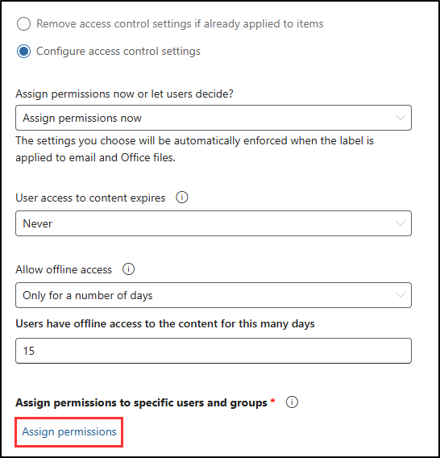
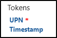

# Exercise 2 - Create sensitivity labels

Contoso is starting to use Microsoft 365 Copilot to improve productivity, and they need to make sure that sensitive HR data is kept secure. HR deals with confidential information like employee records, salary details, and performance reviews, so it's important that only authorized personnel can access or edit these files. Sensitivity labels are a way to protect this information and ensure that even when using tools like Copilot, the right protections are in place.

In this lab, you'll create and configure sensitivity labels that Contoso's HR department can use to protect their documents and keep them safe while using Microsoft 365 tools.

**Tasks**:

1. Enable support for sensitivity labels
1. Create sensitivity labels
1. Publish sensitivity labels

## Task 1 – Enable co-authoring for files with sensitivity labels

In this task, you'll enable co-authoring for files that have sensitivity labels. This feature allows multiple users to collaborate on a document while keeping it protected. It also enables sensitivity labels for files in OneDrive and SharePoint, if not already enabled.

1. In the Microsoft Purview portal, in the left sidebar, select **Settings**.

1. On the **Settings** page, select **Information Protection**.

1. On the **Information Protection settings** page, select the **Co-authoring for files with sensitivity labels** tab.

1. Select the checkbox for **Turn on co-authoring for files with sensitivity labels**.

   This also enables sensitivity label support SharePoint and OneDrive.

1. Select **Apply** at the bottom of the page.

You've successfully enabled co-authoring for files with sensitivity labels. Now, multiple users can securely edit documents in real time, and sensitivity label support is active in OneDrive and SharePoint

## Task 2 – Create sensitivity labels

In this task, you'll create a sensitivity label for Contoso's HR department to protect internal documents. These labels help control who can access and share sensitive information, such as employee data. By applying this label, you'll ensure only authorized HR personnel can access these documents, even when using Microsoft 365 Copilot.

1. In the Microsoft Purview portal, select **Solutions** from the left sidebar, then select **Information Protection**.

1. Select **Sensitivity labels** from the left sidebar.

1. On the **Sensitivity labels** page select **+ Create a label**.

1. The **New sensitivity label** configuration will start. On the **Provide basic details for this label**, enter:

    - **Name**: `Internal`
    - **Display name**: `Internal`
    - **Description for users**: `Internal sensitivity label.`
    - **Description for admins**: `Internal sensitivity label for Contoso.`

1. Select **Next**.

1. On the **Define the scope for this label** page, ensure that only **Files** and **Emails** are selected under **Items**. If **Meetings** is selected, deselect it.

1. Select **Next**.

1. On the **Choose protection settings for labeled items** page, select **Next**.

1. On the **Auto-labeling for files and emails** page, select **Next**.

1. On the **Define protection settings for groups and sites** page, select **Next**.

1. On the **Auto-labeling for schematized data assets (preview)** page, select **Next**.

1. On the **Review your settings and finish** page, select **Create label**.

1. On the **Your sensitivity label was created** page, select **Don't create a policy yet**, then select **Done**.

You have successfully created an internal sensitivity label to protect company documents. This label will be the base for more specific labels, like the one for HR data.

## Task 3 – Create a sublabel for HR Employee Data

In this task, you'll create a sublabel under the **Internal** sensitivity label to protect HR documents. Dynamic watermarking will be added to display personalized details, such as the user’s email and access timestamp, on documents. This feature discourages unauthorized sharing and provides visibility into document usage.

1. On the **Sensitivity labels** page, find the newly created **Internal** sensitivity label.

1. Select the vertical ellipsis (**...**) next to **Internal** sensitivity label, then select **+ Create sublabel** from the dropdown menu.

   

1. The **New sensitivity label** wizard will start. On the **Provide basic details for this label** page enter:

   - **Name**: `Employee data (HR)`
   - **Display name**: `Employee data (HR)`
   - **Description for users**: `This HR label is the default label for all specified documents in the HR Department.`
   - **Description for admins**: `This label was created with input from the Head of HR. Contact the HR department for any changes to the label settings.`

1. Select **Next**.

1. On the **Define the scope for this label** page, leave the default selected, then select **Next**.

1. On the **Choose protection settings for labeled items** page, select the **Control access** option, then select **Next**.

1. On the **Access control** page, select **Configure access control settings**.

1. Configure the encryption settings with these options:

   - **Assign permissions now or let users decide?**: Assign permissions now
   - **User access to content expires**: Never
   - **Allow offline access**: Only for a number of days
   - **Users have offline access to the content for this many days**: 15
   - Select the **Assign permissions** link.

   

1. On the **Assign permissions** flyout page, select **+ Add all users and groups in your organization**, then select **Save**.

1. On the **Access control** page, select the checkbox for **Use dynamic watermarking**, then select **Customize text (optional)**.

1. On the **Add custom text to watermark (optional)** page, in the custom text field, enter `Confidential | HR only |`

1. Select the tokens for **UPN** and **Timestamp**, then select **Save** at the bottom of the page.

   

1. On the **Access control** page, select **Next**.

1. On the **Auto-labeling for files and emails** page, select **Next**.

1. On the **Define protection settings for groups and sites** page, select **Next**.

1. On the **Auto-labeling for schematized data assets (preview)** page, select **Next**.

1. On the **Review your settings and finish** page, select **Create label**.

1. On the **Your sensitivity label was created** page, select **Don't create a policy yet**, then select **Done**.

You have successfully created a sublabel specifically for HR documents, ensuring that employee data is protected, and only authorized users can access it. The HR department can now apply this label to securely manage sensitive employee information.

## Task 4 – Publish sensitivity labels

Now that you've created the sensitivity labels, you'll publish them so they can be applied to HR documents across Contoso. This will make sure that HR files stay protected, and that tools like Microsoft 365 Copilot respect the rules set by these labels to prevent unauthorized access or accidental sharing.

1. On the **Sensitivity labels** page select **Publish labels**.

1. The publish sensitivity labels configuration will start.

1. On the **Choose sensitivity labels to publish** page, select the **Choose sensitivity labels to publish** link.

1. On the flyout page, select the checkboxes for **Internal** and **Internal/Employee Data (HR)**, then select **Add** at the bottom.

1. Back on the **Choose sensitivity labels to publish** page, select **Next**.

1. On the **Assign admin units** page, select **Next**

1. On the **Publish to users and groups** page, select **Next**.

1. On the **Policy settings** page, select **Next**.

1. On the **Default settings for documents** page, select **Next**.

1. On the **Default settings for emails** page, select **Next**.

1. On the **Default settings for meetings and calendar events** page, select **Next**.

1. On the **Default settings for Fabric and Power BI content** page, select **Next**.

1. On the **Name your policy** page, enter:

   - **Name**: `Internal HR employee data`
   - **Enter a description for your sensitivity label policy**: `This HR label is to be applied to internal HR employee data.`

1. Select **Next**.

1. On the **Review and finish** page, select **Submit**.

1. On the **New policy created**, select **Done** to finish publishing your label policy.

You have successfully published the Internal and HR sensitivity labels. Note that it can take up to 24 hours for changes to replicate to all users and services.
