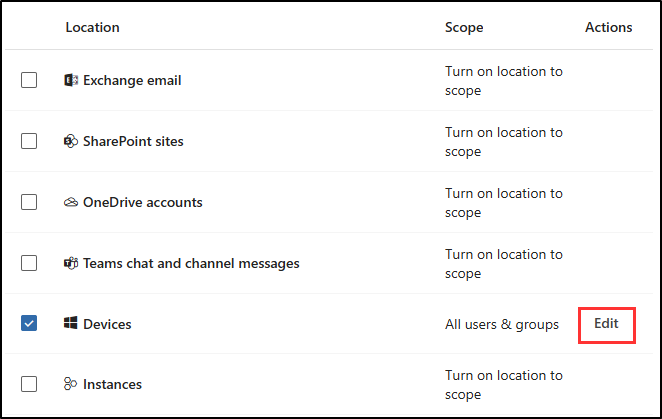
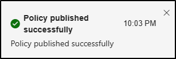

# Exercise 3 - Create a DLP Policy

Contoso is concerned about employees sharing sensitive information on generative AI platforms. Before they can implement a DLP policy, they need to onboard devices to Microsoft Purview Endpoint DLP. They will begin testing the policy in simulation mode with a small group to ensure there are no operational issues before expanding it across the organization. After testing, they will activate the policy to enforce it across the company.

**Tasks**:

1. Enable device onboarding
1. Onboard a device to endpoint DLP
1. Create a DLP policy in simulation mode
1. Modify a DLP policy
1. Activate a policy in simulation mode

## Task 1 – Enable device onboarding

To enforce endpoint DLP policies, Contoso needs to enable device onboarding in Microsoft Purview. This step will allow the organization to track and protect sensitive information across their devices.

1. You should still be logged into the Microsoft Purview portal as Joni Sherman.

1. Select **Settings** from the left sidebar.

1. In the left sidebar, expand **Device onboarding** then select **Devices**.

1. On the **Devices** page, select **Turn on device onboarding** to enable the solution for your tenant.

1. Accept the **Turn on device onboarding** dialog by selecting **OK**.

1. Accept the **Device monitoring is being turned on** dialog by selecting **OK**.

1. Wait for the process to complete. Refresh the page until device onboarding is active.

You've successfully enabled device onboarding, preparing the environment to onboard devices and apply endpoint DLP policies.

## Task 2 – Onboard a device to endpoint DLP

Now that device onboarding is enabled, Contoso will onboard a Windows 11 device to apply the Endpoint DLP policies. This will allow the system to protect sensitive data shared from this device.

1. From the **Devices** page, on the left sidebar, expand **Device onboarding**, then select **Onboarding**.

1. On the **Onboarding** page, in the **Deployment method** dropdown menu, select **Local Script (for up to 10 machines)** and select **Download package**.

1. In the **Downloads** dialog, hover over the download, then select the folder icon to **Show in folder**.

1. Extract the zip-file to the **Desktop** of SC-400-CL1. You should see a script named **DeviceComplianceLocalOnboardingScript.cmd**.

1. On the desktop right click the **DeviceComplianceLocalOnboardingScript.cmd** file you just extracted and select **Show more options**, then select **Properties**.

1. Towards the bottom of the **General** tab of the properties window, in the **Security** section, select **Unblock**, then select **OK** to save this setting.

1. Back on the desktop, right click **DeviceComplianceLocalOnboardingScript.cmd**, then select **Run as administrator**. On the **User Account Control** dialogue, select **Yes**.

1. In the **Command Prompt** screen type **Y** to confirm, and then press Enter.

1. When the script is complete, you'll get a success message and a prompt to **Press any key to continue**. Press any key to close the command line window. It can take a minute to complete the onboarding.

You've successfully onboarded a Windows 11 device, allowing it to be protected by the endpoint DLP policy.

## Task 3 – Create an endpoint DLP policy in simulation mode

In this task, you'll create an endpoint DLP policy that blocks users from copying and pasting sensitive data into generative AI platforms. Contoso will start by testing it in simulation mode with a small group of employees to make sure it doesn't cause any problems.

1. In the Microsoft Purview portal, select **Solutions** from the left sidebar, then select **Data Loss Prevention**.

1. Select **Policies** then select **+ Create policy**.

1. On the **Start with a template or create a custom policy** page, select **Custom** and **Custom policy**, then select **Next**.

1. On the **Name your DLP policy** page, enter:

    - **Name**: `Generative AI sharing DLP policy`
    - **Description**: `Prevent sharing of sensitive data with generative AI platforms.`

1. Select **Next**.

1. On the **Assign admin units** page, select **Next**.

1. On the **Choose locations to apply the policy** page, select only the **Devices** location. If any other location is selected, ensure they're deselected.

1. On the **Devices** row under the **Actions** column, select **Edit** to change the policy scope.

   

1. On the **Scope for devices** page, select **Specific users and groups** the **+ Include users and groups** in the flyout page.

1. On the **Choose users and groups** page, select the checkbox for the `Retail` group, then select **Done** at the bottom of the page.

1. On the **Scope for devices** select **Done**.

1. On the **Choose where to apply the policy** page, select **Next**.

1. On the **Define policy settings** page, select **Create or customize advanced DLP rules** then select **Next**.

1. On the **Customize advanced DLP rules** page, select **+ Create rule**.

1. On the **Create rule** page, enter:

    - **Name**: `Sensitive data protection rule`
    - **Description**: `Detect and restrict sharing of sensitive information with generative AI platforms.`

1. Under **Conditions** select **+ Add condition** then select **Content contains**.

1. In the newly opened **Content contains** area, select **Add** then select **Sensitive info types**.

1. On the **Sensitive info types** flyout page on the right, search for `Credit` then select the checkbox for the **Credit Card Number** sensitive info type.

1. Select **Add** at the bottom of the page.

1. In the **Actions** section, select the **+ Add an action** dropdown, then select **Audit or restrict activities on devices**.

1. In the newly opened **Audit or restrict activities on devices** area, in the **Service domain and browser activities** section, select the checkbox for **Upload to a restricted cloud service domain or access from an unallowed browsers**, then select **+ Choose different restrictions for sensitive service domains** under this option.

1. In the **Sensitive service domain restrictions** flyout page, select **+ Add group**.

1. In the **Choose sensitive service domain groups** select the checkbox for **Generative AI Websites**, then select **Add** at the bottom of the flyout page.

1. Back on the **Sensitive service domain restrictions** page, ensure **Generative AI Websites** is listed, then select **Save** at the bottom of the flyout page.

1. Back on the **Create rule** page, select the checkbox for **Paste to supported browsers**, then select **+ Choose different restrictions for sensitive service domains** under this option.

1. In the **Sensitive service domain restrictions** flyout page, select **+ Add group**.

1. In the **Choose sensitive service domain groups** select the checkbox for **Generative AI Websites**, then select **Add** at the bottom of the flyout page.

1. Select **Save** on the **Sensitive service domain restrictions** page.

1. Back on the **Create rule** in the **Service domain and browser activities** section, update the action for both **Upload to a restricted cloud service domain or access from an unallowed browsers** and **Paste to supported browsers** from **Audit only** to **Block**.

1. In the **User notifications** section, set **Use notifications to inform your users and help educate them on the proper use of sensitive info.** to **On**.

1. Under **Endpoint devices** select the checkbox to **Show users a policy tip notification**.

1. Under **Microsoft 365 services** select the checkbox for **Notify users in Office 365 service with a policy tip**.

1. Select **Save** at the bottom of the flyout page.

1. Back on the **Customize advanced DLP rules**, select **Next**.

1. On the **Policy mode** page select **Run the policy in simulation mode** then select **Next**.

1. On the **Review and finish** page, review your policy settings then select **Submit** to create the policy.

1. Once the policy is created select **Done** on the **New policy created** page.

You've successfully created the endpoint DLP Policy in simulation mode.

## Task 4 – Modify a DLP policy

After testing the policy with a small group, Contoso is ready to expand it to include all employees. In this task, you'll modify the policy to apply it to the entire company, so sensitive data is protected for everyone.

1. On the **Policies** page select the checkbox for the recently created **Generative AI sharing DLP policy**, then select **Edit policy** to open the policy configuration.

1. On the **Name your DLP policy** page, select **Next**.

1. On the **Assign admin units** page select **Next**.

1. On the **Devices** row under the **Actions** column, select **Edit** to change the policy scope.

1. On the **Scope for devices** page, select **All users and groups**, then select **Done** at the bottom of the page.

1. Select **Next** until you reach the **Policy mode** page.

1. On the **Policy mode** page, select **Run the policy in simulation mode**, then select **Next**.

1. On the **Review and finish** page, select **Submit**, then select **Done** on the **Policy updated** page.

You've successfully updated the DLP policy to cover all employees.

## Task 5 – Activate a policy in simulation mode

Now that the policy has been tested and expanded, Contoso is ready to turn it on. In this task, you'll activate the policy so it starts blocking any attempts to share sensitive data with generative AI platforms.

1. On the  **Policies** page select the **Generative AI sharing DLP policy**.

1. On the flyout page with the description for the Generative AI sharing DLP policy, select **View simulation**.

1. Select **Turn the policy on**, then **Confirm** to confirm your choice.

1. You should receive a flyout notification confirming that your DLP policy has been published.

   

You've successfully activated the DLP policy. The sensitive data is now protected from being copied and pasted into generative AI platforms.
