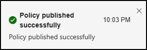

# Exercise 4 - Create a DLP Policy

Contoso is concerned about employees sharing sensitive information on generative AI platforms. To address this, they will implement a DLP policy to detect and block sensitive data, including employee IDs, from being shared. In a prior exercise, a custom sensitive information type was created to identify employee IDs. This will be included in the DLP policy to ensure that these identifiers are protected.

**Tasks**:

1. Create a DLP policy in simulation mode
1. Activate a policy in simulation mode

## Task 1 – Create an endpoint DLP policy in simulation mode

In this task, you'll create an endpoint DLP policy that blocks users from copying and pasting sensitive data into generative AI platforms. Contoso will start by testing it in simulation mode with a small group of employees to make sure it doesn't cause any problems.

1. In the Microsoft Purview portal, select **Solutions** from the left sidebar, then select **Data Loss Prevention**.

1. Select **Policies** then select **+ Create policy**.

1. On the **Start with a template or create a custom policy** page, select **Custom** and **Custom policy**, then select **Next**.

1. On the **Name your DLP policy** page, enter:

    - **Name**: `Generative AI sharing DLP policy`
    - **Description**: `Prevent sharing of sensitive data with generative AI platforms.`

1. Select **Next**.

1. On the **Assign admin units** page, select **Next**.

1. On the **Choose locations to apply the policy** page, select only the **Devices** location. If any other location is selected, ensure they're deselected, then select **Next**.

1. On the **Define policy settings** page, select **Create or customize advanced DLP rules** then select **Next**.

1. On the **Customize advanced DLP rules** page, select **+ Create rule**.

1. On the **Create rule** page, enter:

    - **Name**: `Sensitive data protection rule`
    - **Description**: `Detect and restrict sharing of sensitive information with generative AI platforms.`

1. Under **Conditions** select **+ Add condition** then select **Content contains**.

1. In the newly opened **Content contains** area, select **Add** then select **Sensitive info types**.

1. On the **Sensitive info types** flyout page on the right, search for `Contoso` then select the checkbox for the **Contoso Employee IDs** sensitive info type created in a previous exercise.

1. In the search field, enter `Credit` then select the checkbox for the **Credit Card Number** sensitive info type.

1. Select **Add** at the bottom of the page to add the **Contoso Employee IDs** and **Credit Card Number** sensitive info types.

1. In the **Actions** section, select the **+ Add an action** dropdown, then select **Audit or restrict activities on devices**.

1. In the newly opened **Audit or restrict activities on devices** area, in the **Service domain and browser activities** section select the checkbox for **Upload to a restricted cloud service domain or access from an unallowed browsers**, then select **+ Choose different restrictions for sensitive service domains** under this option.

1. In the **Sensitive service domain restrictions** flyout page, select **+ Add group**.

1. In the **Choose sensitive service domain groups** select the checkbox for **Generative AI Websites**, then select **Add** at the bottom of the page.

1. On the **Sensitive service domain restrictions** page, set the **Action** for **Generative AI Websites** to **Block**, then select **Save** at the bottom of the page.

1. Back on the **Create rule** page, select the checkbox for **Paste to supported browsers**, then select **+ Choose different restrictions for sensitive service domains** under this option.

1. In the **Sensitive service domain restrictions** flyout page, select **+ Add group**.

1. In the **Choose sensitive service domain groups** select the checkbox for **Generative AI Websites**, then select **Add** at the bottom of the flyout page.

1. On the **Sensitive service domain restrictions** page, set the **Action** for **Generative AI Websites** to **Block**, then select **Save** at the bottom of the page.

1. Back on the **Create rule** in the **Service domain and browser activities** section, ensure the action for both **Upload to a restricted cloud service domain or access from an unallowed browsers** and **Paste to supported browsers** is set to **Audit only**.

1. In the **User notifications** section, set **Use notifications to inform your users and help educate them on the proper use of sensitive info.** to **On**.

1. Under **Endpoint devices** select the checkbox to **Show users a policy tip notification**.

1. Select **Save** at the bottom of the flyout page.

1. Back on the **Customize advanced DLP rules**, select **Next**.

1. On the **Policy mode** page select **Run the policy in simulation mode** then select **Next**.

1. On the **Review and finish** page, review your policy settings then select **Submit** to create the policy.

1. Once the policy is created select **Done** on the **New policy created** page.

You've successfully created the endpoint DLP Policy in simulation mode.

## Task 2 – Activate a policy in simulation mode

Now that the policy has been tested and expanded, Contoso is ready to turn it on. In this task, you'll activate the policy so it starts blocking any attempts to share sensitive data with generative AI platforms.

1. On the  **Policies** page select the **Generative AI sharing DLP policy**.

1. On the flyout page with the description for the Generative AI sharing DLP policy, select **View simulation**.

1. Select **Turn the policy on**, then **Confirm** to confirm your choice.

1. You should receive a flyout notification confirming that your DLP policy has been published.

   

You've successfully activated the DLP policy. The sensitive data is now protected from being copied and pasted into generative AI platforms.
