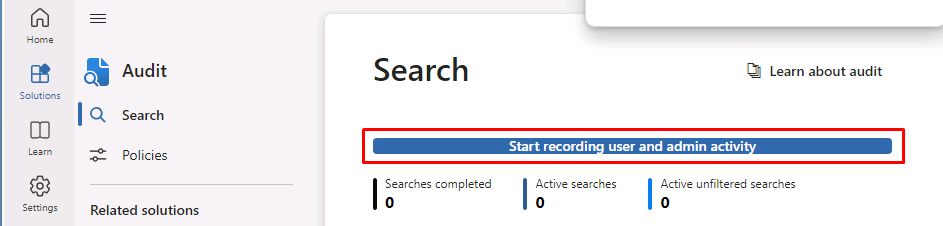

---
lab:
    title: 'Lab Setup: Preparing Your Environment for Administration'
    module: 'Module 0 - Lab Setup'
---

## WWL Tenants - Terms of use

If you are being provided with a tenant as a part of an instructor-led training delivery, please note that the tenant is made available for the purpose of supporting the hands-on labs in the instructor-led training.

Tenants should not be shared or used for purposes outside of hands-on labs. The tenant used in this course is a trial tenant and cannot be used or accessed after the class is over and are not eligible for extension.

Tenants must not be converted to a paid subscription. Tenants obtained as a part of this course remain the property of Microsoft Corporation and we reserve the right to obtain access and repossess at any time.

# Lab Setup - Preparing Your Environment for Administration

In this lab you'll configure and prepare your environment for administration tasks. By following the provided steps, you'll ensure that essential features and settings are enabled in advance, allowing for an easier learning experience in upcoming lab activities. This preparation will include activating necessary features, setting up administrative permissions, and ensuring the proper configuration of key elements.

## Task 1 - Set user passwords for lab exercises

In this task, you'll set passwords for the user accounts needed for the labs.

1. Sign in to Client 1 VM (LON-CL1) as the **lon-cl1\admin** account. The password should be provided by your lab hosting provider.

1. In **Microsoft Edge**, navigate to https://admin.microsoft.com and sign in to the Microsoft Purview portal as the MOD Administrator, admin@WWLxZZZZZZ.onmicrosoft.com (where ZZZZZZ is your unique tenant ID provided by your lab hosting provider).

1. On the left navigation pane, expand **Users** then select **Active users**.

1. On the **Active users** page, hover over **Joni Sherman**'s user account, and a key should appear.

1. Select the **Reset password** key and the **Reset password** flyout page should appear on the right to reset Joni's password.

1. Ensure none of the checkboxes are selected on the **Reset password** flyout page.

1. In the **Password** field, enter a password for Joni you can remember, such as the MOD Administrator account's password:

    >**Tip**: You can reset Joni's password to the same password as the admin's account, which should be provided by your lab hosting provider.

1. Select the **Reset password** button to reset Joni's password.

1. On the **Password has been reset** page, select the **Close** button to go back to the **Active users** page.

1. Repeat steps 4-8 to reset the passwords for **Megan Bowen** and **Lynne Robbins**.

## Task 2 - Grant Compliance Administrator role

1. Select **Joni Sherman** from the list of users.

1. Under the **Roles** section in the **Account** tab, select **Manage roles**.

1. Select **Admin center access**, then select **Show all by category**.

1. Scroll down to under the **Security & Compliance** section and select **Compliance Administrator**. Then select **Save changes** at the bottom.

1. Close out of Joni's user pane.

## Task 3 - Enable Audit in the Microsoft Purview portal

In this task, you'll enable Audit in the Microsoft Purview compliance portal. This tracking feature ensures visibility and accountability by monitoring portal activities.

<!-- 
1. You should still be signed in to Client 1 VM (LON-CL1) as the **lon-cl1\admin** account and Microsoft 365 with the MOD Administrator account.
-->

1. In **Microsoft Edge**, navigate to https://purview.microsoft.com.

1. Select the checkbox for **I agree to the terms of data flow disclosure**, then select **Get started**.

1. In the left navigation, select **Solutions**, then select **Audit**.

1. On the Search page, select the **Start recording user and admin activity** button to activate audit logging.

    

## Task 4 - Enable Search by Name in Microsoft Teams

In this task, you'll enable the **Search by Name** feature in Microsoft Teams for the lab setup. This allows easy user location and connection within the organization. Follow the steps to activate it beforehand, ensuring availability when working with Information Barriers.

<!-- 
1. You should still be signed in to Client 1 VM (LON-CL1) as the **lon-cl1\admin** account and Microsoft 365 with the MOD Administrator account.
-->

1. In **Microsoft Edge**, navigate to https://admin.teams.microsoft.com.

1. In the left navigation select **Teams**, then select **Teams settings**.

1. Scroll down to the **Search by name** section and switch the toggle to **On** to enable **Scope directory search using an Exchange address book policy**.

1. Select **Save** to save this setting, then select **Confirm**.

## Task 5 - Enable information barriers in SharePoint Online and OneDrive

In this task, you'll enable information barriers in SharePoint Online and OneDrive to promote secure collaboration and prevent unauthorized communication.

<!-- 
1. You should still be signed in to Client 1 VM (LON-CL1) as the **lon-cl1\admin** account.
-->

1. Open an elevated PowerShell window by searching for **Windows PowerShell** from the Start Menu and selecting **Run as administrator**.

1. Confirm the **User Account Control** window with **Yes**.

1. Run the following cmdlet to install the latest version of the SharePoint Online PowerShell module:

    ```powershell
    Install-Module -Name Microsoft.Online.SharePoint.PowerShell
    ```

1. If prompted to install the PowerShell NuGet provider, enter **Y** to install the provider.

1. If prompted to install from an untrusted repository, enter **Y** to install the module from the PSGallery.

1. Run the following cmdlet to connect to the admin center for SharePoint Online:

    ```powershell
    Connect-SPOService -Url https://WWLxZZZZZZ-admin.sharepoint.com
    ```

    >**Note:** Be sure to update ZZZZZZ. ZZZZZZ is your unique tenant ID provided by your lab hosting provider.

1. Sign in with admin@WWLxZZZZZZ.onmicrosoft.com provided by your lab hosting provider.

1. To enable information barriers in SharePoint and OneDrive, run the following command:

    ```powershell
    Set-SPOTenant -InformationBarriersSuspension $false
    ```

<!--
1. Close the PowerShell window once this is complete.
-->

1. Keep PowerShell open for later use.