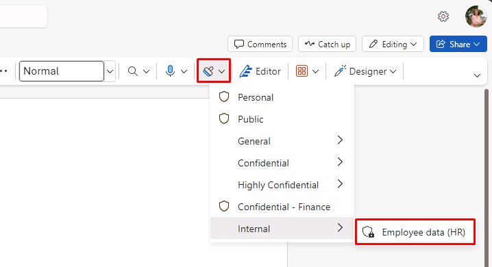
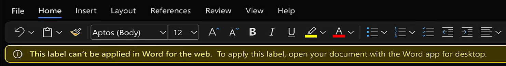

---
lab:
    title: 'Exercise 5 - Manage Sensitivity Labels'
    module: 'Module 1 - Implement Information Protection'
---

<!-- 
# Lab 1 - Exercise 5 - Manage Sensitivity Labels
-->

# Exercise 2 – Manage Sensitivity Labels

In this lab you will assume the role of Joni Sherman, a System Administrator for Contoso Ltd.
Your organization is based in Rednitzhembach, Germany and is currently implementing a sensitivity plan to ensure that all employee documents in the HR department have been marked with a sensitivity label as part of your organizations information protection policies.

## Task 1 – Enable support for sensitivity labels

In this task, you will install the MSOnline module and the SharePoint Online PowerShell module and enable support for sensitivity labels on your tenant.

<!--
1. Sign in to the Client 1 VM (LON-CL1) as the **lon-cl1\admin** account.

1. Open an elevated PowerShell window by selecting the start menu with the right mouse button and then select **Windows PowerShell** and run as administrator.

1. Confirm the **User Account Control** window with **Yes** and press Enter.
-->

1. Open your previously elevated PowerShell window from the task bar.

1. Enter the following cmdlet to install the latest MS Online PowerShell module version:

    ```powershell
    Install-Module -Name MSOnline
    ```

1. Confirm the Nuget security dialog and the Untrusted repository security dialog with **Y** for Yes and press **Enter**. This may take a while to complete processing.

1. Enter the following cmdlet to connect to the MS Online service:

    ```powershell
    Connect-MsolService
    ```

1. In the **Sign into your account** form, sign in as **Joni Sherman** JoniS@WWLxZZZZZZ.onmicrosoft.com (where ZZZZZZ is your unique tenant ID provided by your lab hosting provider). Joni's password should be provided by your lab hosting provider.

1. Enter the following cmdlet to get and store the domain value:

    ```powershell
    $domain = get-msoldomain
    ```

1. Enter the following cmdlet to configure the SharePoint admin URL:

    ```powershell
    $adminurl = "https://" + $domain.Name.split('.')[0] + "-admin.sharepoint.com"
    ```

1. Enter the following cmdlet to sign in to the SharePoint Online admin center:

    ```powershell
    Connect-SPOService -url $adminurl
    ```

1. Sign in as **MOD Administrator**. admin@WWLxZZZZZZ.onmicrosoft.com (where ZZZZZZ is your unique tenant ID provided by your lab hosting provider). <!--Admin's password should be provided by your lab hosting provider.-->

1. Enter the following cmdlet to enable support for sensitivity labels:

    ```powershell
    Set-SPOTenant -EnableAIPIntegration $true
    ```

1. Confirm the changes with **Y** for Yes and press Enter.

<!--
1. Close the PowerShell window.
-->

1. Keep the PowerShell window open for later user.

You have successfully enabled support for sensitivity labels with Teams and SharePoint sites.

## Task 2 – Create Sensitivity Labels

In this task, your HR department has requested a sensitivity label to apply to HR employee documents. You will create a sensitivity label for Internal documents and a sublabel for the HR department.

<!--
1. You should still be signed in to Client 1 VM (LON-CL1) as the **lon-cl1\admin** account.

1. In **Microsoft Edge**, navigate to **https://purview.microsoft.com** and sign in to the Microsoft Purview portal as **Joni Sherman** JoniS@WWLxZZZZZZ.onmicrosoft.com (where ZZZZZZ is your unique tenant ID provided by your lab hosting provider).  Joni's password should be provided by your lab hosting provider.
-->

1. Open the InPrivate window signed in with **Joni Sherman** and go back to https://purview.microsoft.com if it was closed.

1. Select **Solutions** from the left pane, then select **Information Protection**.

1. Select **Sensitivity labels**.

1. Select **+ Create a label** from the row above the list of existing labels.

1. On the **Name and create a tooltip for your label** step, enter the following information:

    - **Name**: Internal
    - **Display name**: Internal
    - **Description for users**: Internal sensitivity label.
    - **Description for admins**: Internal sensitivity label for Contoso.

1. Select **Next**.

1. On the **Define the scope for this label** step, select **Items** and select **Files** and **Emails**. If any other options on this page are selected, deselect those options.

1. Select **Next** until you reach the **Review your settings and finish** step.

1. Select **Create label**.

1. On the **Your sensitivity label was created** step, select **Don't create a policy yet** and then select **Done**.

1. On the Sensitivity labels page, highlight (without selecting) the newly created **Internal** label and select the vertical **...**

    

1. Select the **+ Create sublabel** from the drop-down menu.

1. On the **Provide basic details for this label** step, enter the following information:

   - **Name**: Employee data (HR)
   - **Display name**: Employee data (HR)
   - **Description for users**: This HR label is the default label for all specified documents in the HR Department.
   - **Description for admins**: This label is created in consultation with Ms. Jones (Head of HR department). Contact her, when you want to change settings of the label.

1. Select **Next**.

1. On the **Define the scope for this label** page, select **Items**, **Files**, and **Emails**. If any other options on this page are selected, deselect them. Select **Next**.

1. On the **Choose protection settings for labeled items** step, select the **Control access** checkbox. Select **Next**.

1. On the **Access control** step, select **Configure access control settings**.

1. Enter the following information into the encryption settings:

   - **Assign permissions now or let users decide?**: Assign permissions now
   - **User access to content expires**: Never
   - **Allow offline access**: Only for a number of days
   - **Users have offline access to the content for this many days**: 15

1. Select the **Assign permissions** link.

1. On the Assign permissions side menu, select the **+ Add any authenticated users**.

1. Select **Save**.

1. On the **Access control** step, select **Next**.

1. Select **Next** until you reach the **Review your settings and finish** step.

1. Select **Create label**.

1. On the **Your sensitivity label was created** step, select **Don't create a policy yet** and then select **Done**.

You have successfully created a sensitivity label for your organizations internal policies and a sensitivity sublabel for the Human Resources (HR) department.

## Task 3 – Publish Sensitivity Labels

You will now publish the Internal and HR sensitivity label so that the published sensitivity labels will be available for the HR users to apply to their HR documents.

<!--
1. You should still be signed in to Client 1 VM (LON-CL1) as the **lon-cl1\admin** account, and you should be signed in to Microsoft 365 as **Joni Sherman**.  Sign in as JoniS@WWLxZZZZZZ.onmicrosoft.com (where ZZZZZZ is your unique tenant ID provided by your lab hosting provider).  Joni's password should be provided by your lab hosting provider.

1. In **Microsoft Edge**, the Microsoft Purview portal tab should still be open. If so, select it and proceed to the next step. If you closed it, then in a new tab, navigate to **https://purview.microsoft.com**.
-->

1. You should still be on the Sensitivity labels page in Purview.

1. Select **Publish labels**, in the same row where you used **+ Create a label**.

1. Select the **Choose sensitivity labels to publish** link.

1. In the new pane, select the **Internal** and **Internal/Employee Data (HR)** checkboxes, then Select **Add**.

1. On the **Choose sensitivity labels to publish** step, select **Next**.

1. Select **Next** until you reach the **Name your policy** step.

1. Enter the following information:

   - **Name**: Internal HR employee data
   - **Enter a description for your sensitivity label policy**: This HR label is to be applied to internal HR employee data.

1. Select **Next**.

1. On the **Review and finish** step, select **Submit**.

1. On the **New policy created** step, select **Done** to finish publishing your label policy.

You have successfully published the Internal and HR sensitivity labels. Note that it can take up to 24 hours for changes to replicate to all users and services.

## Task 4 – Work with Sensitivity Labels

In this task, you will create sensitivity labels in Word and Outlook emails. The document created will be stored in OneDrive and sent to an HR employee via email.

<!--
1. You should still be signed in to Client 1 VM (LON-CL1) as the **lon-cl1\admin** account, and you should be signed in to Microsoft 365 as **Joni Sherman** JoniS@WWLxZZZZZZ.onmicrosoft.com (where ZZZZZZ is your unique tenant ID provided by your lab hosting provider).  Joni's password should be provided by your lab hosting provider.

1. In **Microsoft Edge**, the Microsoft Purview portal tab should still be open. Select the address bar and navigate to **https://www.microsoft365.com**.
-->

1. Open a new tab from the InPrivate window signed in as **Joni Sherman** and go to https://www.microsoft365.com.

1. Select **Sign in**.

1. Scroll through the Welcome to Microsoft 365 message to close it.

1. Select the **app launcher** menu (the 9 dots) from the top-left corner of the page and select **Word**.

1. Select **Blank document** to create a new document.

1. If a **Your privacy options** message is shown, select **Close**.

1. Enter the following contents into the word document:

    ``` text
    Important HR employee document.
    ```

1. Select **Sensitivity** from the top pane to open the dropdown menu. Select **Internal > Employee Data (HR)**  to apply the label.

    

    >**Note:** Be aware, the script you ran in task 1 of this exercise activated sensitivity labels in Word for your tenant.  It can sometimes take an hour for that activation to be realized in Microsoft Word online.  If you don't see the Sensitivity label menu in Word, you may need to return to this lab later or make sure you properly completed task 1 of this exercise.

    >You may see a warning stating, "This label can't be applied in Word for the web..." If you see this give it a few minutes, re-launch Word, and try again.

    

1. Select **Document** in the upper-left corner of the window next to the Word logo to rename it.

1. Enter **HR Document** as the File Name and press **Enter**.

1. Close the tab. 

1. Select the **app launcher** menu from Microsoft 365, and select **Outlook** to launch it.

1. If a welcome message is shown, close it by selecting the **X**.

1. In Outlook, select **New mail** from the upper-left of the window.

1. In the **To** field enter the name **Allan** and select **Allan Deyoung** from the dropdown list.

1. In the **Add a subject** field, enter: **Employee data for HR**

1. Within the email body (the large content panel at the bottom of the page), insert the following message:

    ``` text
    Dear Mr. Deyoung, 

    Please find attached the important HR employee document. 

    Kind regards,

    Joni Sherman
    ```

1. Select the paperclip symbol from the top menu to add an attachment. Select the **HR Document.docx** below **Suggested files** to attach the document.

    >The file name may still be showing as **Document.docx** due to propagation time. It should be the only .docx file under **Suggested files**.

1. Select **Send** to send out the email with the attached document.

1. Leave the browser window open.

You have successfully created an HR Word document with a sensitivity label, which was saved onto your OneDrive. You then emailed to document to an HR staff member where the email was also set with a sensitivity label.

## Task 5 – Configure Auto Labeling

In this task, you will create a Sensitivity Label that will auto label documents and emails found to contain information related to the European General Data Protection Regulation (GPDR).

<!--
1. You should still be signed in to Client 1 VM (LON-CL1) as the **lon-cl1\admin** account.

1. In **Microsoft Edge**, navigate to **https://purview.microsoft.com** and sign in to the Microsoft Purview portal as **Joni Sherman**.

1. In the Microsoft Purview portal, on the left navigation pane, select **Information Protection**.
-->

1. Go back to your Purview tab or re-open it by going to https://purview.microsoft.com.

1. If it is not still on the Sensitivity labels page, select **Information Protection** from the leftmost pane, then select **Sentivity labels**.

1. Highlight (without selecting) the existing **Internal** label, and select the three dots.

1. Select the **+ Create sublabel** menu item.

1. On the **Provide basic details for this label** step, enter the following:

   - **Name**: GDPR Germany
   - **Display name**: GDPR Germany
   - **Description for users**: This document or email contains data related to the European General Data Protection Regulation (GPDR) for the region Germany.
   - **Description for admins**: This label is auto applied to German GDPR documents.

1. Select **Next**.

1. On the **Define the scope for this label** step, select **Items**, **Files**, and **Emails**. If any other options on this page are selected, deselect them. Select **Next**.

1. On the **Choose protection settings for labeled items** step, select **Next**.

1. On the **Auto-labeling for files and emails** step, switch the toggle for **Auto-labeling for files and emails** to on.

1. In the **Detect content that matches these conditions** section, select **+Add condition** then select **Content contains**.

1. In the **Content contains** section select **Add**, then select **Sensitive info types**.

1. In the **Sensitive info types** search panel that opens to the right, enter the following and press **Enter**:

    ``` text
    German
    ```

1. Press the **Select all** checkbox at the top to select all sensitivity info types related to Germany, then select **Add** at the bottom.

1. Back on the **Auto-labeling for files and emails** step, select **Next**.

1. Select **Next** until you reach the **Review your settings and finish** step.

1. Select **Create label**.

1. On the **Your sensitivity label was created** step, select **Don't create a policy yet** and then select **Done**.

1. On the Sensitivity labels page, select **Publish labels**.

1. Select the **Choose sensitivity labels to publish** link.

1. In the  **Sensitivity labels to publish** pane, select the **Internal** and **Internal/GDPR Germany** checkboxes. Then select **Add**.

1. On the **Choose sensitivity labels to publish** step, select **Next**.

1. Select **Next** until you reach the **Name your policy** step.

1. On the **Name your policy** step, enter the following information:

   - **Name**: GDPR Germany policy
   - **Enter a description for your sensitivity label policy**: This auto apply sensitivity labels policy is for the GDPR region of Germany.

1. Select **Next**.

1. On the **Review and finish** step, select **Submit**.

1. Select **Done** once created.

You've successfully created and published an auto apply sensitivity label for GDPR documents in the region of Germany.

Be aware that it can take up to 24 hours for auto applied sensitivity labels to be applied, this duration will be longer when applied to more than 25,000 documents (that is, the daily limit).
