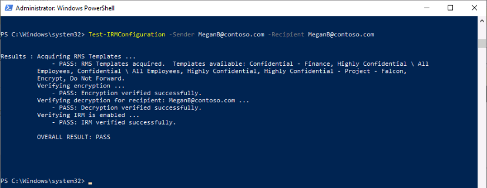
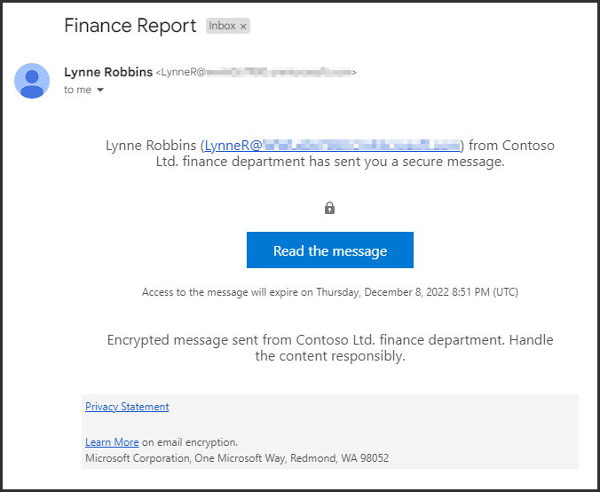

---
lab:
    title: 'Exercise 2 - Manage Microsoft Purview Message Encryption'
    module: 'Module 1 - Implement Information Protection'
---

<!--
# Lab 1 - Exercise 2 - Manage Microsoft Purview Message Encryption
-->

# Exercise 3 – Manage Microsoft Purview Message Encryption

The first setting Joni Sherman needs to configure and test with her pilot team is the Microsoft Purview Message Encryption. For this purpose, she will modify the default template and create a new branding template, which will be assigned to one of the pilot users. The pilot users will then test the message encryption functionality with their accounts.

## Task 1 – Verify Azure RMS functionality

In this task, you will install the Exchange Online PowerShell module and verify the correct Azure RMS functionality of your tenant in context of Joni Sherman, who was assigned the role of the Compliance Administrator in the last exercise.

<!--
1. You should still be signed in to Client 1 VM (LON-CL1) as the **lon-cl1\admin** account.

1. Open an elevated PowerShell window by selecting the Windows button with the right mouse button and then select **Windows PowerShell (Admin)**.

1. Confirm the **User Account Control** window with **Yes**.
-->

1. Open your elevated PowerShell window from the task bar.

1. Enter the following cmdlet to install the latest Exchange Online PowerShell module version:

    ```powershell
    Install-Module ExchangeOnlineManagement
    ```

1. Confirm the Untrusted repository security dialog with **Y** for Yes and press **Enter**.  This process may take some time to complete.

1. Enter the following cmdlet to change your execution policy and press **Enter**

    ```powershell
    Set-ExecutionPolicy -ExecutionPolicy RemoteSigned -Scope CurrentUser
    ```

1. Confirm the Execution Policy Change with  **Y** for Yes and press **Enter**.

<!--
1. Close the PowerShell window.

1. Open a regular PowerShell window, without elevation, by selecting the Windows button with the right mouse button and select **Windows PowerShell**.
-->

1. Enter the following cmdlet to use the Exchange Online PowerShell module and connect to your tenant:

    ```powershell
    Connect-ExchangeOnline
    ```

1. When the **Sign in** window is displayed, sign in as JoniS@WWLxZZZZZZ.onmicrosoft.com (where ZZZZZZ is your unique tenant ID provided by your lab hosting provider). You will use the password you reset Joni's to in a previous lab.

1. Verify Azure RMS and IRM is activated in your tenant by using the following cmdlet and press **Enter**:

    ```powershell
    Get-IRMConfiguration | fl AzureRMSLicensingEnabled
    ```

1. When **AzureRMSLicensingEnabled** result is **True**, Azure RMS is activated for your tenant. Continue with the next step. 

1. Test the Azure RMS templates used for Office 365 Message Encryption against the other pilot user **Megan Bowen** by using the following cmdlet and press **Enter**:

    ```powershell
    Test-IRMConfiguration -Sender MeganB@contoso.com -Recipient MeganB@contoso.com
    ```

    

1. Verify all tests show **PASS** and no errors are shown.

1. Leave the PowerShell window open.

You have successfully installed the Exchange Online PowerShell module, connected to your tenant, and verified the correct functionality of Azure RMS.

## Task 2 – Modify default branding template

There is a requirement in your organization to restrict trust for foreign identity providers, such as Google or Facebook. Because these social IDs are activated by default for accessing messages protected with message encryption, you need to deactivate the use of social IDs for all users in your organization.

<!--
1. You should still be signed in to your Client 1 VM (LON-CL1) as the **lon-cl1\admin** account and there should still be an open PowerShell window with Exchange Online connected.
-->

1. Run the following cmdlet to view the default configuration:

    ```powershell
    Get-OMEConfiguration -Identity "OME Configuration" | fl
    ```

1. Review the settings and confirm that the **SocialIdSignIn** parameter is set to **True**.

1. Run the following cmdlet to restrict the use of social IDs for accessing messages from your tenant protected with OME:

    ```powershell
    Set-OMEConfiguration -Identity "OME Configuration" -SocialIdSignIn:$false
    ```

1. Confirm the warning message for customizing the default template with **Y** for Yes and press **Enter**.

1. Check the default configuration again and validate, the SocialIdSignIn parameter is now set to False.

    ```powershell
    Get-OMEConfiguration -Identity "OME Configuration" | fl
    ```

1. Notice the result should show the **SocialIDSignIn** is set to **False**. Leave the PowerShell window and client open.

You have successfully deactivated the usage of foreign identity providers, such as Google and Facebook in Office 365 Message Encryption.

## Task 3 – Test default branding template

You must confirm that no social IDs dialog is displayed for external recipients when receiving a message protected with Office 365 Message Encryption from users of your tenant and they need to use the OTP at any time accessing the encrypted content.

1. Sign in to the other VM, Client 2 VM (LON-CL2), as the **lon-cl2\admin** account.

<!--
1. Make sure all available Windows Updates are installed and the client does not require a restart to finish update installation.

[//]: <> (Installing the latest OS updates will also update the Edge browser to the new chromium version required to do this labs.)

1. Open **Microsoft Edge** from the taskbar and when a **Welcome to Microsoft Edge** windows is displayed, select **Start without your data**, select **Continue without this data** again and select **Confirm and start browsing**.

1. If the welcome message is missing, navigate to https://microsoft.com/edge, select **DOWNLOAD for Windows** and **Windows 10**. Select **Accept and download** and **Run** to install the latest version of the Edge browser. Once this is complete perform the previous step.
-->

1. Open **Microsoft Edge** and go to https://outlook.office.com.

1. Sign in to Outlook on the web as LynneR@WWLxZZZZZZ.onmicrosoft.com (where ZZZZZZ is your unique tenant ID provided by your lab hosting provider). 

    >You reset Lynne's password at the start of the course, alongside Joni Sherman's.

1. On the **Stay signed in?** dialog box, select the **Don’t show this again** checkbox and then select **No**.

1. Select **Save** in the **Save password** dialog, to save the pilot users password in your browser.

1. If a **Translate page from...** window is shown, select the arrow down and select **Never translate from...**.

1. Select **New mail** from the upper-left corner of Outlook.

1. In the **To** field enter your personal or other third-party email address that is not in the tenant domain. 

1. In the **Add a subject** field, enter **Secret Message**.

1. In the body, enter **My super-secret message.**

1. In the top bar, select the **Options** tab, then **Encrypt** (lock icon), and then **Encrypt** from the dropdown list. 

    >At the top of the message pane above **Send**, you should see a notice that says "This message is encrypted. Recipients can't remove encryption."

    

1. Select **Send** to send the message.

1. Sign into your personal email account and open the message from Lynne Robbins. 

1. If you sent this email to a Microsoft account (like @outlook.com) the encryption may be processed automatically and you will see the message without additional steps.

    >**Note:** If you see **My super-secret message.** this task is now complete. Otherwise, proceed with the following steps.

1. If you sent the email to another email service like @gmail.com, you may have to perform the next steps to process the encryption and read the message.

    >**Note:** You may need to check your junk or spam folder for the message from Lynne Robbins.

1. Select **Read the message**.

1. Without having social IDs activated, there is no button to authenticate with your Google account.

1. Select **Sign in with a One-time passcode** to receive a limited time passcode.

1. Go to your personal email portal and open the message with subject **Your one-time passcode to view the message**.

1. Copy the passcode, paste it into the OME portal and select **Continue**.

1. Review the encrypted message.

<!--
1. Leave Client 1 VM (LON-CL1) open as it is.
-->

You have successfully tested the modified default OME template with deactivated social IDs.

## Task 4 – Create custom branding template

Protected messages sent by your organizations finance department require special branding, including customized introduction and body texts and a Disclaimer link in the footer. The finance messages shall also expire after seven days. In this task, you will create a new custom OME configuration and create a transport rule to apply the OME configuration to all mail sent from the finance department.

1. Sign back in to Client 1 VM (LON-CL1) with the **lon-cl1\admin** account and there should still be an open PowerShell window with Exchange Online connected.

1. Run the following cmdlet to create a new configuration:

    ```powershell
    New-OMEConfiguration -Identity "Finance Department" -ExternalMailExpiryInDays 7
    ```

1. Confirm the warning message for customizing the template with **Y** for Yes and press **Enter**. 

1. Change the introduction text message with the following cmdlet:

    ```powershell
    Set-OMEConfiguration -Identity "Finance Department" -IntroductionText " from Contoso Ltd. finance department has sent you a secure message."
    ```

1. Confirm the warning message for customizing the template with **Y** for Yes and press **Enter**.

1. Change the body email text of the message with the following cmdlet:

    ```powershell
    Set-OMEConfiguration -Identity "Finance Department" -EmailText "Encrypted message sent from Contoso Ltd. finance department. Handle the content responsibly."
    ```

1. Confirm the warning message for customizing the template with **Y** for Yes and press **Enter**.

1. Change the disclaimer URL to point to Contoso's privacy statement site:

    ```powershell
    Set-OMEConfiguration -Identity "Finance Department" -PrivacyStatementURL "https://contoso.com/privacystatement.html"
    ```

1. Confirm the warning message for customizing the template with **Y** for Yes and press **Enter**.

1. Use the following cmdlet to create a mail flow rule, which applies the custom OME template to all messages sent from the finance team.  This process may take a few seconds to complete.

    ```powershell
    New-TransportRule -Name "Encrypt all mails from Finance team" -FromScope InOrganization -FromMemberOf "Finance Team" -ApplyRightsProtectionCustomizationTemplate "Finance Department" -ApplyRightsProtectionTemplate Encrypt
    ```

1. Type the following cmdlet to verify changes.

    ```powershell
    Get-OMEConfiguration -Identity "Finance Department" | Format-List
    ```

1. Leave the PowerShell window open.

You have successfully created a new transport rule that applies the custom branding template automatically, when a member of the finance department sends a message to external recipients.

## Task 5 – Test the custom branding template

To validate the new custom configuration, you need to use the account of Lynne Robbins again, who is a member of the finance team.

1. Sign back in to Client 2 VM (LON-CL2) as the **lon-cl2\admin** account.

1. The Outlook on the web tab should still be open and signed in as **Lynne Robbins**.

1. Select **New mail** from the upper-left corner of Outlook.

1. In the **To** field enter your personal or other third-party email address that is not in the tenant domain. 

1. In the **Add a subject** field, enter **Finance Report**.

1. In the body, enter **Secret finance information.**

1. Select **Send**.

1. Sign into your personal email account and open the message from **Lynne Robbins**. It will look similar to the image below. Select **Read the message**.

    

1. The customized configuration has social IDs activated, because both options are available. Select **Sign in with a One-time passcode** to receive a limited time passcode.

1. Go back to your personal email and open the message with subject **Your one-time passcode to view the message**.

1. Copy the passcode, paste it in to the portal and select **Continue**.

1. Review the encrypted message with custom branding.

You have successfully tested the new customized template.
