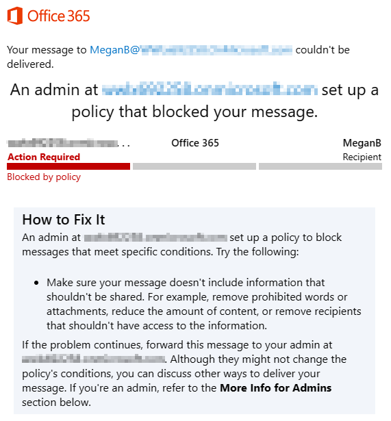

---
lab:
    title: 'Exercise 1 - Manage DLP Policies'
    module: 'Module 2 - Implement Data Loss Prevention'
---
## WWL Tenants - Terms of use

If you are being provided with a tenant as a part of an instructor-led training delivery, please note that the tenant is made available for the purpose of supporting the hands-on labs in the instructor-led training.

Tenants should not be shared or used for purposes outside of hands-on labs. The tenant used in this course is a trial tenant and cannot be used or accessed after the class is over and are not eligible for extension.

Tenants must not be converted to a paid subscription. Tenants obtained as a part of this course remain the property of Microsoft Corporation and we reserve the right to obtain access and repossess at any time.

# Lab 2 - Exercise 1 - Manage DLP Policies

You are Joni Sherman, the newly hired Compliance Administrator for Contoso Ltd. tasked to configure the company's Microsoft 365 tenant for data loss prevention. Contoso Ltd. is a company that offers driving instruction in the United States, and you need to make sure that sensitive customer information does not leave the organization.

## Task 1 – Create a DLP policy in test mode

In this exercise, you will create a Data Loss Prevention policy in the Microsoft Purview portal to protect sensitive data from being shared by users. The DLP Policy that you create will inform your users if they want to share content that contains Credit Card information and allow them to provide a justification for sending this information. The policy will be implemented in test mode because you do not want the block action to affect your users yet.

1. Log into Client 1 VM (LON-CL1) as the **lon-cl1\admin** account.

1. In **Microsoft Edge**, navigate to **https://compliance.microsoft.com** and log into the Microsoft Purview portal as **Joni Sherman**. sign in as JoniS@WWLxZZZZZZ.onmicrosoft.com (where ZZZZZZ is your unique tenant ID provided by your lab hosting provider).  Joni's password should be provided by your lab hosting provider.

1. If the **Stay signed in?** dialog box appears, select the **Don’t show this again** checkbox and then select **No**.

1. In the **Microsoft Purview** portal, in the left navigation pane, expand **Data loss prevention** then select **Policies**.

1. On the **Policies** page select **+Create policy** to start the wizard for creating a new data loss prevention policy.

1. On the **Start with a template or create a custom policy** page, scroll down and select **Custom** under **Categories** and **Custom policy** under **Templates**. By default, both  options should already be selected , select **Next**.

1. On the **Name your DLP policy** page enter:

   - **Name**: Credit Card DLP Policy
   - **Description**: Protect credit card numbers from being shared

1. Select **Next**.

1. On the **Assign admin units (preview)** page select **Next**.

1. On the **Choose locations to apply the policy** page, enable the **Teams chat and channel messages** option only and select **Next**.

1. On the **Define policy settings** page, select **Create or customize advanced DLP rules** and select **Next**.

1. On the **Customize advanced DLP rules** page, select **+ Create rule**.

1. On the **Create rule** flyout page, type _Credit card information_ in the **Name** field.

1. Under **Conditions**, select **+ Add Condition** and then select **Content contains** from the dropdown menu.

1. In the new **Content contains** area, select **Add** and select **Sensitive info types** from the dropdown menu.

1. On the **Sensitive info types** page, select **Credit Card Number** and select **Add**.

1. On the **Create rule** page, select **+ Add condition** and select **Content is shared from Microsoft 365** from the dropdown menu.

1. In the new **Content is shared from Microsoft 365** section, select the **only with people inside my organization** option.

1. On the **Create rule** page, select **+ Add an action**. Under **Use actions to protect content when the conditions are met.** expand **Restrict access or encrypt the content in Microsoft 365 locations** and select **Block everyone.**

1. On the **Create rule** page, in the **User notifications** section, select the switch to **On** to enable user notifications.

1. Select the check box to enable **Notify users in Office 365 service with a policy tip**.

1. Under **User overrides** select the checkbox to **Allow overrides from M365 services. Allows users in Exchange, SharePoint, OneDrive and Teams to override policy restrictions.**

1. Check the checkbox to **Require a business justification to override**.

1. In the **Incident reports** section, in the **Use this severity level in admin alerts and reports** dropdown, select **Low**.

1. On the **Create rule** page select **Save** then select **Next**.

1. On the **Policy mode** page select **Test it out first** and select **Show policy tips while in test mode**.

1. On the **Review your policy and create it** page review your settings then select **Submit**

1. On the **New policy created** page select **Done**.

You have now created a DLP policy that scans Credit Card numbers in Microsoft Teams chats and channels and allows users to provide a business justification to override the policy.

## Task 2 - Modify a DLP policy

In this task, you will modify the existing DLP policy you created in the previous step to also scan e-mails for Credit Card information and inform users if they want to share this content in an e-mail.

1. You should still be logged into Client 1 VM (LON-CL1) as the **lon-cl1\admin** account, and you should be logged into Microsoft 365 as **Joni Sherman**.

1. In **Microsoft Edge**, the Microsoft Purview portal tab should still be open. If so, select it and proceed to the next step. If you closed it, then in a new tab, navigate to **https://compliance.microsoft.com**.

1. In the **Microsoft Purview** portal, in the left navigation pane, expand **Data loss prevention** then select **Policies**.

1. On the **Policies** page select the checkbox next to the recently created **Credit Card DLP Policy** and then select **Edit policy** (pencil icon) to open the policy wizard.

1. On the **Name your DLP policy** page, select **Next**.

1. On the **Assign admin units (preview)** page select **Next**.

1. On the **Choose locations to apply the policy** page, enable the **Exchange email** option and then select **Next** until you reach the **Review your policy and create it** page.

1. Select **Submit** to apply the change you made to the policy.

1. Once the policy is updated select **Done**.

You have now modified an existing DLP policy and changed the locations it scans for content.

## Task 3 - Create a DLP policy in PowerShell

In this task, you use PowerShell to create a DLP policy to protect the Contoso EmployeeIDs and prevent them from being shared in Exchange. Users will be informed that they are attempting to share sensitive data and are blocked from sending the e-mail if it includes Contoso EmployeeIDs.

1. You should still be logged into Client 1 VM (LON-CL1) as the **lon-cl1\admin** account.

1. In the start menu, select **Windows PowerShell**.

1. In the **PowerShell** window, enter

   ```powershell
   Connect-IPPSSession
   ```

   and then sign in as **Joni Sherman** JoniS@WWLxZZZZZZ.onmicrosoft.com (where ZZZZZZ is your unique tenant ID provided by your lab hosting provider).  Joni's password should be provided by your lab hosting provider.

1. Enter the following command into PowerShell to create a DLP policy that scans all Exchange mailboxes:

   ```powershell
   New-DlpCompliancePolicy -Name "EmployeeID DLP Policy" -Comment "This policy blocks sharing of Employee IDs" -ExchangeLocation All
   ```

1. Enter the following command into PowerShell to add a DLP rule to the DLP policy you created in the previous step:

   ```powershell
   New-DlpComplianceRule -Name "EmployeeID DLP rule" -Policy "EmployeeID DLP Policy" -BlockAccess $true -ContentContainsSensitiveInformation @{Name="Contoso Employee IDs"}
   ```

1. Use the following command to review the **EmployeeID DLP rule**:

   ```powershell
   Get-DLPComplianceRule -Identity "EmployeeID DLP rule"
   ```

You have now created a DLP Policy that scans Contoso EmployeeIDs in Exchange by using PowerShell.

## Task 4 - Test your DLP Policy

In this task you'll test the DLP policy that was created in the previous task.

1. You should still be logged into Client 1 VM (LON-CL1) as the **lon-cl1\admin** account and logged into Microsoft 365 as Joni Sherman.

1. Open a Microsoft Edge browser window and navigate to **https://outlook.office.com/**

1. Select the **New mail** button on the top left to compose a new email message.

1. In the **To** field, enter _Megan_ and select **Megan Bowen**'s email address.

1. In the subject field enter _Help with employee information_.

1. In the body of the email enter:

   ``` text
   Please help me with the start dates for the following employees:
   ABC123456
   DEF678901
   GHI234567

   Thank you, 
   Joni Sherman
   ```

1. Select the **Send** button in the upper right of the message window to send the email.

1. You should receive a message that the email was undeliverable and blocked by a DLP policy.

      

You have successfully tested your DLP policy.

## Task 5 - Activate a policy in test mode

In this task, you will activate the credit card information DLP policy you created in test mode so it enforces its protective actions.

1. You should still be logged into Client 1 VM (LON-CL1) as the **lon-cl1\admin** account, and you should be logged into Microsoft 365 as **Joni Sherman**.

1. In **Microsoft Edge**, the Microsoft Purview portal tab should still be open. If so, select it and proceed to the next step. If you closed it, then in a new tab, navigate to **https://compliance.microsoft.com**.

1. In the **Microsoft Purview** portal, in the left navigation pane, expand **Data loss prevention** then select **Policies**.

1. On the  **Policies** page select the checkbox next to **Credit Card DLP Policy** and select **Edit policy** (pencil) to open the policy wizard.

1. Select **Next** until you reach the **Policy mode** page and select **Turn it on right away**.

1. On the **Review your policy and create it** select **Submit**.

1. On the **Policy updated** page select **Done**.

You have successfully activated the DLP Policy. If the policy detects an attempt to share credit card information, it will now block the attempt and allow the users to provide a business justification to override the block action.

## Task 6 - Modify policy priority

After creating two DLP policies, you want to make sure that the more restrictive policy is processed at a higher priority than the less restrictive policy. For this reason, you want to move the EmployeeID DLP Policy into the higher priority.

1. You should still be logged into Client 1 VM (LON-CL1) as the **lon-cl1\admin** account, and you should be logged into Microsoft 365 as **Joni Sherman**.

1. In **Microsoft Edge**, the Microsoft Purview portal tab should still be open. If so, select it and proceed to the next step. If you closed it, then in a new tab, navigate to **https://compliance.microsoft.com**.

1. In the **Microsoft Purview** portal, in the left navigation pane, expand **Data loss prevention** then select **Policies**.

1. On the **Policies** select the three vertical dots next to the **EmployeeID DLP Policy** to open the **Actions** selection and select **Move to top**.

1. In the **Data loss prevention** window, select **Refresh** and review the priority in the **Order** column of the policy table.

You successfully modified the priority of your DLP policies. If both policies match the same content the action of the higher priority policy will be enforced.

## Task 7- Enable file monitoring in Microsoft 365 Defender

You want to use file policies in Microsoft 365 Defender to protect files in your OneDrive and SharePoint Online locations. Before you can create a file policy, you need to enable file monitoring so Microsoft 365 Defender can scan files in your organization.

1. You should still be logged into Client 1 VM (LON-CL1) as the **lon-cl1\admin** account.

1. In **Microsoft Edge**, the Microsoft Purview portal tab should still be open. Select the **Profile picture** of Joni Sherman in the top right and select **Sign out**, then close the browser.

1. Open **Microsoft Edge** and navigate to **https://security.microsoft.com** and log into the Microsoft 365 Defender portal as **MOD Administrator** admin@WWLxZZZZZZ.onmicrosoft.com (where ZZZZZZ is your unique tenant ID provided by your lab hosting provider). Admin's password should be provided by your lab hosting provider.

1. On the left navigation pane, scroll down then select **Settings**.

1. On the **Settings** page select **Cloud Apps**.

1. In the left pane within the **Cloud apps** window, scroll down to the **Information Protection** section, then select **Files**.

1. Select the **Enable file monitoring** checkbox then select **Save** if it is not already marked.

You successfully enabled file monitoring in Microsoft 365 Defender and can now scan files for sensitive content using file policies.

## Task 8 - Create a file policy for Microsoft 365 Defender

In this task, you want to create a file policy in Microsoft 365 Defender to scan files in OneDrive and SharePoint Online and automatically quarantine files containing credit card information if they are shared.

1. You should still be logged into Client 1 VM (LON-CL1) as the **lon-cl1\admin** account.

1. In **Microsoft Edge**, the Microsoft Defender for Cloud Apps portal tab should still be open. Select the **Profile picture** of the MOD Admin in the top right and select **Sign out** next to the cogwheel, then close the  browser.

1. Open **Microsoft Edge** and navigate to **https://security.microsoft.com** and log into the Microsoft 365 Defender portal as **Joni Sherman** JoniS@WWLxZZZZZZ.onmicrosoft.com (where ZZZZZZ is your unique tenant ID provided by your lab hosting provider). Joni Sherman's password should be provided by your lab hosting provider.

1. In the **Microsoft 365 Defender** portal, in the left navigation, scroll down to the **Cloud apps** section, then select **Files**.

1. On the **Files** page select **+ New policy from search**.

1. On the **Create file policy** page, leave the **Policy template** selection as **No template**.

1. Enter this information on the **Create file policy** page

   - **Policy name**: Credit Card Information for files
   - **Description**: Protect credit card numbers from being shared in files

1. Keep the **Policy Severity** on **Low** (one lighted icon) and make sure the **Category** is set to **DLP**. For a file policy, this should be the default.

1. In the **Files matching all of the following** area, expand the dropdown menu **Public (Internet), External, Public** and add **Internal**.

1. In the **Inspection Method** dropdown menu, select **Data Classification Service**.

1. In the **Choose inspection type...** dropdown menu, select **Sensitive information type...**.

1. On the **Select a sensitive information type** dialog, select **Credit Card Number**, then select **Done** in the upper right corner.

1. Under **Alerts**, check the **Create an alert for each matching file** checkbox and review your options. Keep the settings as the default by selecting **Save as default settings**.

1. In the **Governance actions** section, expand **Microsoft OneDrive for Business** and select **Put in user quarantine**.

1. In the **Governance actions** section, expand **Microsoft SharePoint Online** and select the checkbox for **Put in user quarantine**.

1. Select **Create** at the bottom of the page.

You have now created a file policy that will continuously scan files saved in OneDrive and SharePoint for credit card information and quarantine them if they are shared inside your organization.

## Task 9 - Create a DLP policy for Power Platform

Your company uses Power Automate flows to share data between SharePoint Online and Salesforce. In this task, you will create a DLP policy for Power Platform that allows your existing flows to keep working but prevents the creation of flows that will share data between SharePoint Online and Apps defined as non-business.

1. Log into Client 2 VM (LON-CL1) as the **lon-cl2\admin** account.

1. In **Microsoft Edge**, navigate to **https://admin.powerplatform.microsoft.com** and log into the Power Platform admin center as **MOD Administrator** admin@WWLxZZZZZZ.onmicrosoft.com (where ZZZZZZ is your unique tenant ID provided by your lab hosting provider).  Admin's password should be provided by your lab hosting provider.

1. In the **Power Platform admin center**, in the left navigation pane, select the drop-down for **Policies** and then select **Data policies**.

1. On the **Data policies** page, select **+ New Policy**.

1. On the **Name your policy** page, enter _Tenant-wide SharePoint Policy_, then select **Next**.

1. On the **Non-business|Default** tab on the **Assign connectors** page, select **SharePoint** and **Salesforce**, then select **Move to Business** at the top of the page.

1. In the **Assign connectors** page, select the **Business** tab to make sure both SharePoint and Salesforce now appear then select **Next**.

1. On the **Custom connector patterns** page select **Next**.

1. On the **Define scope** page, select **Add all environments** then select **Next**.

1. On the **Review and create policy** page review your policy settings then select **Create policy**.

You have now created a Power Platform DLP policy that prevents users from creating flows involving a SharePoint Online Connector and any connector that is not Salesforce.
