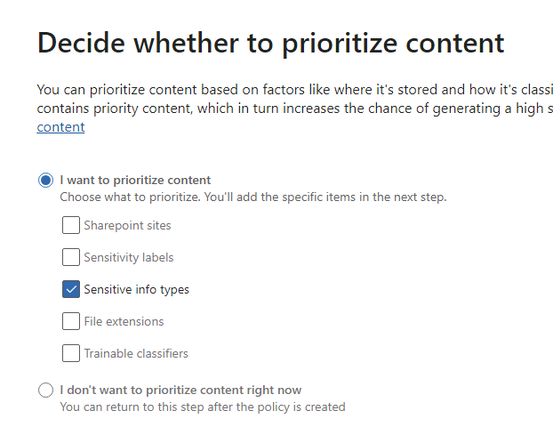
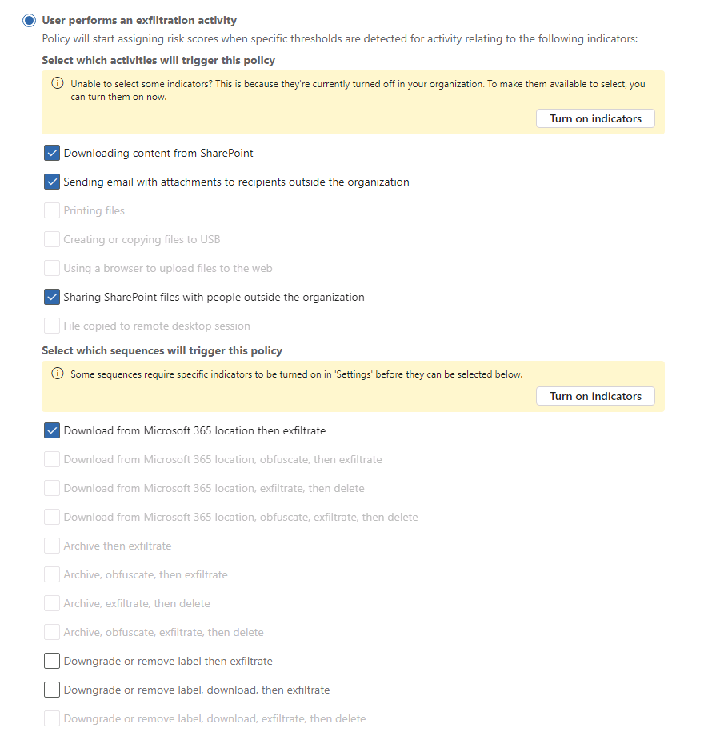
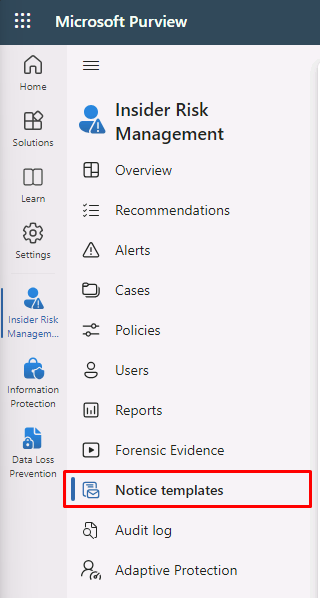

---
lab:
    title: 'Exercise 2 - Configure Insider Risk Management'
    module: 'Module 5 - Manage insider and privacy risk in Microsoft 365'
---

<!--
# Lab 5 - Exercise 2 - Configure Insider Risk Management
-->
# Exercise 5 – Configure Insider Risk Management

You are Joni Sherman, the Compliance Administrator for Contoso Ltd. Your role involves ensuring regulatory compliance and protecting sensitive information within the organization. Recently, Contoso Ltd. has recognized the need to proactively address insider risks that could potentially harm the company's reputation, compromise data security, or lead to legal issues.

To effectively manage insider risks, you implement Microsoft Purview Insider Risk Management, a comprehensive solution designed to identify, analyze, and respond to potential insider threats.

## Task 1 – Assign Insider Risk Management Role

In this exercise, you will assign the Insider Risk Management role to Joni to grant access to perform insider risk tasks in the Microsoft Purview portal.

<!--
1. Sign in to the Client 1 VM (LON-CL1) as the **lon-cl1\admin** account.

1. In Microsoft Edge, navigate to **https://purview.microsoft.com** and sign in to the Microsoft Purview portal as MOD Administrator, **admin@WWLxZZZZZZ.onmicrosoft.com** (where ZZZZZZ is your unique tenant ID provided by your lab hosting provider). Admin’s password should be provided by your lab hosting provider.
-->

1. If not still signed in, sign in to the Client 1 VM (LON-CL1) as the **lon-cl1\admin** account.

1. From the regular browser window signed in as **MOD Administrator**, go to your Purview tab. Go to https://purview.microsoft.com if previously closed.

1. Select **Settings** from the left navigation.

1. Select **Roles and scopes**, then **Role groups** from the submenu.

1. Find and select **Insider Risk Management** from the list by searching or by sorting the **Name** column.

1. Select **Edit** from the **Insider Risk Management** flyout page on the right.

1. On the **Edit members of the role group** step select **Choose users**.

1. In the **Choose users** pane, select the checkbox next to **Joni Sherman**, then select the **Select** button.

1. On the **Edit members of the role group** step select **Next**.

1. On the **Review the role group and finish** step select **Save**.

1. Select **Done** once updated.

<!--
1. Sign out of the **MOD Administrator** account and close all browser windows.
-->

You have successfully assigned the Insider Risk Management role to Joni Sherman, granting her access to perform insider risk tasks in the Microsoft Purview portal.

## Task 2 – Insider Risk Settings Configuration

In this task, you will customize the Insider risk management settings in the Microsoft Purview portal. This will allow Joni Sherman to effectively manage potential insider risks within the organization and ensure the security of sensitive information.

<!--
1. In **Microsoft Edge**, navigate to **https://purview.microsoft.com** and sign in to the Microsoft Purview portal as JoniS@WWLxZZZZZZ.onmicrosoft.com (where ZZZZZZ is your unique tenant ID provided by your lab hosting provider).
-->

1. Open the InPrivate Edge browser window that's signed in as **Joni Sherman** and go to your Purview tab. Go to https://purview.microsoft.com if previously closed.

1. Select **Settings** from the left navigation.

1. Under the **Solution settings** section, select **Insider Risk Management**.

1. Explore the settings:

    - **Analytics**: Assesses potential insider risks without configuring policies to guide policy creation.
    - **Data sharing**: Exports risk alert information to SIEM solutions using Office 365 Management Activity APIs.
    - **Inline alert customization**: Allows policy tuning and threshold adjustment directly from the Alerts dashboard.
    - **Intelligent detections**: Controls alert volume, excludes certain entities from risk scoring and allows filtering of Microsoft Defender alerts.
    - **Microsoft Teams**: Enables Microsoft Teams for collaboration on insider risk management cases.
    - **Notifications**: Automatically sends email notifications to insider risk management role groups.
    - **Policy indicators**: Involves configuring the policy template using specific risk indicators.
    - **Policy timeframes**: Defines review periods triggered by policy matches based on events and activities.
    - **Power Automate flows (preview)**: Automates insider risk management tasks using Microsoft Power Automate flows.
    - **Priority physical assets**: Identifies and monitors access to priority physical assets correlating activity to user events.
    - **Priority user groups**: Determines high-risk users for closer inspection and more sensitive risk scoring.
    - **Privacy**: Allows you to select displaying usernames or anonymized versions in alerts and cases.

1. Select **Privacy** from the Insider Risk Management settings menu.

1. Select **Do not show pseudonymized versions of usernames**, then select **Save**.

1. Select **Policy indicators** from the Insider Risk Management settings menu.

1. Select **Office indicators** to expand its menu, select the checkbox for **Select all**, and scroll down to the bottom to select **Save**.

1. Select **Priority user groups** from the Insider Risk Management settings menu.

1. Select **+ Create priority user group** to open the **New priority user group** wizard.

1. On the **Name and describe the priority user group** step, enter:

    - **Name**: Finance team
    - **Description**: Team members that manage financial operations, budgeting, and reporting

1. Select **Next**.

1. On the **Members** step, select **+ Members**.

1. On the **Members** pane select the checkbox next to **Debra Berger**, **Lynne Robbins**, and **Megan Bowen** then select **Add** to add the three members.

1. Select **Next**.

1. On **Choose who can view data involving users in this priority group** select **+ Choose users and role groups**.

1. On the **Choose users and role groups** pane select the checkbox next to **Insider Risk Management** to add all members who have the Insider Risk Management role in Purview, then select **Add**.

1. Select **Next**.

1. On the **Review** page select **Submit**.

1. Select **Done** once created. This will take you back to the Insider Risk Management settings page.

You have successfully customized the Insider Risk Management settings. Now, Joni Sherman has the necessary tools and capabilities to proactively identify and mitigate insider risks, safeguarding valuable data in the Microsoft Purview portal.

## Task 3 – Insider Risk Policy Creation

In this task, you will configure a policy named 'Financial Data Protection' in Microsoft Purview to monitor and protect sensitive financial data access within the organization.

1. You should still be signed in as **Joni Sherman** in Microsoft Purview.

1. Select **Solutions** from the left navigation bar, then select **Insider Risk Management**.

1. Select the **Policies** tab from the Insider Risk Management menu.

1. Select **+ Create policy**.

1. On the **Choose a policy template** step, select **Data leaks**, then select **Next**.

1. On the **Name your policy** step, enter:

    - **Name**: Financial Data Protection
    - **Description**: Sensitive financial data access monitoring

1. Select **Next**.

1. On the **Choose users and groups** step, leave **All users, groups, and adaptive scopes** selected, then select **Next**.

1. On the **Exclude users and groups (optional)** step, select **Next**.

1. On the **Decide whether to prioritize content** step, only enable the **Sensitive info types** checkbox then select **Next**.

    

1. On the **Sensitive info types to prioritize** step, select **+ Add or edit sensitive info type**.

1. Search for _bank_ and press **Enter**. Select the checkbox next to **U.S. Bank Account Number** and **International Banking Account Number (IBAN)**. 

1. Search for _credit_ and press **Enter**. Select the checkbox next to **Credit Card Number**, then select **Add**.

1. Verify the three sensitive info types have been added and select **Next**.

1. On the **Decide whether to score only activity with priority content** step, leave **Get alerts for all activity** selected, then select **Next**.

1. On the **Choose triggering event for this policy** step, select **User performs an exfiltration activity**.

1. Under **Select which activities will trigger this policy**, only select and enable the following:

   - **Downloading content from SharePoint**
   - **Sending email with attachments to recipients outside the organization**
   - **Sharing SharePoint files with people outside the organization**
   - **Download from Microsoft 365 location the exfiltrate**

    >**Note**: If you are unable to select policy triggers, you may have a tip to Turn on indicators. If this option is available, select **Turn on indicators**. On the **Choose indicators to turn on** pop up, click the check box next to **Select all** for **Office indicators** then select **Save**.

    

1. Select **Next**.

1. On the **Choose thresholds for triggering events** step, select **Apply built-in thresholds**, then select **Next**.

1. On the **Indicators** step, select **Physical access indicators**, then deselect **Physical access after termination or failed access to sensitive asset** if selected, then select **Next**.

1. On the **Detection options** step, ensure that **Select all** is selected for the following sections:

    - **Sequence detection**
    - **Cumulative exfiltration detection**
    - **Risk score boosters** 
    
1. Select **Next**.

1. On the **Choose threshold type for indicators** step, select **Apply thresholds provided by Microsoft**, then select **Next**.

1. On the **Review settings and finish** step, select **Submit**.

1. Select **Done** once created.

    >**Note:** As noted on this page, it may take up to 24 hours before policy matches will start showing up in the Alerts tab.

You have successfully created the 'Financial Data Protection' policy, which will help detect and prevent unauthorized access to sensitive financial information. Keep in mind that it may take up to 24 hours for policy matches to appear in the Alerts tab.

## Task 4 – Create a Notice template

In this task, you will create a notice template in Microsoft Purview's Insider Risk Management, which allows you to automatically send email messages to users when a case is generated for risk activities, serving as reminders or providing information for compliance training.

<!--
1. You should still be signed in as Joni in Microsoft Purview in Insider risk management.
-->

1. In the Insider Risk Management navigation menu, select **Notice templates**.

    >If you don't see the option, try refreshing your page.

    

1. Select **Create notice template**.

1. Fill out the necessary information with the following:

    - **Template name**: Data Leak Policy Alert
    - **Send from**: Joni Sherman
    - **Subject**: Potential Data Leak Detected
    - **Message body**:

        ````html
        <!DOCTYPE html>
        <html>
        <body>
        <h2>Alert: Potential Data Leak Detected</h2>
        <p>We detected a potential data leak associated with your account. As part of our Insider Risk Management policy, we are required to investigate any suspicious activity related to data breaches.</p>
        <p>Please review your recent actions, report any unusual behavior, and refer to the Contoso User Code of Conduct training at <a href='https://contoso.com'>https://contoso.com</a> for more information.</p>
        <p>Thank you for your cooperation,</p>
        <p><em>Human Resources</em></p>
        </body>
        </html>
        ````

1. Select **Create**.

You have successfully created the **Data Leak Policy Alert** notice template, enabling automated notifications to be sent to users when potential data leaks are detected, reinforcing security measures and promoting adherence to the Contoso User Code of Conduct.
