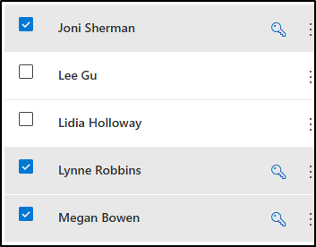
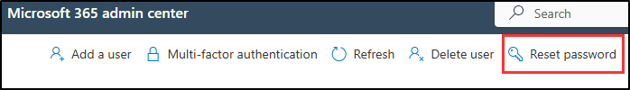
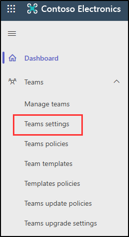

---
lab:
    title: 'Lab Setup: Preparing Your Environment for Administration'
    module: 'Module 0 - Lab Setup'
---

## WWL Tenants - Terms of use

If you are being provided with a tenant as a part of an instructor-led training delivery, please note that the tenant is made available for the purpose of supporting the hands-on labs in the instructor-led training.

Tenants should not be shared or used for purposes outside of hands-on labs. The tenant used in this course is a trial tenant and cannot be used or accessed after the class is over and are not eligible for extension.

Tenants must not be converted to a paid subscription. Tenants obtained as a part of this course remain the property of Microsoft Corporation and we reserve the right to obtain access and repossess at any time.

# Lab Setup: Preparing Your Environment for Administration

In this lab, you'll configure and prepare your environment for administration tasks. You'll activate necessary features, set up administrative permissions, and ensure proper configuration of key elements.

**Tasks:**

- Set user passwords for lab exercises
- Enable Audit in the Microsoft Purview portal
- Enable Search by Name in Microsoft Teams
- Enable information barriers in SharePoint Online and OneDrive

## Task - Set user passwords for lab exercises

In this task, you'll set passwords for the user accounts needed for the labs.

1. Log into Client 1 VM (SC-400-CL1) as the **SC-400-CL1\admin** account. The password should be provided by your lab hosting provider.

1. Open **Microsoft Edge** and navigate to **`https://admin.microsoft.com`** and log into the Microsoft 365 admin center as the MOD Administrator, `admin@WWLxZZZZZZ.onmicrosoft.com` (where ZZZZZZ is your unique tenant ID provided by your lab hosting provider).

1. On the left navigation pane, expand **Users** then select **Active users**.

1. Select the checkbox to the left of **Joni Sherman**, **Lynne Robbins**, and **Megan Bowen**.

   These accounts will be used through the lab exercises.

   

1. Select the **Reset password** button from the top, navigation ribbon to reset all three passwords.

   

1. In the **Reset Password** flyout page on the right, ensure all options are deselected.

   This will ensure that you can select a password for the three users being used for exercises, and that these passwords won't need to be reset when you first sign in.

1. In the **Password** field, enter a password you can remember to reset the user passwords to be used in future exercises.

1. At the bottom of the **Reset password** flyout page, select the **Reset password** button.

1. On the **Passwords have been reset** page, you should see the three user accounts that have been reset. At the bottom of this flyout page, select **Close**.

You have successfully reset passwords for lab exercises.

## Task - Enable Audit in the Microsoft Purview portal

In this task, you'll enable Audit in the Microsoft Purview portal to monitor portal activities.

1. You should still be logged into Client 1 VM (SC-400-CL1) as the **SC-400-CL1\admin** account and logged into Microsoft 365 with the MOD Administrator account.

1. In Microsoft Edge, navigate to the Microsoft Purview portal, `https://purview.microsoft.com`, and log in.

1. A message about the new Microsoft Purview portal will appear on the screen. Select the option to agree with the terms of data flow disclosure and the privacy statement, then select **Try now**.

    

1. Select **Solutions** from the left sidebar, then select **Audit**.

1. On the **Search** page, select the **Start recording user and admin activity** bar to enable audit logging.

    

1. Once you select this option, the blue bar should disappear from this page.

>[!alert] If you receive an error enabling Audit in this exercise, please use these steps as a work around:
>1. Open an elevated Terminal window by selecting the Windows button with the right mouse button and then select Terminal (Admin).
>1. Install the ExchangeOnlineManagement module by running `Install-Module -Name ExchangeOnlineManagement`
>1. Connect to ExchangeOnlineManagement by running `Connect-ExchangeOnline`
>1. When prompted, login by entering the administrator username and password from your lab hosting provider.
>1. To verify if Audit is enabled, run `Get-AdminAuditLogConfig | FL UnifiedAuditLogIngestionEnabled`
>1. If false, then the audit log is turned off.
>1. To enable Audit, run `Set-AdminAuditLogConfig -UnifiedAuditLogIngestionEnabled $true`
>   1. If you receive an error that you are unable to run the script in your organization, run `Enable-OrganizationCustomization`
>   1. Try again to run `Set-AdminAuditLogConfig -UnifiedAuditLogIngestionEnabled $true`
>1. To confirm Audit is enabled, run `Get-AdminAuditLogConfig | FL UnifiedAuditLogIngestionEnabled`
>1. Once complete, run `Disconnect-ExchangeOnline` to end your session

You have successfully enabled auditing in Microsoft 365.

## Task - Enable search by name in Microsoft Teams

In this task, you'll enable the **Search by name** feature in Microsoft Teams for easy user location. This is needed for configuring information barriers in a later exercise.

1. You should still be logged into Client 1 VM (SC-400-CL1) as the **SC-400-CL1\admin** account and logged into Microsoft 365 with the MOD Administrator account.

1. In **Microsoft Edge**, navigate to **`https://admin.teams.microsoft.com`**.

1. In the left navigation pane, under the **Teams** dropdown, select **Teams settings**.

    

1. Scroll down to **Search by name** section and toggle the **Scope directory search using an Exchange address book policy** to **On**.

1. Select **Save** at the bottom of the page.

1. On the **Changes might take some time to take effect** dialogue, select **Confirm**.

You have successfully enabled the search by name feature in Microsoft Teams for information barriers.

## Task - Enable information barriers in SharePoint Online and OneDrive

In this task, you'll enable information barriers in SharePoint Online and OneDrive to ensure secure collaboration.

1. You should still be logged into Client 1 VM (SC-400-CL1) as the **SC-400-CL1\admin** account.

1. Open an elevated PowerShell window by selecting the Windows button with the right mouse button and then select **Windows PowerShell (Admin)**.

1. Confirm the **User Account Control** window with **Yes**.

1. Run the following cmdlet to install the latest version of the SharePoint Online PowerShell module:

    ```powershell
    Install-Module -Name Microsoft.Online.SharePoint.PowerShell
    ```

1. If prompted to install the PowerShell NuGet provider, enter **Y** to install the provider.

1. If prompted to install from an untrusted repository, enter **Y** to install the module from the PSGallery.

1. Run the following cmdlet to connect to the admin center for SharePoint Online:

    ```powershell
     Connect-SPOService -Url https://WWLxZZZZZZ-admin.sharepoint.com
    ```

    >**Note:** Be sure to update ZZZZZZ. ZZZZZZ is your unique tenant ID provided by your lab hosting provider.

1. Login with the MOD Administrator password provided by your lab hosting provider.

1. To enable information barriers in SharePoint and OneDrive, run the following command:

    ```powershell
    Set-SPOTenant -InformationBarriersSuspension $false
    ```

1. Close the PowerShell window once this is complete.

You have successfully enabled information barriers in SharePoint Online and OneDrive.
