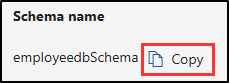

---
lab:
    title: 'Exercise 2 - Manage Sensitive Information Types'
    module: 'Module 1 - Implement Information Protection'
---


# Lab 1 - Exercise 2 - Manage sensitive information types

Contoso Ltd. previously had issues with employees accidentally sending out personal information from customers when working on support tickets in the ticketing solution. To prevent this, you need to create a custom sensitive information type to identify employee IDs in emails and documents.

**Tasks**:

1. Create custom sensitive information types
1. Create EDM-based classification information type
1. Create EDM-based classification data source
1. Create keyword dictionary
1. Test custom sensitive information types

## Task 1 – Create custom sensitive information types

In this task, you'll create a new custom sensitive information type that recognizes the pattern of employee IDs near the keywords "Employee" and "ID".

1. You should still be logged into Client 1 VM (SC-400-CL1) as the **SC-400-CL1\admin** account.

1. In **Microsoft Edge**, navigate to **`https://purview.microsoft.com`** and log into the Microsoft Purview portal as `JoniS@WWLxZZZZZZ.onmicrosoft.com` (where ZZZZZZ is your unique tenant ID provided by your lab hosting provider). Joni's password was set in a previous exercise.

1. On the left sidebar, select **Solutions** then select **Information Protection**.

1. On the left sidebar, expand **Classifiers** then select **Sensitive info types**.

1. On the **Sensitive info types** page, select **+ Create sensitive info type** to start the sensitive information type configuration.

1. On the **Name your sensitive info type** page, enter:

    - **Name**: `Contoso Employee IDs`
    - **Description**: `Pattern for Contoso employee IDs.`

1. Select **Next**.

1. On the **Define patterns for this sensitive info type** page, select **Create pattern**.

1. On the **New pattern** flyout panel on the right, select **+ Add primary element** > **Regular expression**.

1. On the **+ Add a regular expression​** flyout panel on the right, enter:

    - **ID**: `Contoso IDs`
    - **Regular expression**: `[A-Z]{3}[0-9]{6}`
    - Select the radio button for *String match*

1. Select **Done** at the bottom of the flyout panel.

1. Back on the **New pattern** flyout panel, under **Supporting elements**, select **+ Add supporting elements or group of elements** drop-down menu and select **Keyword list**.

1. On the **Add a keyword list** flyout panel on the right, enter:

    - **ID**: `Employee ID keywords`
    - **Case insensitive**:

       ```text
       Employee
       ID
       ```

    - Select the radio button for *Word match*

1. Select **Done** at the bottom of the flyout panel.

1. Back on the **New pattern** flyout panel, under **Character proximity**, decrease the **Detect primary AND supporting elements** value to `100` characters.

1. Select the **Create** button at the bottom of the flyout panel.

1. Back on the **Define patterns for this sensitive info type** page select **Next**.

1. On the **Choose the recommended confidence level to show in compliance policies** page use the default value and select **Next**.

1. On the **Review settings and finish** page review the settings and select **Create**. When successfully created select **Done**.

1. Sign out of Joni's account by selecting the profile picture of Joni Sherman in the top right. Select **Sign out**, then close the browser window.

1. Close the browser window then open a new browser window.

You have successfully created a new sensitive information type to identify employee IDs in the pattern of three uppercase characters, six numbers, and the keywords 'Employee' or 'IDs' within a range of 100 characters.

## Task 2 – Create EDM-based classification information type

In this task, you'll create an Exact Data Match (EDM) based classification with a database schema of employee data.

1. You should still be logged into Client 1 VM (SC-400-CL1) as the **SC-400-CL1\admin** account.

1. Open **Microsoft Edge** then navigate to **`https://admin.microsoft.com`**.

1. When the **Pick an account** page is displayed, select **Use another account** and sign in as **MOD Administrator** `admin@WWLxZZZZZZ.onmicrosoft.com` (where ZZZZZZ is your unique tenant ID provided by your lab hosting provider).  Admin's password should be provided by your lab hosting provider.

1. From the left pane, expand **Teams & groups** then select **Active teams & groups**.

1. On the **Active teams and groups** page, on the top navigation ribbon, select **Security groups** then select **+ Add a security group**.

    

1. On the **Set up the basics** screen, enter the following:

    - **Name**: `EDM_DataUploaders`
    - **Description**: `People who upload data for EDM.`

1. Select **Next**.

1. On the **Edit settings** page, leave the default settings, then select **Next**.

1. On the **Review and finish adding group** page, review your settings and select **Create group**.

1. On the **EDM_DataUploaders group created** page, select **Close**.

1. Back on the **Active teams and groups** page, ensure the **Security** tab is selected from the top navigation ribbon, then select the **Refresh** button to display the newly created security group. Select the **EDM_DataUploaders** group from the list to open the **EDM_DataUploaders** flyout panel on the right.

1. Select the **Members** tab then select **View all and manage members**.

1. On the **Members** page select **+ Add members**.

1. On the **Add members** page, select the checkbox to the left of **Joni Sherman**, then select the **Add (1)** button at the bottom of the flyout panel.

1. Verify **Joni Sherman** is listed below **Members**, then close the flyout panel by selecting the **X** on the top right of the flyout panel.

1. Sign out of the Mod Administrator account by selecting the MA icon on the top right of the window, then selecting **Sign out**.

1. Close the browser window and open a new one.

1. Navigate to the Microsoft Purview portal at `https://purview.microsoft.com`.

1. When the **Pick an account** page is displayed, select **Joni Sherman** and sign in.

1. Navigate to **Information Protection** by selecting **Solutions** > **Information Protection** from the left sidebar.

1. On the **Information Protection** page, expand **Classifiers** then select **EDM classifiers**.

1. On the **EDM classifiers** page, select **+ Create EDM classifier**.

1. Examine the **Familiarize yourself with the steps needed to put your classifier to work** to understand the workflow for creating EDM classifiers, then select **Create EDM classifier**.

1. On the **Name and describe your EDM classifier** page, enter:

    - **Name**: `employeedb`
    - **Description**: `Employee Database schema`

1. Select **Next**.

1. On the **Choose a method for defining your schema** page, select **Manually define your data structure**, then select **Next**.

1. On the **Define columns that contain the data you want to detect**, enter these columns:

   - `Name`
   - `BirthDate`
   - `StreetAddress`
   - `EmployeeID`

   You should have four columns. You'll need to select the **+ Add column** button to add new fields for new columns.

      

1. Select **Next**.

1. On the **Select primary elements** page, for the **EmployeeID** column, expand the **Match mode** dropdown here **Single-token** is displayed, and select the **+** (plus sign) for **Choose a SIT**.

      

1. On the **Choose a sensitive info type for "EmployeeID"** flyout panel on the right, in the search bar, search for `Contoso`.

1. The **Contoso Employee IDs** sensitive info type created in a previous task should be displayed. Select the checkbox to the left of this sensitive info type, then select **Save**.

1. Back on the **Select primary elements** page, select the checkbox to the right of **EmployeeID** to identify this field as a **Primary element**.

      

1. Select **Next**.

1. On the **Configure settings for data in selected columns**, ensure the toggle is set to **Yes** for **Use the same settings for all columns**.

1. Select the checkbox for **Ignore delimiters and punctuation for data in all columns**.

1. Select the dropdown for **Choose delimiters and punctuation to ignore** dropdown and select *Hyphen*, *Period*, *Space*, *Open parenthesis* and *Close parenthesis*, then select **Next**.

1. On the **Configure detection rules for primary elements**, leave the default configuration, then select **Next**.

1. On the **Review settings and finish** page, select **Submit**.

1. On the **You successfully created an EDM classifier** page, be sure to copy and paste the **Schema name** to use in the next task.

      

1. Once you've captured the schema name, select **Done**.

1. Leave the browser open with the Microsoft Purview portal.

You have successfully created a new EDM-based classification sensitive information type for identifying employee data from a database file source.

## Task 3 – Create EDM-based classification data source

In this task, you'll hash and upload the actual data for the EDM-based classification sensitive information type via the EDM Upload Agent tool.

1. You should still be logged into Client 1 VM (SC-400-CL1) as the **SC-400-CL1\admin** account, and you should be logged into Microsoft 365 as **Joni Sherman**.

1. In **Microsoft Edge**, navigate to **`https://go.microsoft.com/fwlink/?linkid=2088639`** to download the EDM upload agent.

1. Once the download is complete, select **Open file** in the Microsoft Edge browser window to open the **Microsoft Exact Data Match Upload Agent Setup** wizard.

1. On the **Welcome to the Microsoft Exact Data Match Upload Agent Setup Wizard** page, select **Next**.

1. On the **End-User License Agreement** page, select the **I accept the terms in the License Agreement** checkbox, then select **Next**.

1. On the **Destination Folder** page, don't change the default destination path, then select **Next**.

1. On the **Ready to install Microsoft Exact Data Match Upload Agent** page, select **Install**.

1. If the **User Account Control** window pops up, select **Yes** to allow this application to make changes to your device.

1. When the installation finishes, select **Finish** on the **Completed the Microsoft Exact Data Match Upload Agent Setup Wizard** page.

1. In your task bar, search for `Notepad` in the search field. Select the **Notepad** app from the **Best match** section of the search.

1. In Notepad, enter:

    ``` text
    Name,Birthdate,StreetAddress,EmployeeID
    Joni Sherman,01.06.1980,1 Main Street,CSO123456
    Lynne Robbins,31.01.1985,2 Secondary Street,CSO654321
    ```

1. In Notepad, select **File** and **Save As** to save the file.

1. Select **Documents** from the left side pane and enter `EmployeeData.csv` as the **File name**, then select **Save**.

1. Close the Notepad window.

1. right click the Windows symbol in the task bar and select **Terminal (Admin)**.

1. If the **User Account Control** window pops up, select **Yes** to allow this application to make changes to your device.

1. In the terminal window, navigate to the EDM Upload Agent directory:

    ``` powershell
    cd "C:\Program Files\Microsoft\EdmUploadAgent"
    ```

1. Authorize with your account to upload the database to your tenant by running this cmdlet:

    ``` powershell
    .\EdmUploadAgent.exe /Authorize
    ```

1. When the **Pick an account** window is displayed, sign in as `JoniS@WWLxZZZZZZ.onmicrosoft.com` (where ZZZZZZ is your unique tenant ID provided by your lab hosting provider). Joni's password was set in a previous exercise.

1. Back in the terminal window, download the database schema definition of the EDM-based classification sensitive information type by running this script in PowerShell. For the **DataStoreName**, this is where you'll use the schema name saved from the previous task.

    ``` powershell
    .\EdmUploadAgent.exe /SaveSchema /DataStoreName employeedbSchema /OutputDir "C:\Users\Admin\Documents\"
    ```

    You should get a message that the command completed successfully.

    > **Note**: If the last command fails, it possibly takes more time until the **EDM_DataUploaders** group membership is applied. It can take up to one hour until it is possible to download the schema file.  If it fails proceed to the next task and return to this step later.

1. Hash the database file and upload it to the EDM-based classification sensitive information type by running the following script in PowerShell:

    ``` powershell
    .\EdmUploadAgent.exe /UploadData /DataStoreName employeedbSchema /DataFile "C:\Users\Admin\Documents\EmployeeData.csv" /HashLocation "C:\Users\Admin\Documents\" /Schema "C:\Users\Admin\Documents\employeedbSchema.xml"
    ```

    You should get a message that the command completed successfully.

1. Check the upload progress with this command:

    ``` powershell
    .\EdmUploadAgent.exe /GetSession /DataStoreName employeedbSchema
    ```

1. In the terminal window, once the status is **Completed**, your EDM data is ready for use.

    Alternatively, you can also refresh the **EDM classifiers** window in the Microsoft Purview portal to check the status of the hash. Once the status is set to **Index complete** the hash is complete.

    > **Note**: This process time, and you might have to run the GetSession script or refresh the EDM classifiers page a few times before the status shows the hash is complete.

    

    

1. Close the PowerShell window.

You have successfully hashed and uploaded a database file for an EDM-based classification sensitive information type.

## Task 4 – Create keyword dictionary

Several violations of personal information leakage happened when users sent out emails after colleagues reported on sick leave. When that happened the reason for illness or disease was sent out. We don't want that to happen. In this task, you'll create a keyword dictionary to prevent personal information leakage in emails.

1. You should still be logged into Client 1 VM (SC-400-CL1) as the **SC-400-CL1\admin** account, and you should be logged into Microsoft 365 as **Joni Sherman**.

1. The Microsoft Purview portal should still be to the EDM classifiers page in Microsoft Edge. If not, in Microsoft Edge, navigate to `https://purview.microsoft.com` > **Solutions** > **Information protection**.

1. In the left sidebar, expand **Classifiers** then select **Sensitive info types**.

1. Select **+ Create sensitive info type** to open the configuration for a new sensitive information type.

1. On the **Name your sensitive info type** page, enter:

    - **Name**: `Contoso Diseases List`
    - **Description**: `List of possible diseases of employees`.

1. Select **Next**.

1. On the **Define patterns for this sensitive info type** page, select **+ Create pattern**.

1. On the **New pattern** flyout panel on the right, under **Primary element** select **+ Add primary element**, then select **Keyword dictionary**.

1. On the **Add a keyword dictionary** page enter:

   - **Name**: `Diseases Dictionary`
   - **Keywords**:

    ```text
    flu
    influenza
    cold
    bronchitis
    otitis
    ```

1. Select **Done** at the bottom of the flyout panel.

1. Back on the **New pattern** page, under **Supporting elements**, select **+ Add supporting elements or group of elements**, then select **Keyword list** to add additional support for the keyword dictionary.

1. On the **Add a keyword list** page enter:

   - **ID**: `Employee absence`
   - **Case insensitive**:

    ``` text
    employee
    absence
    reason
    ```

1. Select **Done** at the bottom of the flyout panel.

1. Back on the **New pattern** page, review the configuration and select **Create**.

1. Back on the **Define patterns for this sensitive info type** select **Next**.

1. On the **Choose the recommended confidence level to show in compliance policies**, leave the default value, then select **Next**.

1. On the **Review settings and finish** page, review your settings and select **Create**. Once your sensitive info type is created, select **Done** on the **Your sensitive info type is created** page.

1. Leave the browser window in the Microsoft Purview portal open.

You have successfully created a new sensitive information type based on a keyword dictionary and added more keywords to decrease the false positive rate.

## Task 5 – Test custom sensitive information types

Custom sensitive information types should always be tested before using them in policies otherwise data loss or leakage may occur due to a malfunctioning custom search pattern. In this task, you'll test the custom sensitive information types to ensure they recognize the desired patterns.

1. You should still be logged into Client 1 VM (SC-400-CL1) as the **SC-400-CL1\admin** account, and you should be logged into Microsoft 365 as **Joni Sherman**.

1. In your task bar, search for `Notepad` in the search field. Select the **Notepad** app from the **Best match** section of the search.

1. In Notepad, enter:

    ``` text
    Employee Joni Sherman EMP123456 is absent because of the flu/influenza.
    ```

1. Select **File** > **Save As**.

1. Select **Documents** on the left side pane and enter `SickTestData` as the **File name**, then select **Save**.

1. Close the Notepad window.

1. Back in **Microsoft Edge**, Microsoft Purview portal should still be open on the Sensitive info types page.

1. In the **Search** bar on the upper right, enter `Contoso` and press Enter.

1. Select **Contoso Employee IDs**.

1. Select **Test**.

1. On the **Upload file to test "Contoso Employee IDs"** flyout panel on the right, select **Upload file**.

1. Select **Documents** from the left pane, select the *SickTestData.txt* file, then select **Open**.

1. Select **Test** to start the analysis.

1. On the **Match results** page, review the matches, then select **Finish** to end the test.

1. Navigate back to **Sensitive info types** and search for `Contoso` again.

1. This time select the **Contoso Diseases List** sensitive info type, then select **Test**.

1. On the **Upload file to test "Contoso Diseases List"** flyout panel on the right, select **Upload file**.

1. On the **Upload file to test** pane, select **Upload file**.

1. Select **Documents** from the left pane, select the *SickTestData.txt* file, then select **Open**.

1. Select **Test** to start the analysis.

1. On the **Match results** page, review the matches, then select **Finish** to end the test.

You have successfully tested the two custom sensitive information types and validated the search pattern recognizes the desired patterns.
