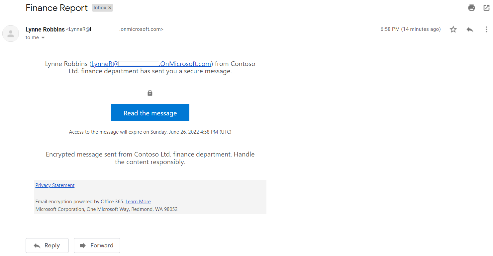

# Lab 1 Exercise 2 - Manage Office 365 Message Encryption

The first setting Joni Sherman needs to configure and test with her pilot team is the Microsoft 365 built-in Office 365 Message Encryption (OME). For this purpose, she will modify the default template and create a new branding template, that will be assigned to one of the pilot users. The pilot users will then test the OME functionality with their accounts.

### Task 1 – Verify Azure RMS functionality

In this task, you will install the Exchange Online PowerShell module and verify the correct Azure RMS functionality of your tenant in context of Joni Sherman, who was assigned the role of the Compliance Administrator in the last exercise.

1. You should still be logged into your Client 1 VM (LON-CL1) as the **lon-cl1\admin** account.

2. Open an elevated PowerShell window by selecting the Windows button with the right mouse button and then select **Windows PowerShell (admin)**.

3. Confirm the **User Account Control** window with **Yes**.

4. Enter the following cmdlet to install the latest Exchange Online PowerShell module version:

    `Install-Module ExchangeOnlineManagement`

5. Confirm the NuGet provider security dialog with **Y** for Yes and press **Enter**. This process may take some seconds to complete.

6. Confirm the Untrusted repository security dialog with **Y** for Yes and press **Enter**.  This process may take some seconds to complete.

7. Enter the following cmdlet to change your execution policy and press **Enter**

    `Set-ExecutionPolicy -ExecutionPolicy RemoteSigned -Scope CurrentUser`

8. Confirm the Execution Policy Change with  **Y** for Yes and press **Enter**. 

9. Close the PowerShell window.

10. Open a regular PowerShell window, by selecting the Windows button with the right mouse button and select **Windows PowerShell**.

11. Enter the following cmdlet to use the Exchange Online PowerShell module and connect to your tenant:

    `Connect-ExchangeOnline`

12. When the **Sign in** window is displayed, sign in as sign in as JoniS@WWLxZZZZZZ.onmicrosoft.com (where ZZZZZZ is your unique tenant ID provided by your lab hosting provider).  Joni's password should be provided by your lab hosting provider.

13. Verify Azure RMS and IRM is activated in your tenant by using the following cmdlet and press **Enter**:

    `Get-IRMConfiguration | fl AzureRMSLicensingEnabled`

14. Test the Azure RMS templates used for Office 365 Message Encryption against the other pilot user **Megan Bowen** by using the following cmdlet and press **Enter**:

    `Test-IRMConfiguration -Sender MeganB@contoso.com -Recipient MeganB@contoso.com`

    

15. Verify all tests are in the status PASS and no errors are shown.

16. Leave the PowerShell window open.

You have successfully installed the Exchange Online PowerShell module, connected to your tenant, and verified the correct functionality of Azure RMS.

### Task 2 – Modify default OME template

There is a requirement in your organization to restrict trust for foreign identity providers, such as Google or Facebook. Because these social IDs are activated by default for accessing messages protected with OME, you need to deactivate the use of social IDs for all users in your organization.  

1. You should still be logged into your Client 1 VM (LON-CL1) as the **lon-cl1\admin** account and there should still be an open PowerShell window with Exchange Online connected.

2. Run the following cmdlet to view the default OME configuration:

    `Get-OMEConfiguration -Identity "OME Configuration" |fl`

3. Review the settings and confirm that the SocialIdSignIn parameter is set to True.

4. Run the following cmdlet to restrict the use of social IDs for accessing messages from your tenant protected with OME:

    `Set-OMEConfiguration -Identity "OME Configuration" -SocialIdSignIn:$false`

5. Confirm the warning message for customizing the default template with **Y** for Yes and press **Enter**.

6. Check the default configuration again and validate, the SocialIdSignIn parameter is now set to False.

    `Get-OMEConfiguration -Identity "OME Configuration" |fl`

7. Notice the result should show the SocialIDSignIn is set to False. Leave the PowerShell window and client open.

You have successfully deactivated the usage of foreign identity providers, such as Google and Facebook in Office 365 Message Encryption.

### Task 3 – Test default OME template

You must confirm that no social IDs dialog is displayed for external recipients when receiving a message protected with Office 365 Message Encryption from users of your tenant.

1.	Log into the Client 2 VM (LON-CL2) as the **lon-cl2\admin** account.

2.	Open **Microsoft Edge** from the taskbar and when a **Welcome to the new Microsoft Edge** windows is displayed, select **Complete setup** if it appears.

3. Select **Confirm** to accept the default browser settings and **Continue without signing in** if it appears.

4. In **Microsoft Edge**, navigate to **https://outlook.office.com** and log into Outlook on the web as LynneR@WWLxZZZZZZ.onmicrosoft.com (where ZZZZZZ is your unique tenant ID provided by your lab hosting provider).  Lynne Robin's password should be provided by your lab hosting provider. Hint: usually it's the same as the MOD admin's password in your lab tenant.

5. On the **Stay signed in?** dialog box, select the **Don’t show this again** checkbox and then select **No**.

6. Select **Save** in the **Save password** dialog, to save the pilot users password in your browser.

7. If a **Translate page from...** window is shown, select the arrow down and select **Never translate from...**.

8. Select **New message** from the upper left side part of Outlook on the web.

9. In the **To** line enter your personal or other third-party email address that is not in the tenant domain. Enter **Secret Message** to the subject line and **My super-secret message.** to the body.

10. From the top pane, select **Encrypt** to encrypt the message.  Once you've successfully encrypted the message, you should see a notice that says something like "...This message is encrypted."

11. Select **Send** to send the message.

12. Sign in to your personal email account and open the message from Lynne Robbins.  If you sent this email to a Microsoft account (like @outlook.com) the encryption may be processed automatically and you will see the message automatically.  If you sent the email to another email service (like @google.com), you may have to perform the next steps to process the encryption and read the message.

13. Select **Read the message**.

14. Without having social IDs activated, there is no button to authenticate with your Google account.

15. Select **Sign in with a One-time passcode** to receive a limited time passcode.

16. Go to your personal email portal and open the message with subject **Your one-time passcode to view the message**.

17. Copy the passcode, paste it in to the OME portal and select **Continue**.

18. Review the encrypted message.

You have successfully tested the modified default OME template with deactivated social IDs.

### Task 4 – Create custom branding template

Protected messages sent by your organizations finance department require a special branding, including customized introduction and body texts and a Disclaimer link in the footer. The finance messages shall also expire after seven days. In this task, you will create a new custom OME configuration and create a transport rule to apply the OME configuration to all mails sent from the finance department.

1. You should still be logged into your Client 1 VM (LON-CL1) as the **lon-cl1\admin** account and there should still be an open PowerShell window with Exchange Online connected.

2. Run the following cmdlet to create a new OME configuration:

    `New-OMEConfiguration -Identity "Finance Department" -ExternalMailExpiryInDays 7` 

3. Confirm the warning message for customizing the template with **Y** for Yes and press **Enter**. 

4. Change the introduction text message with the following cmdlet:

    `Set-OMEConfiguration -Identity "Finance Department" -IntroductionText " from Contoso Ltd. finance department has sent you a secure message."`

5. Confirm the warning message for customizing the template with **Y** for Yes and press **Enter**.

6. Change the body email text of the message with the following cmdlet:

    `Set-OMEConfiguration -Identity "Finance Department" -EmailText "Encrypted message sent from Contoso Ltd. finance department. Handle the content responsibly."`

7. Confirm the warning message for customizing the template with **Y** for Yes and press **Enter**.

8. Change the disclaimer URL to point to Contoso's privacy statement site:

    `Set-OMEConfiguration -Identity "Finance Department" -PrivacyStatementURL "https://contoso.com/privacystatement.html"`

9. Confirm the warning message for customizing the template with **Y** for Yes and press **Enter**..

10. Use the following cmdlet to create a mail flow rule, which applies the custom OME template to all messages sent from the finance team.  This process may take a few seconds to complete.

    `New-TransportRule -Name "Encrypt all mails from Finance team" -FromScope InOrganization -FromMemberOf "Finance Team" -ApplyRightsProtectionCustomizationTemplate "Finance Department" -ApplyRightsProtectionTemplate Encrypt`

11. Type the following cmdlet to verify changes.
    `Get-OMEConfiguration -Name "Finance Department"` | Format-List
    
12. Leave the PowerShell open.

You have successfully created a new transport rule that applies the custom OME template automatically, when a member of the finance department sends a message to external recipients.

### Task 5 – Test the custom branding template

To validate the new custom OME configuration, you need to use the account of Lynne Robbins again, who is a member of the finance team.

1. You should still be logged into your Client 2 VM (LON-CL2) as the **lon-cl2\admin** account, and you should be logged into Microsoft 365 as **Lynne Robbins**. 

3. Select the **Outlook** symbol from the left navigation pane.

4. Select **New message** from the upper left side part of Outlook on the web.

5. In the **To** line enter your personal or other third-party email address that is not in the tenant domain. Enter *Finance Report* to the subject line and enter *Secret finance information.* to the body.

6. Select **Send** to send the message.

7. Sign in to your personal email account and open the message from Lynne Robbins.

8. You should see a message from Lynne Robbins that looks like the image below.  Select **Read the message**.

    

9. The customized OME configuration has social IDs activated, because both options are available. Select **Sign in with a One-time passcode** to receive a limited time passcode.

10. Go to your personal email portal and open the message with subject **Your one-time passcode to view the message**.

11. Copy the passcode, paste it in to the OME portal and select **Continue**.

12. Review the encrypted message with custom branding.

You have successfully tested the new customized OME template. 

# Proceed to Exercise 3 
