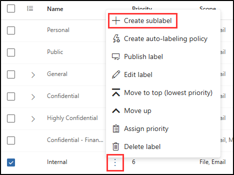
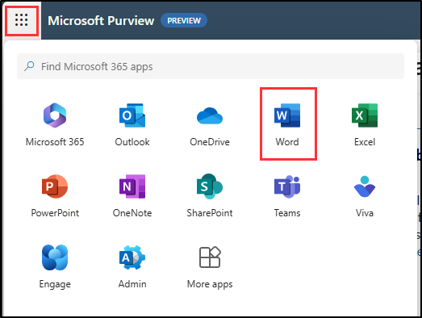
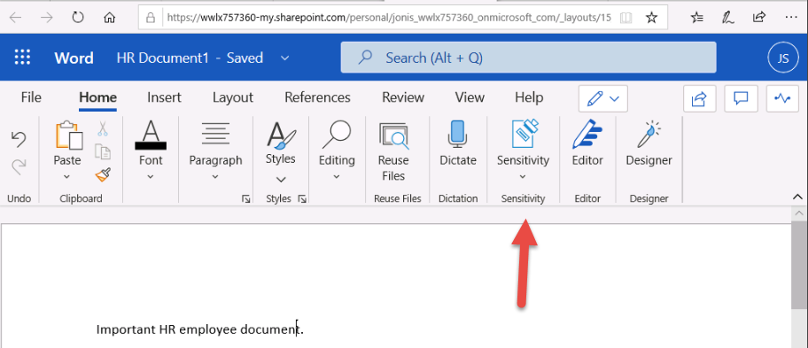

---
lab:
    title: 'Exercise 4 - Manage Sensitivity Labels'
    module: 'Module 1 - Implement Information Protection'
---

# Lab 1 - Exercise 4 - Manage sensitivity labels

Joni Sherman, the System Administrator for Contoso Ltd., is implementing a sensitivity labeling plan to ensure that all employee documents in the HR department are appropriately labeled according to the company's information protection policies. Contoso Ltd. is based in Rednitzhembach, Germany, and aims to comply with internal data handling standards and regional regulations.

**Tasks**:

1. Enable support for sensitivity labels
1. Create sensitivity labels
1. Publish sensitivity labels
1. Apply sensitivity labels
1. Configure auto labeling

## Task 1 – Enable support for sensitivity labels

In this task, you'll install the necessary modules and enable support for sensitivity labels on your tenant.

1. You should still be logged into Client 1 VM (SC-400-CL1) as the **SC-400-CL1\admin** account.

1. Open an elevated PowerShell window by right clicking the Windows button in the task bar, then select **Terminal (Admin)**.

1. Confirm the **User Account Control** window with **Yes** and press Enter.

1. Run the **Install-Module** cmdlet to install the latest MS Online PowerShell module version:

    ```powershell
    Install-Module -Name MSOnline
    ```

1. Confirm the Nuget security dialog and the Untrusted repository security dialog with **Y** for Yes and press Enter. This might take a while to complete processing.

1. Run the **Install-Module** cmdlet to install the latest SharePoint Online PowerShell module version:

    ```powershell
    Install-Module -Name Microsoft.Online.SharePoint.PowerShell
    ```

1. Confirm the Untrusted repository security dialog with **Y** for Yes and press Enter.

1. Run the **Connect-MsolService** to connect to the MS Online service:

    ```powershell
    Connect-MsolService
    ```

1. In the **Sign into your account** form, sign in as **Joni Sherman** `JoniS@WWLxZZZZZZ.onmicrosoft.com` (where ZZZZZZ is your unique tenant ID provided by your lab hosting provider). Joni's password was set in a previous exercise.

1. After signing in, navigate back to the terminal window.

1. Run the **Get-Msoldomain** cmdlet and save the domain as a variable:

    ```powershell
    $domain = get-msoldomain
    ```

1. Use the _$domain_ variable created in the previous step to create a new variable for _$adminurl_:

    ```powershell
    $adminurl = "https://" + $domain.Name.split('.')[0] + "-admin.sharepoint.com"
    ```

1. Run the **Connect-SPOService** cmdlet using the _$adminurl_ variable created in the previous step:

    ```powershell
    Connect-SPOService -url $adminurl
    ```

1. In the **Sign into your account** form, sign in as **MOD Administrator**. `admin@WWLxZZZZZZ.onmicrosoft.com` (where ZZZZZZ is your unique tenant ID provided by your lab hosting provider). Admin's password should be provided by your lab hosting provider.

1. After signing in, navigate back to the terminal window.

1. Run the **Set-SPOTenant** cmdlet to enable support for sensitivity labels:

    ```powershell
    Set-SPOTenant -EnableAIPIntegration $true
    ```

1. Confirm the changes with **Y** for Yes and press Enter.

1. Close the PowerShell window.

You have successfully enabled support for sensitivity labels for Teams and SharePoint sites.

## Task 2 – Create sensitivity labels

In this task, your HR department has requested a sensitivity label to apply to HR employee documents. You'll create a sensitivity label for internal documents and a sublabel for the HR department.

1. You should still be logged into Client 1 VM (SC-400-CL1) as the **SC-400-cl1\admin** account.

1. Open **Microsoft Edge** and navigate to **`https://purview.microsoft.com`**. Log into Microsoft Purview as **Joni Sherman** `JoniS@WWLxZZZZZZ.onmicrosoft.com` (where ZZZZZZ is your unique tenant ID provided by your lab hosting provider). Joni's password was set in a previous exercise.

1. In the Microsoft Purview portal, select **Solutions** from the left sidebar, then select **Information Protection**.

1. On the **Microsoft Information Protection** page, on the left sidebar, select **Sensitivity labels**.

1. On the **Sensitivity labels** page select **+ Create a label**.

1. The **New sensitivity label** configuration will start. On the **Provide basic details for this label**, enter:

    - **Name**: `Internal`
    - **Display name**: `Internal`
    - **Description for users**: `Internal sensitivity label.`
    - **Description for admins**: `Internal sensitivity label for Contoso.`

1. Select **Next**.

1. On the **Define the scope for this label** page, select **Items**, then select **Files** and **Emails**. If the checkbox for **Meetings** is selected, make sure it's deselected.

1. Select **Next**.

1. On the **Choose protection settings for labeled items** page, select **Next**.

1. On the **Auto-labeling for files and emails** page, select **Next**.

1. On the **Define protection settings for groups and sites** page, select **Next**.

1. On the **Auto-labeling for schematized data assets (preview)** page, select **Next**.

1. On the **Review your settings and finish** page, select **Create label**.

1. On the **Your sensitivity label was created** page, select **Don't create a policy yet**, then select **Done**.

1. On the **Sensitivity labels** page, find the newly created **Internal** sensitivity label. Select the vertical ellipsis (**...**) next to it, then select **+ Create sublabel** from the dropdown menu.

    

1. The **New sensitivity label** wizard will start. On the **Provide basic details for this label** page enter:

   - **Name**: `Employee data (HR)`
   - **Display name**: `Employee data (HR)`
   - **Description for users**: `This HR label is the default label for all specified documents in the HR Department.`
   - **Description for admins**: `This label is created in consultation with Ms. Jones (Head of HR department). Contact her, when you want to change settings of the label.`

1. Select **Next**.

1. On the **Define the scope for this label** page, select **Items**, then select **Files** and **Emails**. If the checkbox for **Meetings** is selected, make sure it's deselected.

1. Select **Next**.

1. On the **Choose protection settings for labeled items** page, select the **Control access** option, then select **Next**.

1. On the **Access control** page, select **Configure access control settings**.

1. Configure the encryption settings with these options:

   - **Assign permissions now or let users decide?**: Assign permissions now
   - **User access to content expires**: Never
   - **Allow offline access**: Only for a number of days
   - **Users have offline access to the content for this many days**: 15
   - Select the **Assign permissions** link. On the **Assign permissions** flyout panel, select the **+ Add any authenticated users**, then select **Save** to apply this setting.

1. On the **Access control** page, select **Next**.

1. On the **Auto-labeling for files and emails** page, select **Next**.

1. On the **Define protection settings for groups and sites** page, select **Next**.

1. On the **Auto-labeling for schematized data assets (preview)** page, select **Next**.

1. On the **Review your settings and finish** page, select **Create label**.

1. On the **Your sensitivity label was created** page, select **Don't create a policy yet**, then select **Done**.

You have successfully created a sensitivity label for your organizations internal policies and a sensitivity sublabel for the Human Resources (HR) department.

## Task 3 – Publish sensitivity labels

You will now publish the Internal and HR sensitivity label so that the published sensitivity labels will be available for the HR users to apply to their HR documents.

1. You should still be logged into Client 1 VM (SC-400-CL1) as the **SC-400-cl1\admin** account, and you should be logged into Microsoft Purview as **Joni Sherman**.

1. In **Microsoft Edge**, the Microsoft Purview portal tab should still be open. If not, navigate to **`https://purview.microsoft.com`** > **Solutions** > **Information Protection** > **Sensitivity labels**.

1. On the **Sensitivity labels** page select **Publish label**.

1. The publish sensitivity labels configuration will start.

1. On the **Choose sensitivity labels to publish** page, select the **Choose sensitivity labels to publish** link.

1. On the **Sensitivity labels to publish** flyout panel, select the **Internal** and **Internal/Employee Data (HR)** checkboxes, then select **Add** at the bottom of the flyout panel.

1. Back on the **Choose sensitivity labels to publish** page, select **Next**.

1. On the **Assign admin units** page, select **Next**

1. On the **Publish to users and groups** page, select **Next**.

1. On the **Policy settings** page, select **Next**.

1. On the **Default settings for documents** select **Next**.

1. On the **Default settings for emails** select **Next**.

1. On the **Default settings for meetings and calendar events** select **Next**.

1. On the **Default settings for Power BI Content** select **Next**.

1. On the **Name your policy** page, enter:

   - **Name**: `Internal HR employee data`
   - **Enter a description for your sensitivity label policy**: `This HR label is to be applied to internal HR employee data.`

1. Select **Next**.

1. On the **Review and finish** page, select **Submit**.

1. On the **New policy created**, select **Done** to finish publishing your label policy.

You have successfully published the Internal and HR sensitivity labels. Note that it can take up to 24 hours for changes to replicate to all users and services.

## Task 4 – Apply sensitivity labels

In this task, you will create sensitivity labels in Word and Outlook emails. The document created will be stored in OneDrive and sent to an HR employee via email.

1. You should still be logged into Client 1 VM (SC-400-CL1) as the **SC-400-cl1\admin** account, and you should be logged into Microsoft 365 as **Joni Sherman** `JoniS@WWLxZZZZZZ.onmicrosoft.com` (where ZZZZZZ is your unique tenant ID provided by your lab hosting provider). Joni's password was set in a previous exercise.

1. In **Microsoft Edge**, open a new Word document by selecting the meatball menu in the top left and selecting **Word**.

    

1. Select **Blank document** to create a new document.

1. On the **Your privacy option** dialogue, select **Close**.

1. Enter this text in the new blank document:

   `Important HR employee document.`

1. Select **Sensitivity** from the navigation ribbon and select **Internal** > **Employee Data (HR)** to apply the newly created sensitivity label to this document.

    

    >**Note:** It can take 24-48 hours for newly published sensitivity labels to be available for application. If the newly created sensitivity labels aren't available, you can use **Confidential** > **All Employees** for this exercise.

1. In the upper left of the document, select **Document** to rename this file, and rename it to **`HR Document`**. Press enter to apply this name change.

    

1. Close the tab to return to the Word Online tab. Select the meatball menu on the top left and select **Outlook** to open Outlook on the web.

1. In Outlook on the web, select **New mail**.

1. In the **To** field enter the name: **`Allan`** and select **Allan Deyoung** from the drop-down list.

1. In the subject line, enter: **`Employee data for HR`**

1. In the body of the email, enter:

    ``` text
    Dear Mr. Deyoung, 

    Please find attached the important HR employee document. 

    Kind regards,

    Joni Sherman
    ```

1. Select the paperclip symbol from the top navigation ribbon to add an attachment. Under **Suggested files** select **HR Document.docx**.

1. Select **Send** to send out the email message with attached document.

You have successfully created an HR Word document with a sensitivity label, which was saved onto your OneDrive. You then emailed to document to an HR staff member where the email was also set with a sensitivity label.

## Task 5 – Configure auto labeling

In this task, you'll create a sensitivity label that will auto label documents and emails found to contain information related to the European General Data Protection Regulation (GPDR).

1. You should still be logged into Client 1 VM (SC-400-CL1) as the **SC-400-cl1\admin** account.

1. In **Microsoft Edge**, navigate to **`https://purview.microsoft.com`** and log into the Microsoft Purview portal as **Joni Sherman**.

1. In the Microsoft Purview portal, select **Solutions** from the left side bar, then select **Information protection**. Select **Sensitivity labels**.

1. On the **Sensitivity labels** page, find the newly created **Internal** sensitivity label. Select the vertical ellipsis (**...**) next to it, then select **+ Create sublabel** from the dropdown menu.

1. The **New sensitivity label** configuration will start. On the **Provide basic details for this label** page, enter:

   - **Name**: `GDPR Germany`
   - **Display name**: `GDPR Germany`
   - **Description for users**: `This document or email contains data related to the European General Data Protection Regulation (GPDR) for the region Germany.`
   - **Description for admins**: `This label is auto applied to German GDPR documents.`

1. Select **Next**.

1. On the **Define the scope for this label** page, select **Items**, then select **Files** and **Emails**. If the checkbox for **Meetings** is selected, make sure it's deselected.

1. Select **Next**.

1. On the **Choose protection settings for labeled items** page, select **Next**.

1. On the **Auto-labeling for files and emails** page, set the **Auto-labeling for files and emails** to enabled.

1. In the **Detect content that matches these conditions** section, select **+ Add condition** > **Content contains**.

1. In **Content contains** section select the **Add** > **Sensitive info types**.

1. In the **Sensitive info types** flyout panel, search for `German` to display sensitive info types related to Germany.

1. Select the checkbox next to the **Name** field to select all sensitive info types related to German, then select **Add**.

    

1. Back on the **Auto-labeling for files and emails** page, select **Next**.

1. On the **Define protection settings for groups and sites** page, select **Next**.

1. On the **Auto-labeling for schematized data assets (preview)** page, select **Next**.

1. On the **Review your settings and finish** page, select **Create label**.

1. On the **Your sensitivity label was created** page, select **Publish label to users' apps**, then select **Done**.

1. On the **Create auto-labeling policy** flyout panel, select **Review policy** to start the configuration to create a new label policy.

1. On the **Name your auto-labeling policy** page, enter:

   - **Name**: `GDPR Germany policy`
   - **Enter a description for your sensitivity label policy**: `This auto apply sensitivity labels policy is for the GDPR region of Germany.`

1. Select **Next**.

1. On the **Assign admin units** page, select **Next**.

1. On the **Choose locations where you want to apply the label** page, leave the defaults selected, then select **Next**.

1. On the **Set up common or advanced rules** page, select **Next**.

1. On the **Define rules for content in all locations** page, select **Next**.

1. On the **Decide if you want to test out the policy now or later** select **Run policy in simulation mode**, then select the checkbox for **Automatically turn on policy if not modified for 7 days in simulation.**, then select **Next**.

1. On the **Review and finish** page, select **Create policy**.

1. On the **Your auto-labeling policy was created** page, select **Done**.

You have successfully created and published an auto apply sensitivity label for GDPR documents in the region Germany.

It can take up to 24 hours for auto applied sensitivity labels to be applied. This duration will be longer when applied to more than 25,000 documents (that is, the daily limit).
