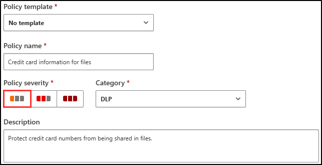
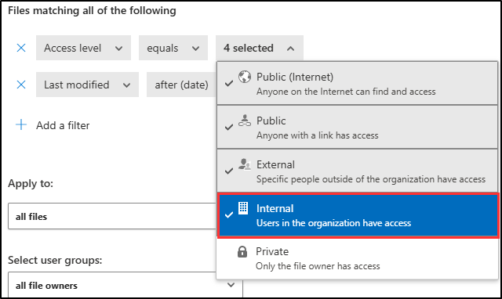
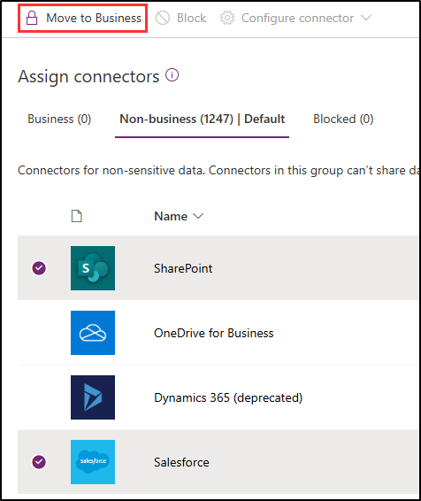

---
lab:
    title: 'Exercise 1 - Manage DLP Policies'
    module: 'Module 2 - Implement Data Loss Prevention'
---
## WWL Tenants - Terms of use

If you are being provided with a tenant as a part of an instructor-led training delivery, please note that the tenant is made available for the purpose of supporting the hands-on labs in the instructor-led training.

Tenants should not be shared or used for purposes outside of hands-on labs. The tenant used in this course is a trial tenant and cannot be used or accessed after the class is over and are not eligible for extension.

Tenants must not be converted to a paid subscription. Tenants obtained as a part of this course remain the property of Microsoft Corporation and we reserve the right to obtain access and repossess at any time.

# Lab 2 – Exercise 1 – Manage DLP Policies

You are Joni Sherman, the newly hired Compliance Administrator for Contoso Ltd. tasked to configure the company's Microsoft 365 tenant for data loss prevention. Contoso Ltd. is a company that offers driving instruction in the United States, and you need to make sure that sensitive customer information does not leave the organization.

**Tasks**:

1. Create a DLP policy in simulation mode
1. Modify a DLP policy
1. Create a DLP policy in PowerShell
1. Test your DLP policy
1. Activate a policy in simulation mode
1. Modify policy priority
1. Enable file monitoring in Microsoft 365 Defender
1. Create a file policy for Microsoft 365 Defender
1. Create a DLP policy for Power Platform

## Task 1 – Create a DLP policy in simulation mode

In this exercise, you'll create a data loss prevention (DLP) policy to protect sensitive data from being shared by users. The DLP policy that you create will inform your users if they want to share content that contains credit card information and allow them to provide a justification for sending this information. The policy will be implemented in simulation mode because you don't want the block action to affect your users yet.

1. Log into Client 1 VM (SC-400-CL1) as the **SC-400-CL1\admin** account.

1. In **Microsoft Edge**, navigate to **`https://purview.microsoft.com`** and log into the Microsoft Purview portal as **Joni Sherman**. sign in as `JoniS@WWLxZZZZZZ.onmicrosoft.com` (where ZZZZZZ is your unique tenant ID provided by your lab hosting provider). Joni's password was set in a previous exercise.

1. Select **Solutions** from the left sidebar, then select **Data Loss Prevention**.

1. On the left sidebar, select **Policies**.

1. On the **Policies** page, select **+ Create policy** to start the configuration for creating a new data loss prevention policy.

1. On the **Start with a template or create a custom policy** page, select **Custom** as the category, then select **Custom policy** under **Regulations**.

1. Select **Next**.

1. On the **Name your DLP policy** page enter:

   - **Name**: `Credit Card DLP Policy`
   - **Description**: `Protect credit card numbers from being shared`

1. Select **Next**.

1. On the **Assign admin units** page select **Next**.

1. On the **Choose locations to apply the policy** page, enable the location for **Teams chat and channel messages** only. If any other locations are selected, deselect them.

1. Select **Next**.

1. On the **Define policy settings** page, select **Create or customize advanced DLP rules**, then select **Next**.

1. On the **Customize advanced DLP rules** page, select **+ Create rule**.

1. On the **Create rule** flyout page, enter `Credit card information` as name in the **Name** field.

1. Under **Conditions**, select **+ Add Condition**, then select **Content contains**.

1. In the new **Content contains** area, select **Add**, then select **Sensitive info types**.

1. On the **Sensitive info types** page, select **Credit Card Number** then select **Add**.

1. Select **+ Add condition**, then select **Content is shared from Microsoft 365**.

1. In the new **Content is shared from Microsoft 365** section, select the **only with people inside my organization** option.

1. Under **Actions** select **+ Add an action**, then select **Restrict access or encrypt the content in Microsoft 365 locations**.

1. In the new **Restrict access or encrypt the content in Microsoft 365 locations** area select **Block everyone.**

1. Under **User notifications**, turn **On** the option for **Use notifications to inform your users and help educate them on the proper use of sensitive info.**, then select the checkbox to **Notify users in Office 365 service with a policy tip**.

1. Under **User overrides** select the checkbox to **Allow users to override policy restrictions Fabric (including Power BI), Exchange, SharePoint, OneDrive and Teams.**

1. Select the checkbox to **Require a business justification to override**.

1. Under **Incident reports**, in the **Use this severity level in admin alerts and reports** dropdown, select **Low**.

1. At the bottom of the **Create rule** flyout panel, select **Save**.

1. Back on the **Customize advanced DLP rules**, select **Next**.

1. On the **Policy mode** page select **Run the policy in simulation mode** and select the checkbox for **Show policy tips while in simulation mode**.

1. Select **Next**.

1. On the **Review and finish** page review your settings then select **Submit**.

1. On the **New policy created** page select **Done**.

You have now created a DLP policy that scans for credit card numbers in Microsoft Teams chats and channels, allowing users to provide a business justification to override the policy.

## Task 2 – Modify a DLP policy

In this task, you'll modify the existing DLP policy created in the previous task to also scan emails for credit card information. This modification ensures that sensitive data is protected across more communication channels.

1. You should still be logged into Client 1 VM (SC-400-CL1) as the **SC-400-CL1\admin** account, and you should be logged into Microsoft 365 as **Joni Sherman**.

1. You should still be on the **Policies** page in Microsoft Purview. If not, open **Microsoft Edge** and navigate to `https://purview.microsoft.com`. Select **Solutions** > **Data Loss Prevention** > **Policies**.

1. On the **Policies** page select the checkbox for the recently created **Credit Card DLP Policy**, then select **Edit policy** to open the policy configuration.

1. On the **Name your DLP policy** page, select **Next**.

1. On the **Assign admin units** page select **Next**.

1. On the **Choose locations to apply the policy** page, select the checkbox for **Exchange email** to add this location to your DLP policy.

1. Select **Next** until you reach the **Review and finish** page.

1. Select **Submit** on the **Review and finish** page to apply the change you made to the policy.

1. Once the policy is updated select **Done** on the **Policy updated** page.

You have successfully modified the DLP policy to include email scanning, enhancing the protection of sensitive information.

## Task 3 – Create a DLP policy in PowerShell

In this task, you'll use PowerShell to create a DLP policy to protect Contoso employee IDs and prevent them from being shared via Exchange. This policy will notify users attempting to share this sensitive data and block the email if it contains Employee IDs.

1. You should still be logged into Client 1 VM (SC-400-CL1) as the **SC-400-CL1\admin** account.

1. Open an elevated PowerShell window by right clicking the Windows button in the task bar, then select **Terminal (Admin)**.

1. Run the **Connect-IPPSSession** cmdlet to connect to the Security & Compliance PowerShell:

   ```powershell
   Connect-IPPSSession
   ```

1. Sign in as **Joni Sherman** `JoniS@WWLxZZZZZZ.onmicrosoft.com` (where ZZZZZZ is your unique tenant ID provided by your lab hosting provider) in the **Sign in to your account** pop-up window. Joni's password was set in a previous exercise.

1. Run the **New-DlpCompliancePolicy** cmdlet to create a DLP policy that scans all Exchange mailboxes:

   ```powershell
   New-DlpCompliancePolicy -Name "EmployeeID DLP Policy" -Comment "This policy blocks sharing of Employee IDs" -ExchangeLocation All
   ```

1. Run the **New-DlpComplianceRule** cmdlet to add a DLP rule to the DLP policy you created in the previous step:

   ```powershell
   New-DlpComplianceRule -Name "EmployeeID DLP rule" -Policy "EmployeeID DLP Policy" -BlockAccess $true -ContentContainsSensitiveInformation @{Name="Contoso Employee IDs"}
   ```

1. Run the **Get-DLPComplianceRule** cmdlet to review the **EmployeeID DLP rule**:

   ```powershell
   Get-DLPComplianceRule -Identity "EmployeeID DLP rule"
   ```

You have successfully created a DLP policy using PowerShell that scans for Contoso Employee IDs in Exchange.

## Task 4 – Test your DLP Policy

In this task you'll test the DLP policy that was created in the previous task.

1. You should still be logged into Client 1 VM (SC-400-CL1) as the **SC-400-CL1\admin** account and logged into Microsoft 365 as Joni Sherman.

1. Open a Microsoft Edge browser window and navigate to **`https://outlook.office.com`**

1. Select the **New mail** button on the top left to compose a new email message.

1. In the **To** field, enter `Megan` and select **Megan Bowen**'s email address.

1. In the subject field enter `Help with employee information`.

1. In the body of the email enter:

   ``` text
   Please help me with the start dates for the following employees:
   ABC123456
   DEF678901
   GHI234567

   Thank you, 
   Joni Sherman
   ```

1. Select the **Send** button in the upper right of the message window to send the email.

1. You should receive a message that the email was undeliverable and blocked by a DLP policy.

      

You have successfully tested your DLP policy.

## Task 5 – Activate a policy in simulation mode

In this task, you'll activate the **Credit Card DLP Policy** you created in simulation mode so it enforces its protective actions.

1. You should still be logged into Client 1 VM (SC-400-CL1) as the **SC-400-CL1\admin** account, and you should be logged into Microsoft 365 as **Joni Sherman**.

1. In **Microsoft Edge**, navigate to DLP policies by going to `https://purview.microsoft.com` > **Solutions** > **Data Loss Prevention** then select **Policies** from the left sidebar.

1. On the  **Policies** page select the checkbox for the **Credit Card DLP Policy** and select **Edit policy** to open the policy configuration.

1. Select **Next** until you reach the **Policy mode** page and select **Turn the policy on immediately**.

1. On the **Review and finish** select **Submit**.

1. On the **Policy updated** page select **Done**.

You have successfully activated the DLP policy, ensuring that any attempts to share credit card information are blocked and require a business justification.

## Task 6 – Modify policy priority

After creating two DLP policies, you want to make sure that the more restrictive policy is processed at a higher priority than the less restrictive policy. For this reason, you want to move the EmployeeID DLP Policy into the higher priority.

1. You should still be logged into Client 1 VM (SC-400-CL1) as the **SC-400-CL1\admin** account, and you should be logged into Microsoft 365 as **Joni Sherman**.

1. In **Microsoft Edge**, the Microsoft Purview portal tab should still be open to the **Policies** page. If not, open **Microsoft Edge** and navigate to `https://purview.microsoft.com`. Select **Solutions** > **Data Loss Prevention** > **Policies**.

1. On the **Policies** page, select the **EmployeeID DLP Policy** DLP policy.

1. Select **Reprioritize** from the top navigation ribbon, then select **Move to top (highest priority)**.

1. In the **Data loss prevention** window, select **Refresh** and review the priority in the **Order** column of the policy table.

You have successfully modified the policy priority, ensuring that the most restrictive DLP policy is enforced first when matching content.

## Task 7 – Enable file monitoring in Microsoft 365 Defender

You want to use file policies in Microsoft 365 Defender to protect files in your OneDrive and SharePoint Online locations. Before you can create a file policy, you need to enable file monitoring so Microsoft 365 Defender can scan files in your organization.

1. You should still be logged into Client 1 VM (SC-400-CL1) as the **SC-400-CL1\admin** account.

1. In **Microsoft Edge**, the Microsoft Purview portal tab should still be open. Sign out of Joni's account by selecting the profile picture of Joni Sherman in the top right. Select **Sign out**, then close the browser window.

1. Open **Microsoft Edge** and navigate to **`https://security.microsoft.com`** and log into the Microsoft 365 Defender portal as **MOD Administrator** `admin@WWLxZZZZZZ.onmicrosoft.com` (where ZZZZZZ is your unique tenant ID provided by your lab hosting provider). Admin's password should be provided by your lab hosting provider.

1. On the left sidebar, expand **System** then select **Settings**.

1. On the **Settings** page select **Cloud Apps**.

1. In the left pane within the **Cloud apps** window, scroll down to the **Information Protection** section, then select **Files**.

1. Select the **Enable file monitoring** checkbox then select **Save** if it's not already marked.

You successfully enabled file monitoring in Microsoft 365 Defender and can now scan files for sensitive content using file policies.

## Task 8 – Create a file policy for Microsoft 365 Defender

In this task, you'll create a file policy in Microsoft 365 Defender to scan files in OneDrive and SharePoint Online for credit card information. The policy will automatically quarantine files containing sensitive data

1. You should still be logged into Client 1 VM (SC-400-CL1) as the **SC-400-CL1\admin** account.

1. Sign out of the MOD Administrator account by selecting the **MA** icon in the top right, then selecting **Sign out**. Close the browser window once you're signed out.

1. Open **Microsoft Edge** and navigate to **`https://security.microsoft.com`** and log into the Microsoft 365 Defender portal as **Joni Sherman** `JoniS@WWLxZZZZZZ.onmicrosoft.com` (where ZZZZZZ is your unique tenant ID provided by your lab hosting provider). Joni's password was set in a previous exercise.

1. In the **Microsoft 365 Defender** portal, in the left navigation, scroll down to the **Cloud apps** section. Expand **Policies** then select **Policy management**.

1. On the **Policies** page, select **+ Create policy**, then select **File policy**.

1. On the **Create file policy** page, leave the **Policy template** selection as **No template**.

1. In the **Policy name** and **Description** fields, enter:

   - **Policy name**: `Credit card information for files`
   - **Description**: `Protect credit card numbers from being shared in files.`

1. Keep the **Policy Severity** set to **Low** (one lighted icon) and make sure the **Category** is set to **DLP**. For a file policy, this should be the default.

    

1. In the **Files matching all of the following** area, expand the dropdown menu **Public (Internet), External, Public**, and add **Internal**.

    

1. In the **Inspection method** dropdown menu, select **Data Classification Service**.

1. In the **Choose inspection type...** dropdown menu, select **Sensitive information type...**.

1. On the **Select a sensitive information type** dialog, search for `Credit card`, then select the checkbox for **Credit Card Number**.

1. Select **Done** in the upper right corner of the **Select a sensitive information type** screen.

1. Under **Alerts**, select the checkbox for **Create an alert for each matching file** and review your options. Keep the settings as the default by selecting **Save as default settings**.

1. In the **Governance actions** section, expand **Microsoft OneDrive for Business** and select **Put in user quarantine**.

1. In the **Governance actions** section, expand **Microsoft SharePoint Online** and select the checkbox for **Put in user quarantine**.

1. Select **Create** at the bottom of the page to create the file policy.

1. Sign out of Joni's account by selecting the profile picture of Joni Sherman in the top right. Select **Sign out**, then close the browser window.

You have successfully created a file policy that scans and quarantines files with credit card information in OneDrive and SharePoint.

## Task 9 – Create a DLP policy for Power Platform

Your company uses Power Automate flows to share data between SharePoint Online and Salesforce. In this task, you will create a DLP policy for Power Platform that allows your existing flows to keep working but prevents the creation of flows that will share data between SharePoint Online and Apps defined as non-business.

1. You should still be logged into Client 1 VM (SC-400-CL1) as the **SC-400-CL1\admin** account.

1. In **Microsoft Edge**, navigate to **`https://admin.powerplatform.microsoft.com`** and log into the Power Platform admin center as **MOD Administrator** `admin@WWLxZZZZZZ.onmicrosoft.com` (where ZZZZZZ is your unique tenant ID provided by your lab hosting provider). Admin's password should be provided by your lab hosting provider.

1. In the **Power Platform admin center**, in the left sidebar, select the drop-down for **Policies**, then select **Data policies**.

1. On the **Data policies** page, select **+ New Policy**.

1. On the **Name your policy** page, enter `Tenant-wide SharePoint Policy` as the policy name, then select **Next**.

1. On the **Non-business|Default** tab on the **Assign connectors** page, select **SharePoint** and **Salesforce**, then select **Move to Business** at the top of the page.

    

1. In the **Assign connectors** page, select the **Business** tab to make sure both SharePoint and Salesforce now appear in this tab, then select **Next**.

1. On the **Custom connector patterns** page select **Next**.

1. On the **Define scope** page, select **Add all environments**, then select **Next**.

1. On the **Review and create policy** page review your policy settings, then select **Create policy**.

1. Sign out of the MOD Administrator account by selecting the **MA** icon in the top right, then selecting **Sign out**. Close the browser window once you're signed out.

You have successfully created a Power Platform DLP policy, ensuring that data flow between SharePoint Online and non-business connectors is controlled.
