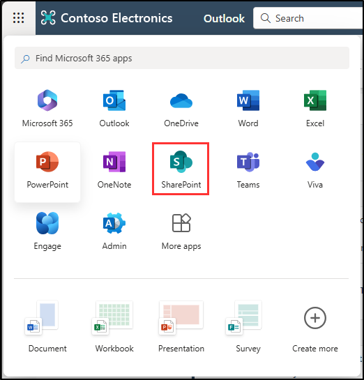
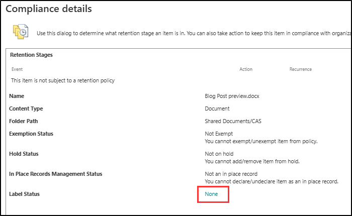
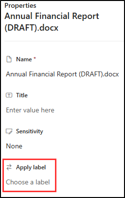

---
lab:
    title: 'Exercise 2 - Implement Retention Labels'
    module: 'Module 3 - Implement Data Lifecycle and Records Management'
---

# Lab 3 - Exercise 2 - Implement retention labels

In this exercise, you will assume the role of Joni Sherman, a System Administrator for Contoso Ltd., based in Sudbury, England. The company is focused on adhering to strict compliance and data retention standards, particularly concerning financial records. To ensure these records are managed systematically and efficiently, you will implement a file plan that includes creating and applying retention labels for critical documents, such as Value Added Tax (VAT) returns and credit card receipts. This will help Contoso Ltd. meet both legal and internal compliance requirements.

**Tasks**:

1. Create retention labels with file plan
1. Publish retention labels
1. Publish auto-apply retention labels
1. Apply retention labels in Outlook
1. Apply retention labels in SharePoint
1. Apply retention labels in OneDrive

## Task 1 – Create retention labels with file plan

In this task, you'll create retention labels for VAT returns and supporting documents, as well as for credit card receipts. These labels will be part of a comprehensive file plan to manage and secure these documents according to the company's compliance requirements.

1. Log into Client 1 VM (SC-400-CL1) as the **SC-400-cl1\admin** account.

1. In **Microsoft Edge**, navigate to **`https://purview.microsoft.com`** and log into the Microsoft Purview portal as **Joni Sherman** JoniS@WWLxZZZZZZ.onmicrosoft.com (where ZZZZZZ is your unique tenant ID provided by your lab hosting provider). Joni's password was set in a previous exercise.

1. In the **Microsoft Purview** portal, on the left sidebar, select **Solutions**, then select **Records Management**.

1. On the **Records Management** page, in the left sidebar select **File plan**.

1. On the **File plan** page, select **+ Create a label**.

1. On the **Name your retention label** page enter:

    - **Name**: `VAT Returns and Supporting Documents`
    - **Description for users**: `Assign this label to VAT Documents to ensure they are retained for the legal period of seven years.`
    - **Description for admins**: `VAT returns with seven-year retention.`

1. Select **Next**.

1. On the **Define file plan descriptors for this label** page enter:

   - **Reference ID**: `VAT-001`
   - **Business function/department**: Select **Choose** next to this field. In the **Business function/department** flyout panel select **Finance**, then select **Choose** at the bottom of the panel.
   - **Category**: Select **Choose** next to this field. In the **Category** flyout panel, select **+ Create new category**. In the **Category** field, enter `Financial records`, then select **Add** at the bottom of the panel.
   - **Sub category**: Leave this field blank.
   - **Authority type**: Select **Choose** next to this field. In the **Authority type** flyout panel, select **Regulatory**, then select **Choose** at the bottom of the panel.
   - **Provision/citation**: Select **Choose** next to this field. In the **Provision/citation** flyout panel, select **Sarbanes-Oxley Act of 2002**, then select **Choose** at the bottom of the panel.

1. Back on the **Define file plan descriptors for this label** page, select **Next**.

1. On the **Define label settings** page, select **Retain items forever or for a specific period**, then select **Next**.

1. On the **Define the period** page, ensure these values are set for the retention period configuration input:

    - **How long is the period?**: 7 Years
    - **When should the period begin?**: When items were created

1. Select **Next**.

1. On the **Choose what happens during the retention period** page, select **Retain items even if users delete**, then select **Next**.

1. On the **Choose what happens after the retention period** page select **Deactivate retention settings** then select **Next**.

1. On the **Review and finish** page select **Create label**.

1. On the **Your retention label is created** page select the option to **Do Nothing** then select **Done**. The label will be published in a later task.

1. Back on the **File plan** page, select **+ Create a label** to create another retention label.

1. On the **Name your retention label** enter:

    - **Name**: `Credit Card Receipts`
    - **Description for users**: `This label is auto applied to Credit card receipts with a retention period of three years.`
    - **Description for admins**: `Auto applied retention label for Credit card receipts with three-year retention.`

1. Select **Next**.

1. On the **Define file plan descriptors for this label** page enter:

   - **Reference ID**: `CC-002`
   - **Business function/department**: Select **Choose** next to this field. In the **Business function/department** flyout panel select **Sales**, then select **Choose** at the bottom of the panel.
   - **Category**: Select **Choose** next to this field. In the **Category** flyout panel select **Financial records**, then select **Choose** at the bottom of the panel.
   - **Sub category**: Select **Choose** next to this field. In the **Sub category** flyout panel, select **+ Create new subcategory**. In the **Sub category** field, enter `Receipts`, then select **Add** at the bottom of the panel.
   - **Authority type**: Select **Choose** next to this field. In the **Authority type** flyout panel, select **Business**, then select **Choose** at the bottom of the panel.
   - **Provision/citation**: Select **Choose** next to this field. In the **Provision/citation** flyout panel, select **Truth in Lending Act**, then select **Choose** at the bottom of the panel.

1. Back on the **Define file plan descriptors for this label** page, select **Next**.

1. On the **Define label settings** page select **Retain items forever or for a specific period** then select **Next**.

1. On the **Define the period** page, ensure these values are set for the retention period configuration input:

    - **Retain items for**: Select the dropdown list and select **Custom**. Enter 3 for Years.
    - **Start the retention period based on**: When items were created.

1. Select **Next**.

1. On the **Choose what happens during the retention period** page, select **Retain items even if users delete**, then select **Next**.

1. On the **Choose what happens after the retention period** page select **Deactivate retention settings** then select **Next**.

1. On the **Review and finish** page select **Create label**.

1. On the **Your retention label is created** page select **Do Nothing** then select **Done**.

You have successfully created retention labels for VAT returns with a seven-year retention period and for Credit Card receipts with a three-year retention period.

## Task 2 – Publish retention labels

Now, you will publish the VAT returns retention label, making it available for finance users to apply to relevant documents in Exchange emails and SharePoint sites.

1. You should still be logged into Client 1 VM (SC-400-CL1) as the **SC-400-cl1\admin** account, and you should be logged into Microsoft 365 as **Joni Sherman**.

1. You should still be on the **File plan** page in **Records Management**. If not, navigate to `https://purview.microsoft.com`, and select **Solutions** from the left sidebar, then select **Records Management**. Select **File plan** from the **Records Management** page.

1. Select the **VAT Returns and Supporting Documents** label that was created previously.

1. Select the **Publish labels** button () to start the configuration to publish this retention label.

1. On the **Choose labels to publish** page, verify the **VAT Returns and Supporting Documents** label is selected, then select **Next**.

1. On the **Policy Scope** page select **Next**.

1. On the **Choose the type of retention policy to create** page select **Static** then select **Next**.

1. On the **Choose where to publish labels** page select **Let me choose specific locations** and select:

    - Exchange mailboxes
    - SharePoint classic and communication sites
    - OneDrive accounts
    - Deselect all other locations

1. Select **Next**.

1. On the **Name your policy** enter:

    - **Name**: `VAT Returns and Supporting Documents Retention Label`
    - **Description**: `VAT Returns and supporting documents Retention label, retention period 3 years, Exchange email and SharePoint site locations.`

1. Select **Next**.

1. On the **Finish** page select **Submit**.  

1. Once your retention label has been published, select **Done** on the **Your retention label was published** page.

You have successfully published the retention label for VAT Returns and supporting documents.

## Task 3 – Publish auto-apply retention labels

In this task, you'll configure the credit card receipts retention label to be auto-applied, ensuring that any relevant documents are automatically labeled and retained for the required period.

1. You should still be logged into Client 1 VM (SC-400-CL1) as the **SC-400-cl1\admin** account, and you should be logged into Microsoft 365 as **Joni Sherman**.

1. You should still be on the **File plan** page in **Records Management**. If not, navigate to `https://purview.microsoft.com`, and select **Solutions** from the left sidebar, then select **Records Management**. Select **File plan** from the **Records Management** page.

1. Select the **Credit Card Receipts** label that was created previously.

1. Select the **Auto-apply a label** button () to start the configuration to publish this auto-apply retention label.

1. On the **Let's get started** page, enter:

    - **Name**: `Credit Card Receipts auto-applied`
    - **Description**: `Credit Card Receipts auto-applied retention label, with a retention period of three years for all locations.`

1. Select **Next**.

1. On the **Choose the type of content you want to apply this label to** page select  **Apply label to content that contains sensitive info** then select **Next**.

1. On the **Content that contains sensitive info** page, select **Financial** under **Categories**, then select **U.K. Financial Data88 under **Regulations**

1. Select **Next**.

1. On the **Define content that contains sensitive info** page select **Next**.

1. On the **Policy Scope** page select **Next**.

1. On the **Choose the type of retention policy to create** page, select **Static** then select **Next**.

1. On the **Choose locations to apply the policy** page, select these locations:

    - Exchange mailboxes
    - SharePoint classic and communication sites
    - OneDrive accounts
    - Microsoft 365 Group mailboxes & sites

1. Select **Next**.

1. On the **Choose a label to auto-apply** page, ensure the **Credit Card Receipts** label is selected, then select **Next**.

1. On the **Decide whether to test or run your policy**, select **Turn on policy** then select **Next**.

1. On the **Review and finish** page, select **Submit**.

1. Once your auto-labeling policy has been created, select **Done** on the **Your auto-labeling policy has been created.** page.

1. Sign out of Joni's account by selecting her image in the top, right hand corner and selecting **Sign out**.

You have successfully configured the **Credit Card Receipts** retention label to be auto-applied, setting a three-year retention period for all identified documents.

## Task 4 – Apply retention labels in Outlook

Megan Bowen, a financial analyst at Contoso Ltd., needs to ensure that specific emails and folders in Outlook comply with the company's data retention policies. In this task, you'll apply the appropriate retention labels to her Outlook items.

1. Log into Client 1 VM (SC-400-CL1) as the **SC-400-cl1\admin** account.

1. In **Microsoft Edge**, navigate to **`https://outlook.office.com/`**. and login as **Megan Bowen** MeganB@WWLxZZZZZZ.onmicrosoft.com (where ZZZZZZ is your unique tenant ID provided by your lab hosting provider). Megan's password was set in a previous exercise.

1. In Megan's inbox, select right click the any email then select **Advanced actions** > **Assign policy** > **5 year delete** under the **Retention labels** section.

   This retention label assigns a retention period of 5 years to the chosen email. After the 5 year period, the item is deleted.

1. Still in Outlook, expand **Inbox** from the left side bar, then right click the right click the **Project Falcon** folder.

1. From the menu that appeared when you right clicked, select **Advanced actions** > **Assign policy** > **5 year delete** under the **Retention labels** section.

   This retention label assigns a retention period of 5 years to the Project Falcon folder and all its contents. After the 5 year period, the items are deleted.

You have successfully applied retention labels to both an email and a folder in Outlook.

## Task 5 – Apply retention labels in SharePoint

As a financial analyst, Megan Bowen manages sensitive documents in SharePoint. In this task, you will apply a retention label to a specific document in the SharePoint library, ensuring the document's retention aligns with company policy.

1. You should still be logged into Client 1 VM (SC-400-CL1) as the **SC-400-cl1\admin** account.

1. You should still be logged into Outlook as Megan Bowen. Select the meatball menu in the top left, then select **SharePoint** to navigate to SharePoint.

   

1. On the SharePoint landing page, search for `Communication site` then select **Communication site** from the search results.

1. In the top navigation bar, select the **Documents** tab.

1. Select the **CAS** folder.

1. Within the CAS folder, hover over the **Blog Post preview.docx** document and select the ellipses **...** for **Show more actions** to open the menu to show more options.

   

1. From the action menu, select **More** > **Compliance details**

1. A new window displaying the **Compliance details** for the document opens. For **Label Status** select **None** to open the **Apply Label** window.

   

1. On the **Apply Label** page, select the dropdown for **Apply label** and change it from **None** to **VAT Returns and supporting documents (Retain for 7 years)**. Select **Save** to the right of the screen.

   >**Note**: Retention labels might take 1-2 days to appear in SharePoint. If the **VAT Returns and Supporting Documents** label isn't available during this task, you can revisit and apply the label later.

You have successfully applied a retention label to a document in SharePoint.

## Task 6 – Apply retention labels in OneDrive

Megan Bowen, while working remotely, stores critical financial documents in OneDrive. This task involves applying retention labels to ensure these documents are managed according to the company's retention policies.

1. You should still be logged into Client 1 VM (SC-400-CL1) as the **SC-400-cl1\admin** account.

1. You should still be logged into Outlook as Megan Bowen. Select the meatball menu in the top left, then select **OneDrive** to navigate to OneDrive.

1. Select **My files** from the left sidebar. When the list of files appears, hover over **Annual Financial Report** and select the ellipses **...** for **More actions** to open the menu to show more options.

1. From the action menu, select **Details** to open the detail panel on the right.

1. Under **Properties** scroll down to find the **Apply label** section. Select **Choose a label**, then select **VAT Returns and Supporting Documents** if available.

   

   >**Note**: Retention labels might take 1-2 days to appear in OneDrive. If the **VAT Returns and Supporting Documents** label isn't available during this task, you can revisit and apply the label later.

1. Select the **x** at the top of the details panel to close it. Changes made here are automatically applied.

1. Sign out of Megan's account by selecting her icon in the top right, then selecting **Sign out**.

You have successfully applied a retention label to a document in OneDrive.
