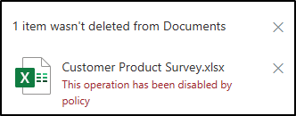

---
lab:
    title: 'Exercise 3 - Configure Event-based Retention'
    module: 'Module 3 - Implement Data Lifecycle and Records Management'
---

# Lab 3 - Exercise 3 - Configure event-based retention

In this exercise you will assume the role of Joni Sherman, a Compliance Administrator for Contoso Ltd. Your organization is based in Texas and wants to implement retention policies to retain content belonging to specific projects for 5 years after they close.

1. Create event-driven retention label and event type
1. Publish event-driven retention label
1. Apply label and add an asset ID
1. Create specific event
1. Observe results of event trigger

## Task 1 – Create event-driven retention label and event type

In this step, you'll create a retention label and an event type. The event type will trigger the retention period. Any content that has the retention label applied to it for that specific event type will have the retention actions from the label enforced on it.

1. You should still be logged into Client 1 VM (SC-400-CL1) as the **SC-400-cl1\admin**.

1. In **Microsoft Edge**, navigate to **`https://purview.microsoft.com`** and log into the Microsoft Purview portal as **Joni Sherman** `JoniS@WWLxZZZZZZ.onmicrosoft.com` (where ZZZZZZ is your unique tenant ID provided by your lab hosting provider). Joni's password was set in a previous exercise.

1. In the **Microsoft Purview** portal, on the left sidebar, select **Solutions**, then select **Records management**.

1. On the **Records Management** page select **File plan** from the left sidebar, then select **Create a label**.

1. On the **Name your retention label**, enter:

    - **Name**: `Project Asset`
    - **Description for users**: `Assign this label to project documents to ensure they are retained for the period of 5 years.`
    - **Description for admins**: `Project asset for event-based retention.`

1. Select **Next**.

1. On the **Define file plan descriptors for this label**, leave this page blank and select **Next**.

1. On the **Define label settings** page, select **Retain items forever or for a specific period**, then select **Next**.

1. On the **Define the retention period** page select the dropdown for **Retain items for**, then select **5 years**.

1. Under the **Start the retention period based on** dropdown select **+ Create new event type**. This will start the event-based label configuration.

1. On the **Name your event type** flyout panel on the right, enter:

    - **Name**: `Project Closure`
    - **Description**: `This event will be triggered when a project closes.`

1. Select **Next**.

1. Review the **Summary** page then select **Submit**

1. On the **Your event type was created** page, select **Done**.

1. Back on the **Define the retention period**, select the dropdown for **Start the retention period based on** then select the newly created **Product Closure** event type.

1. Select **Next**.

1. On the **Choose what happens during the retention period** page, select **Mark items as a record**, and select the option for **Unlock this record by default**.

1. Select **Next**.

1. On the **Choose what happens after the retention period** page, select **Delete items automatically**, then select **Next**.

1. On the **Review and finish** page, select **Create label**.  

1. On the **Your retention label is created** page select **Do Nothing** then select **Done**.

You have successfully created an event-based retention label.

## Task 2 – Publish event-driven retention label

In this task, you will publish the Project Asset retention label, making it available for users to apply to relevant documents in SharePoint and OneDrive.

1. You should still be logged into Client 1 VM (SC-400-CL1) as the **SC-400-cl1\admin** account, and you should be logged into Microsoft Purview as **Joni Sherman**.

1. You should still be on the **File plan** page within Microsoft Purview. If not, navigate to `https://purview.microsoft.com`, then select **Solutions** > **Records Management** > **File plan**.

1. Select the **Project Asset** label, then select the **Publish labels** button ().

1. On the **Choose labels to publish** page, ensure the **Project Asset** retention label is selected, then select **Next**.

1. On the **Policy Scope** page, select **Next**.

1. On the **Choose the type of retention policy to create** page, select **Static**, then select **Next**.

1. On the **Choose where to publish labels** page select **Let me choose specific locations** to display the location options.

1. On the **Choose where to publish labels** page select **Let me choose specific locations** and select:

    - SharePoint classic and communication sites
    - OneDrive accounts
    - Deselect all other locations

1. Select **Next**.

1. On the **Name your policy** enter:

    - **Name**: `Project Asset Retention Label`
    - **Description**: `Project Assets Retention label, retention period 5 years, SharePoint site locations.`

1. Select **Next**.

1. Review your settings on the **Finish** page, then select **Submit**.

1. Once your retention label has been published, select **Done** on the **Your retention label was published** page.

You have successfully published the retention label for project assets.

## Task 3 – Apply label and add an asset ID

In this task, you'll apply the Project Asset retention label to a document and assign an asset ID, which will be used to trigger the retention period once the related project event occurs.

1. You should still be logged into Client 1 VM (SC-400-CL1) as the **SC-400-cl1\admin** account, and you should be logged into Microsoft 365 as **Joni Sherman**.

1. You should still be on the **File plan** page within Microsoft Purview. Select meatball menu in the top-left corner, then select **SharePoint** from the sub-menu.

   

1. Search for `Brand` in the search bar on the top, then select the **Brand** SharePoint page from the search results.

1. On the top navigation pane, select **Documents**.

1. Within the documents folder, hover over the **Customer Product Survey.xlsx** document and select the ellipses **...** for **Show more actions** to open the menu to show more options, then select **Details**.

1. In the right-side panel, under **Properties** select **Apply label**, then select the **Project Asset** label.

   >**Note**: Retention labels might take 1-2 days to appear in SharePoint. If the **Project Asset** label isn't available during this task, you can revisit and apply the label later.

1. In the newly appeared **Asset ID** field enter **`NewProductLaunch`** and close the right-side menu by selecting **X** in the top right corner.

   

You've successfully applied the Project Asset label and assigned an Asset ID to a document. This setup will initiate the retention process when the project closure event occurs.

## Task 4 – Create specific event

In this task, you'll create a specific event to mark the closure of a project, triggering the retention period for all labeled documents.

1. You should still be logged into Client 1 VM (SC-400-CL1) as the **SC-400-cl1\admin** account, and you should be logged into Microsoft 365 as **Joni Sherman**.

1. In **Microsoft Edge**, navigate to **`https://purview.microsoft.com`**, then select **Solutions** > **Records Management** from the left sidebar.

1. On the **Records Management** page, select **Events** from the left sidebar.

1. On the **Events** page, select **+ Create**.

1. On the **Name the event** flyout panel on the right, enter:

    - **Name**: `New Product Launch Closed`
    - **Description**: `Assets with the Project Asset label and AssetID NewProductLaunch will enter their retention period.`

1. Select **Next**.

1. On the **Event settings** page, select **Use event type** then select **Choose an event type**.

1. On the **Choose an event type** page, select **Project Closure**, then select **Add**.

1. Select **Next** on the flyout panel.

1. On the **Event settings** page, set **Asset IDs for items in SharePoint and OneDrive** to **`NewProductLaunch`**.

1. Select today's date for **When did this event occur?**, then select **Next**.

1. Review the **Finish** page then select **Submit**.

1. On the **Your event has been created** page select **Done**.

You have successfully triggered an event and started the retention period for all documents with the Project Asset label and an Asset ID of NewProductLaunch.

## Task 5 – Observe results of event trigger

To verify that the retention period you specified started, you need to try to delete the file.

1. You should still be logged into Client 1 VM (SC-400-CL1) as the **SC-400-cl1\admin** account, and you should be logged into Microsoft 365 as **Joni Sherman**.

1. In Microsoft Edge, you should still be on the **Events** page for records management in the Microsoft Purview portal.

1. In the top left corner select the nine dots and under **Apps** select **SharePoint**.

1. Search for `Brand` in the search bar on the top, then select the **Brand** SharePoint page from the search results.

1. In the top navigation pane, select **Documents**.

1. On the **Documents** page, select the checkbox for **Customer Product Survey.xlsx**, then select the horizontal ellipses, **...** to open the action menu"

1. From the action menu, select **Delete** and observe the results. You should be blocked from deleting this file due to policy.

   

You have successfully confirmed that the retention period on the document has started. If you can still delete the document the synchronization period for the event has not been completed and the triggering of the retention policy is still in progress. As with other Retention Labels, this process can take up to 1-2 days to complete.
