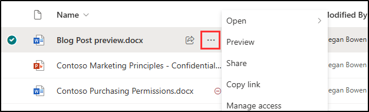

---
lab:
    title: 'Exercise 4 - Configure Service-based Retention'
    module: 'Module 3 - Implement Data Lifecycle and Records Management'
---

# Lab 3 - Exercise 4 - Configure service-based retention

Contoso Ltd. has recently experienced some internal challenges, and there is concern that a potentially disgruntled employee might attempt to delete critical company data. As Joni Sherman, the Compliance Admin for Contoso Ltd., you have been tasked with securing sensitive information and ensuring that no vital records are lost. The legal department has identified specific areas where data might be at risk, and your role is to implement measures to prevent data loss, particularly focusing on email communications and SharePoint documents.

**Tasks**:

1. Configure mailbox holds
1. Recover SharePoint documents

## Task 1 – Configure mailbox holds

To prevent data loss, you'll place a mailbox hold on Alex Wilber's account.

1. Log into Client 1 virtual machine (SC-400-CL1) as the **SC-400-cl1\admin** account.

1. In **Microsoft Edge**, navigate to **`https://admin.exchange.microsoft.com`** and log into the Exchange Admin Center as **Joni Sherman**. Sign in as `JoniS@WWLxZZZZZZ.onmicrosoft.com` (where ZZZZZZ is your unique tenant ID provided by your lab hosting provider).

1. Close all tip windows if any appear.

1. In the Exchange Admin Center, in the left sidebar, expand **Recipients** then select **Mailboxes**.

1. Select  **Alex Wilber** from the list of mailboxes, and a flyout panel on the right displaying Alex's mailbox settings will appear.

1. On **Alex Wilber**'s flyout page, select the **Others** tab.

1. Under **Litigation hold** select **Manage litigation hold**.

1. On the **Manage litigation hold** page, set the **Litigation hold** from **Off** to **On** to display the litigation hold settings.

1. Use these values to configure the litigation hold for Alex's mailbox:

    - **Hold duration (days).**: `90`
    - **Note (visible to the user)**: `Your mailbox has been put on hold for the next 90 days. You will not be able to delete any messages.`

1. Select **Save** at the bottom of the panel. In the panel, you'll get a message stating **Litigation hold updated** should appear.

You have successfully activated the Mailbox Hold on a mailbox in your environment and stopped everyone with access from permanently deleting any content in the mailbox. Applying the hold can take up to 60 minutes.

## Task 2 – Recover SharePoint documents

In this task, you'll delete and restore a deleted document to make sure you can restore documents the employee might delete after he is informed about the litigation hold against his mailbox.

1. Log into Client 1 VM (SC-400-CL1) as the **SC-400-cl1\admin** account.

1. In **Microsoft Edge**, navigate to **`https://www.office.com`** and log in Microsoft 365 as **Joni Sherman**.

1. In the Microsoft Office 365 landing page, select the meatball menu in the top-left corner, then select **SharePoint** from the sub-menu.

   

1. On the SharePoint landing page, search for `Benefits` then select **Benefits @ Contoso** from the search results.

1. In the left sidebar select **Documents**.

1. On the **Documents** page, select the checkbox to the left of **Vacation Policies.pptx** then select **Delete** from the action bar.

1. On the **Delete?** dialog, select **Delete**.

1. On the left sidebar, select **Recycle bin**.

1. On the **Recycle bin** page, right click **Vacation Policies.pptx**, then select **Restore**.

1. On the left sidebar, select **Documents** and notice the file has been restored.

You have successfully recovered a deleted document from a SharePoint Site.
