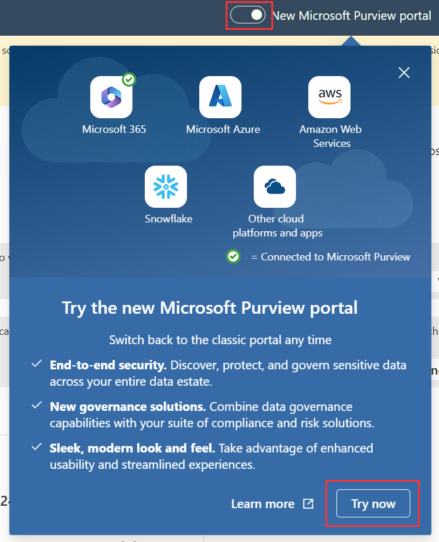
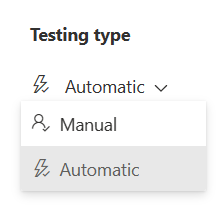

---
lab:
    title: 'Exercise 1 - Explore Compliance Manager'
    module: 'Module 4 - Monitor and investigate data and activities by using Microsoft Purview'
---

## WWL Tenants - Terms of use

If you are being provided with a tenant as a part of an instructor-led training delivery, please note that the tenant is made available for the purpose of supporting the hands-on labs in the instructor-led training.

Tenants should not be shared or used for purposes outside of hands-on labs. The tenant used in this course is a trial tenant and cannot be used or accessed after the class is over and are not eligible for extension.

Tenants must not be converted to a paid subscription. Tenants obtained as a part of this course remain the property of Microsoft Corporation and we reserve the right to obtain access and repossess at any time.

# Lab 4 – Exercise 1 – Explore Compliance Manager

You are Joni Sherman, the Compliance Administrator for Contoso Ltd., responsible for configuring and maintaining compliance within the organization's Microsoft 365 tenant. Contoso Ltd. has offices that operate in the financial sector and is subject to various regulatory requirements, including the Gramm-Leach-Bliley Act (GLBA) in the United States.

As part of your responsibilities, you need to conduct a compliance assessment specifically focused on GLBA requirements within the Microsoft 365 environment. The assessment will involve evaluating the current compliance posture, identifying any potential compliance gaps, and implementing appropriate measures to address them.

**Tasks**:

1. Assign Compliance Manager permissions
1. Explore Compliance Manager
1. Create an assessment
1. Assign improvement action
1. Act on improvement action
1. Manually update improvement action

## Task 1 – Assign Compliance Manager permissions

In this task you will grant Joni the required permissions to create assessments using Compliance Manager. You will also grant Megan the necessary permissions to act on improvement actions if they are assigned to her.

1. Log into the Client 1 VM (LON-CL1) as the **lon-cl1\admin** account. The password should be provided by your lab hosting provider.

1. In **Microsoft Edge**, select the address bar, navigate to **`https://purview.microsoft.com`** and log into the Microsoft Purview compliance portal as **MOD Administrator** `admin@WWLxZZZZZZ.onmicrosoft.com` (where ZZZZZZ is your unique tenant ID provided by your lab hosting provider). Admin's password should be provided by your lab hosting provider.

1. On the left sidebar, select **Settings**.

1. On the **Setting** page, on the left sidebar, expand **Roles and scopes**, then select **Role groups**.

1. On the **Role groups for Microsoft Purview solutions**, search for `Compliance Manager`, then select **Compliance Manager Administrators**.

1. On the **Compliance Manager Administrators** flyout panel on the right, select **Edit** to start the configuration to manage this role group.

1. On the **Edit members of the role group** page, select **+ Choose users**.

1. On the **Choose users** page, search for `Joni`, then select the checkbox for **Joni Sherman**. Select the **Select** button at the bottom of the panel.

1. Back on the **Edit members of the role group** page, select **Next**.

1. On the **Review the role group and finish** select **Save**.

1. On the **You successfully updated the role group** page, select **Done**.

1. Back on the **Role groups for Microsoft Purview solutions** select **Compliance Manager Contributors**.

1. On the **Compliance Manager Contributors** flyout panel on the right, select **Edit**.

1. On the **Edit members of the role group** page, select **+ Choose users**.

1. On the **Choose users** page, search for `Megan`, then select the checkbox for **Megan Bowen**. Select the **Select** button at the bottom of the panel.

1. Back on the **Edit members of the role group** page, select **Next**.

1. On the **Review the role group and finish** select **Save**.

1. On the **You successfully updated the role group** page, select **Done**.

1. Sign out of the MOD Administrator account by selecting the **MA** icon in the top right, then selecting **Sign out**.

In this task, you granted Joni the necessary permissions to create assessments using Compliance Manager and also assigned Megan the appropriate permissions to act on improvement actions when assigned to her.

## Task 2 – Explore Compliance Manager

In this task, you will explore the functionalities of Compliance Manager within the Microsoft Purview compliance portal.

1. Open **Microsoft Edge** and navigate to **`https://purview.microsoft.com`**. Log into the Microsoft Purview compliance portal as **Joni Sherman**. Joni's password was set in a previous exercise.

1. Select the **Solutions** button from the left sidebar, then select **Compliance Manager**.

1. Compliance Manager should open to the **Overview** page. Scroll down to see all the information available on the page. Information on this page includes your compliance score, your points achieved, and Microsoft managed points achieved. You'll see the **Overall compliance score**, **Key improvement actions**, **Solutions that affect your score**, and the **Compliance score breakdown** by categories.

1. On the left sidebar, select **Improvement actions**. These are actions that can improve the organization’s compliance score. Note that as improvement actions are taken, points may take up to 24 hours to update. Notice the available filters.

1. On the **Improvement actions** page, search for, then select **`Enable self-service password reset`**. This will open a new tab for the **Enable self-service password reset** improvement action. Review the available information for the improvement action. From this page, you can assign an _Owner_ or view the assigned owner of the improvement action, the _Implementation status_, _Test status_, _Service_, _Testing type_, and _Testing source_. You can also select the **Details** tab to view implementation information about the improvement action, **Evidence** to upload and view previous uploaded evidence, and **Related controls** to view controls that contain that improvement action.

   >**Note**: If the **Enable self-service password reset** improvement action doesn't appear, it might take a few minutes for permissions to replicate after granting access in the previous task.

1. Exit out of this improvement action by closing the **Enable self-service password reset** tab in Microsoft Edge. You should now be back on the **Improvement actions** page.

1. On the left sidebar, select **Solutions**. On this page, you'll see how solutions contribute to your score and their remaining opportunity for improvement.

1. On the left sidebar, select **Assessments**. On this page, you'll see the **Data Protection Baseline for Microsoft 365**. This is a default baseline assessment Microsoft provides in Compliance Manager for Microsoft 365. This baseline assessment has a set of controls for key regulations and standards for data protection and general data governance. Compliance Manager becomes more helpful as you add your own assessments to meet your organization's particular needs.

1. Select the **Data Protection Baseline** assessment. On the left side of the page is the overview that includes **Details** and **About** information. Expand the **About** section and review the description about the Microsoft 35 data protection baseline. On the right side of the page, notice the information available on the progress tab and for the improvement actions. On the top of the page are tabs you can select view more detailed information on the **Controls**, **Your improvement actions**, and **Microsoft actions**. Explore these at will.

1. On the left sidebar, select **Regulations**. On this page, you'll see the list of regulations available to your organization. You can create assessments for specific regulations to track your compliance against them.

In this task, you explored the functionalities of Compliance Manager within the Microsoft Purview compliance portal, including reviewing the compliance overview, improvement actions, solutions, and assessments, gaining insights into key features and capabilities.

## Task 3 – Create an assessment

1. You should still be logged in with Joni's account and logged into **Compliance Manager** within the Microsoft Purview portal.

1. Select **Assessments** from the left sidebar.

1. Select **+ Add assessments** to launch the assessment creation configuration.

1. On the **Base your assessment on a regulation** page, select **Select regulation**.

1. On the **Select regulation** flyout panel, search for `Gramm`, then select the checkbox for  **Gramm-Leach-Bliley Act, Title V, Subtitle A, Financial Privacy**.

1. Select **Save** at the bottom of the panel.

1. Back on the **Base your assessment on a regulation** page, select **Next**.

1. On the **Add name and group** page under **Assessment name** enter `GLBA Compliance Assessment`. Leave the _Default Group_ selected under **Use existing group**, then select **Next**.

1. On the **Select services** page, leave the default **Microsoft 365** selection, then select **Next**.

1. On the **Review and finish** page, review your selections then select **Create assessment** at the bottom of the screen.

1. On the **New assessment created** page select **Done** to view your new assessment.

1. Leave the browser window open.

You have successfully created the GLBA Compliance Assessment within Compliance Manager, enabling you to assess Contoso Ltd.'s compliance with the Gramm-Leach-Bliley Act (GLBA) in Microsoft 365.

## Task 4 – Assign improvement action

In this task, you will create a new assessment within Compliance Manager to evaluate Contoso Ltd.'s compliance with the Gramm-Leach-Bliley Act (GLBA).

1. You should still be logged in with Joni's account and logged into the **Compliance Manager** within the Microsoft Purview compliance portal. You should be on the **GLBA Compliance Assessment** that was created in the previous task.

1. Expand the **Details** and **About** panes on the left to view more information about the assessment that was just created.

1. Select **Your improvement actions** from the top breadcrumb under **GLBA Compliance Assessment**.

1. Explore the **Improvement actions** available to comply with the Gramm-Leach-Bliley Act regulation.

1. In the search bar on the top right of the list of improvement actions search for `DLP`.

1. Select the improvement action for **Use default DLP policies for US Gramm Leach Bliley Act**. This will open a new window displaying the **Use default DLP policies for US Gramm Leach Bliley Act** improvement action for your newly created assessment.

1. On the **Use default DLP policies for US Gramm Leach Bliley Act** page, select the dropdown under Owner to **Assign owner**.

1. On the dropdown, under _Suggested users_ select **Megan Bowen** to assign this improvement action to Megan, then select **Save** on the top right of the **Use default DLP policies for US Gramm Leach Bliley Act** page. You should see a message indicating that your action details were saved.

## Task 5 – Act on improvement action

In this task, you will review and act upon the assigned improvement action in Compliance Manager.

1. You should be logged into Client 1 VM (LON-CL1) open as the **lon-cl1\admin** and logged into Microsoft 365 as Joni Sherman. Sign out of Joni Sherman's account by selecting her image in the upper right of the screen and selecting **Sign out**.

1. Open **Microsoft Edge** and navigate to **`https://outlook.office.com`**.

1. Log in with Megan Bowen's account, `MeganB@WWLxZZZZZZ.onmicrosoft.com` (where ZZZZZZ is your unique tenant ID provided by your lab hosting provider).

1. Megan should have an email with the subject **A new improvement action item has been assigned to you** in their inbox.

1. Select this message and click **View action item >** to open the assigned improvement action. This will launch the direct improvement action recently assigned to Megan.

   >**Note**: If you don't see this email in Megan's mailbox, navigate to `https://purview.microsoft.com/compliancemanager/assessmentspage`. From the left sidebar, select the **GLBA Compliance Assessment** > **Your improvement actions**, search for `DLP`, then select the **Use default DLP policies for US Gramm Leach Bliley Act** improvement actions.

1. On the **Details** tab of the improvement action, review the notes on **How to implement**. Under **Prerequisites and licensing requirements** select **Launch Now**. This will open directly to the **Data loss prevention** page to begin implementing the improvement action.

1. This takes you directly to the **Data loss prevention** page in the classic compliance portal. Select the toggle in the top left to navigate to the **New Microsoft Purview Portal**, then select **Try now**.

   

   This will open a new tab that takes you directly to the **Data Loss Prevention** page in the new Microsoft Purview portal.

1. On the **Data loss prevention** page, select **Polices**, from the left sidebar, then select **+ Create policy**.

1. On the **Start with a template or create a custom policy** page, under **Categories** select **Financial** to open the list of financial DLP policy templates.

1. Under **Regulations** select the **U.S. Gramm-Leach-Bliley Act (GLBA) Enhanced** template, then select **Next**.

1. On the **Name your DLP policy** page, leave the default name in the **Name** field, then select **Next**.

1. On the **Assign admin units** page select **Next**.

1. On the **Choose locations to apply the policy** select:

   - Exchange email
   - SharePoint sites
   - OneDrive accounts
   - Teams chat and channel messages
   - Devices
   - Deselect all other locations

1. Select **Next**.

1. On the **Define policy settings** page, leave the default selected, then select **Next**.

1. On the **Info to protect** page review the information protected then select **Next**.

1. On the **Protection actions** page leave the default selected then select **Next**.

1. On the **Customize access and override settings** page leave the default selected, then select **Next**.

1. On the **Policy mode** page select **Turn the policy on immediately** then select **Next**.

1. On the **Review and finish** page, select **Submit** to create and activate the new DLP policy.

1. On the **New policy created** page select **Done**.

1. Back on the **Data loss prevention** page, you'll see a new DLP policy for **U.S. Gramm-Leach-Bliley Act (GLBA) Enhanced** that satisfies the assigned improvement action.

1. Sign out of Megan's account by selecting the **MB** icon in the top right, then selecting **Sign out**, then close all browser windows.

Upon completing the creation and activation of the new DLP policy for **U.S. Gramm-Leach-Bliley Act (GLBA) Enhanced**, you will have satisfied the requirements of the assigned improvement action.

## Task 6 – Manually update improvement action

1. You should be logged into Client 1 VM (LON-CL1) open as the **lon-cl1\admin**.

1. Open **Microsoft Edge** and navigate to **`https://purview.microsoft.com`**.

1. Log in with Joni Sherman's account, `JoniS@WWLxZZZZZZ.onmicrosoft.com` (where ZZZZZZ is your unique tenant ID provided by your lab hosting provider).

1. Select **Solutions** from the left sidebar, then select **Compliance Manager**.

1. Select **Assessments** from the left sidebar, then select the **GLBA Compliance Assessment** you created in a previous task.

1. On the **GLBA Compliance Assessment** page, select **Your improvement actions**.

1. In the search bar on the top right, search for `DLP`.

1. Select **Use default DLP policies for US Gramm Leach Bliley Act** to open this improvement action in a new browser tab.

1. On the **Use default DLP policies for US Gramm Leach Bliley Act**  page, change the **Testing type** from **Automatic** to **Manual** if the type is set to automatic. Select **Save** on the top right of the page.

      

1. On the top right of the page, select **Edit details** to open the **Edit Action Details** flyout panel.

1. Under the **Implementation** tab select the dropdown for **Implementation status** and change the status to **Implemented**.

1. Under **Implementation date** change the date to today's date.

1. Select the **Test and Verification** tab at the top of the flyout panel.

1. Under the **Test status** dropdown, select **Not assessed**.

1. Select **Save** at the bottom of the flyout panel.

   Your implementation status and test status should be updated on the improvement action page.

1. On the top right of the **Use default DLP policies for US Gramm Leach Bliley Act** improvement action page, select **Save** to save all changes made to this improvement action.

1. Sign out of Joni Sherman's account by selecting the user image in the upper right corner and select **Sign out**.

You have successfully updated the improvement action.
