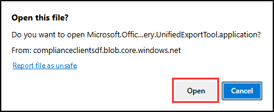

---
lab:
    title: 'Exercise 2 - Case investigation with eDiscovery (Standard) and content search'
    module: 'Module 4 - Monitor and investigate data and activities by using Microsoft Purview'
---

# Lab 4 - Exercise 2 - Investigate a case with eDiscovery (Standard) and content search

You are Joni Sherman, the Compliance Administrator for Contoso Ltd. The company is currently involved in a wrongful termination lawsuit filed by a former employee. As the Compliance Administrator, it's your responsibility to ensure that all relevant electronic data is preserved and made accessible to meet legal obligations. In this exercise, you'll use eDiscovery (Standard) and content search to manage the case effectively, ensuring that Contoso Ltd. can provide the necessary electronic evidence for the lawsuit.

**Tasks**:

1. Assign permissions for eDiscovery
1. Create an eDiscovery (Standard) case
1. Create an eDiscovery (Standard) hold
1. Perform search & purge on mailboxes
1. Create an eDiscovery (Standard) search
1. Export search results and reports
1. Close the eDiscovery (Standard) case

## Task 1 – Assign permissions for eDiscovery

In this task, you will assign the necessary eDiscovery permissions to your account, Joni Sherman. These permissions will enable you to manage and export eDiscovery data as required for the wrongful termination case.

1. Log into Client 1 VM (LON-CL1) as the **lon-cl1\admin** account.

1. In **Microsoft Edge**, navigate to **`https://purview.microsoft.com`** and log into the Microsoft Purview portal as **MOD Administrator** `admin@WWLxZZZZZZ.onmicrosoft.com` (where ZZZZZZ is your unique tenant ID provided by your lab hosting provider). Admin's password should be provided by your lab hosting provider.

1. In the left sidebar, select **Settings**.

1. On the **Settings** page, expand **Roles and Scopes** then select **Role groups**.

1. On the **Role groups for Microsoft Purview solutions** page, search for `eDiscovery`, then select **eDiscovery Manager**.

1. On the **eDiscovery Manager** flyout panel, select **Edit**.

1. On the **Manage eDiscovery Manager** page, select **Choose users**.

1. On the **Choose users** flyout page, search for `Joni`, then select the checkbox for **Joni Sherman**. Select the **Select** button at the bottom of the panel.

1. Back on the **Manage eDiscovery Manager** page, select **Next**.

1. On the **Manage eDiscovery Administrator** page, select **Next**.

1. On the **Review the role group and finish** page select **Save**.

1. On the **You successfully updated the role group**, select **Done**.

1. Sign out of the MOD Administrator account by selecting the **MA** icon on the top right of the window, then select **Sign out**.

You have successfully assigned the necessary eDiscovery permissions to Joni's account.

## Task 2 – Create an eDiscovery (Standard) case

Next, you'll create an eDiscovery (Standard) case for the wrongful termination lawsuit. This case will serve as the central repository for all activities and data related to the lawsuit.

1. Log into the Client 1 VM (LON-CL1) as the **lon-cl1\admin** account.

1. In **Microsoft Edge**, navigate to **`https://purview.microsoft.com`** and log into the Microsoft Purview portal as **Joni Sherman** `JoniS@WWLxZZZZZZ.onmicrosoft.com` (where ZZZZZZ is your unique tenant ID provided by your lab hosting provider).

1. Select **Solutions** from the left sidebar, then select eDiscovery.

1. On the **eDiscovery** page, select **Standard Cases** from the left sidebar.

1. On the **eDiscovery (Standard)** page select **+ Create a case**.

1. From the **New case** flyout panel, enter:

   - **Name**: `Wrongful Termination Case`
   - **Description**: `Wrongful termination lawsuit filed against Contoso Ltd. by a former employee.`

1. Select **Save**.

1. Back on the **eDiscovery (Standard)** page, select the newly created **Wrongful Termination Case**.

1. On the page for the Wrongful Termination Case select the **Settings** tab. Under **Access & permissions** select the **Select** button.

1. On the **Access & permissions** flyout panel, under **Users** select **+ Add**.

1. On the **Add members** flyout panel search for `Diego`, then select the checkbox for **Diego Siciliani**.  Select **Add** at the bottom of the panel to grant Diego access to the eDiscovery case.

1. Back on the **Access & permissions** page, select **Close** to go back to the case settings page.

You have now successfully created an eDiscovery (Standard) case titled "Wrongful Termination Case" and added Diego Siciliani as a member to manage access and permissions.

## Task 3 - Create an eDiscovery (Standard) hold

In Task 2 you will create an eDiscovery (Standard) hold as part of the "Wrongful Termination Case" previously created. This hold preserves all relevant electronic data related to the Contoso Ltd. wrongful termination lawsuit.

1. You should still be logged into Microsoft Purview with Joni's account, and still be on the **Settings** page of the Wrongful Termination Case in eDiscovery (Standard). If not, navigate to `https://purview.microsoft.com`, and login as Joni Sherman. Select **Solutions** > **eDiscovery** > **Standard Cases** > **Wrongful Termination Case**.

1. Select the **Hold** tab from the top navigation bar.

1. On the **Hold** page of the Wrongful Termination Case, select **+ Create**.

1. In the **New Hold** configuration on the **Name your hold** page, enter:

   - **Name**: `Wrongful Termination Hold`
   - **Description**:  `Legal hold to preserve all relevant electronic data related to the Wrongful Termination Case.`

1. On the **Choose locations** page, select the **Exchange mailboxes** location.

1. To the right of **Exchange mailboxes**, under **Included** select **Choose users, groups, or teams**.

1. On the **Exchange mailboxes** flyout panel on the right, in the **Search** field, search for `Lidia`, then select the checkbox for **Lidia Holloway**. Select **Done** at the bottom of the panel.

1. Back on the **Choose locations** page, select **Next**.

1. On the **Query** page, ensure the toggle is set for **Use new query builder**.

1. Under **Filters**, and under the **AND** operator, select **Select a filter**, then select **Date**.

1. A new **Select an operator** field appears to apply an operator to the **Date** filter. Use the **Between** operator and leave the default date range selected.

1. Select **Next**.

1. On the **Review your settings** page select **Submit**.

1. Once you've successfully created your legal hold, select **Done** on the page with the **Succeeded** message.

You have successfully created the **Wrongful Termination Case** and added Diego Siciliani as a member to manage access and permissions. This case is now ready for further eDiscovery actions.

## Task 4 – Perform search & purge on mailboxes

Before conducting a detailed search for case-related data, it's important to remove any phishing emails that could contaminate the dataset. In this task, you'll perform a search and purge operation to eliminate these unwanted emails from all mailboxes.

1. You should still be logged into Microsoft Purview with Joni's account, and still be in **eDiscovery** within Microsoft Purview. If not, navigate to `https://purview.microsoft.com`, and login as Joni Sherman. Select **Solutions** > **eDiscovery**.

1. From the left sidebar, expand **Content Searches**, then select **Search**.

1. 1. On the **Content search** page, select **+ New search**.

1. In the **New search** configuration, on the **Name and description** page, enter `Phishing mail removal` as the search name, then select **Next**.

1. On the **Locations** page, select the **Exchange mailboxes** location, then select **Next**.

1. In the **Define your search conditions** page in the **Keywords** box, enter `From:phishingmail@outlook.com AND subject:"Password changed"`, then select **Next**.

1. In the **Review your search and create it** window select **Submit**.

1. Once your search has successfully been created, select **Done** on the **New search created** page.

1. Once the search has been created, you need to use the **Security & Compliance PowerShell** to start a purge. In the start menu, right click the Windows button, then select **Terminal (Admin)**.

1. Run the **Connect-IPPSSession** cmdlet to connect to the **Security & Compliance PowerShell**:

    ```powershell
    Connect-IPPSSession
    ```

1. When prompted to sign in, sign in as **MOD Administrator** `admin@WWLxZZZZZZ.onmicrosoft.com` (where ZZZZZZ is your unique tenant ID provided by your lab hosting provider).

1. Run the **New-ComplianceSearchAction** cmdlet to remove results found by the **Phishing mail removal** search.

    ```powershell
    New-ComplianceSearchAction -SearchName "Phishing mail removal" -Purge -PurgeType HardDelete
    ```

1. Enter **Y** in the terminal window for Yes then press **Enter** to confirm the action.

1. Close the terminal window.

You have successfully purged phishing emails from the mailboxes. This ensures that the subsequent searches will focus only on relevant and legitimate data.

## Task 5 - Create an eDiscovery (Standard) search

With the mailboxes cleaned, you'll now create an eDiscovery (Standard) search to identify and collect all electronic data relevant to the wrongful termination lawsuit. This search will help gather the necessary evidence for the case.

1. You should still be logged into Microsoft Purview with Joni's account. Navigate to `https://purview.microsoft.com`, and login as Joni Sherman.

1. Select **Solutions**, then select **eDiscovery**.

1. On the left sidebar, select **eDiscovery (Standard)**, then select the **Wrongful Termination Case** that was created in a previous task.

1. Within the Wrongful Termination Case, select the **Searches** tab from the top navigation bar.

1. On the **Searches** page of the Wrongful Termination Case page, select **+ New search**.

1. In the **New search** configuration, on the **Name and description** page, enter:

   - **Name**: `Wrongful Termination Search`
   - **Description**: `Search to identify and collect all relevant electronic data related to the Wrongful Termination Case.`

1. On the **Locations** page, select **On** for **Exchange mailboxes**, **SharePoint sites**, and **Exchange public folders** then select **Next**.

1. On the **Define your search conditions** page select the radio button for **KQL editor**.

1. In the KQL editor box, enter:

    ```text
    To:Lidia OR From:Lidia OR Cc:Lidia OR Bcc:Lidia
    ```

1. Select **Next**.

1. On the **Review your search and create it** page select **Submit**.

1. Once you've successfully created your search, select **Done** on the **New search created** page.

You have successfully created the **Wrongful Termination Search** using the KQL editor. This search will help in identifying and collecting all relevant electronic data related to the case.

## Task 6 - Export search results and reports

In this task, you'll export the search results and generate detailed reports. These exports and reports will be crucial for reviewing and analyzing the collected data to support the wrongful termination case.

1. You should still be logged into Microsoft Purview with Joni's account, and still be on the **Searches** page of the Wrongful Termination Case in eDiscovery (Standard). If not, navigate to `https://purview.microsoft.com`, and login as Joni Sherman. Select ***Solutions** > **eDiscovery** > **Standard Cases** > **Wrongful Termination Case**.

1. On the **Searches** page, select the field (not the checkbox) for the **Wrongful Termination Search**.

1. In the **Wrongful Termination Search** flyout panel on the right, select the **Actions** dropdown on the bottom of the panel then select **Export results**.

1. On the **Export results** page under **Output options** select **All items, excluding ones that have unrecognized format, are encrypted, or weren't indexed for other reasons**.

1. Under **Export Exchange content as** select **One PST file for each mailbox**.

1. Scroll down and select the checkboxes for **Enable de-duplication for Exchange content** and **Include versions for SharePoint files**.

1. Review the estimation report at the bottom of the panel to get an idea of what types of items, the number of items, and the size of the items to be exported, then select **Export**.

1. A **Microsoft Purview** pop up will appear letting you know **A job has been created**. Select **OK**.

1. Back on the **Searches** page select the **Exports** tab from the top navigation bar. Select the job named **Wrongful Termination Search_Export**

    >**Note**: If the status of the export is marked **Scheduling...** select **Refresh** until the **Export key** is available. This might take a few minutes.

1. Once the export key is available, on the **Wrongful Termination Search_Export** flyout panel under **Export key** select to **Copy to clipboard** to copy the export key.

1. At the top of the **Wrongful Termination Search_Export** panel select **Download results** to download the results.

1. In Microsoft Edge, you'll be prompted to open a file. This is the eDiscovery Export Tool. Select **Open** when prompted.

   

1. In the **Application Install** window, select **Install** to install the  **Microsoft Office 365 eDiscovery Export Tool**, select **Install**.

1. In the eDiscovery Export Tool, in the **Paste the export key that will be used to connect to the source:** field, paste in the **Export key** that was copied in a previous step.

1. Select **Browse** under **Select the location that will be used to store the downloaded files:**

1. In the **Browse For Folder** window select **Documents** then select **OK**.

1. Back in the **eDiscovery Export Tool** select **Start** to export the files.

1. Once you get a green check mark for **Processing has completed.** Your results have been downloaded. Select **Close** to close the window.

1. In the **eDiscovery Export Tool**, select the link for the **Export Location:** to open the locally exported files.

1. Explore the contents of the export:

    **Included in the export:**
    - **Export Summary:** An Excel document that contains a summary of the export, including the number of content sources searched, the estimated and downloaded sizes of the search results, and the estimated and downloaded number of items exported.
    - **Manifest:** A manifest file (in XML format) that contains information about each item included in the search results.
    - **Results:** An Excel document providing details about each indexed item in the search results. For emails, it includes message location, date, subject, sender, and recipients. For SharePoint and OneDrive for Business documents, it includes document URL, site collection URL, modification date, and document name.
    - **Skipped Items:** An Excel document that contains information about items that won't be downloaded, such as a folder or a document set.
    - **Trace.log:** Contains detailed logging information about the export process and can help uncover issues during export.
    - All search results and the export reports are included in a folder that has the same name as the Content search. The email messages that were exported are located in a folder named **Exchange**. Documents are located in a folder named **SharePoint**.

    You have successfully exported the search results for the **Wrongful Termination Search**.

1. After exploring the export, close the folder window, and navigate back to the Microsoft Purview browser window in Microsoft Edge, and select **Close** in the **Wrongful Termination Search_Export** panel.

1. Back on the **Exports** page, select the **Searches** tab.

1. On the **Searches** page, select the field (not the checkbox) for the **Wrongful Termination Search**.

1. In the **Wrongful Termination Search** flyout panel on the right, select the **Actions** dropdown on the bottom of the panel then select **Export report**.

1. On the **Export report** page under **Output options** select **All items, excluding ones that have unrecognized format, are encrypted, or weren't indexed for other reasons**.

1. Select the checkbox to **Enable de-duplication for Exchange content**, then select **Generate report**.

1. A **Microsoft Purview** pop up will appear letting you know **A job has been created**. Select **OK**.

1. Back on the **Searches** page select the **Exports** tab from the top navigation bar. You should have a report named **Wrongful Termination Search_ReportsOnly**.

    >**Note**: If the status of the export is marked **Scheduling...** select **Refresh** until the **Export key** is available. This might take a few minutes.

1. Once the export key is available, on the **Wrongful Termination Search_ReportsOnly** flyout panel under **Export key** select to **Copy to clipboard** to copy the export key.

1. At the top of the **Wrongful Termination Search_ReportsOnly** page select **Download report** to download the report.

1. When prompted, select **Open** to open the eDiscovery Export Tool.

1. In the eDiscovery Export Tool, in the **Paste the export key that will be used to connect to the source:** field, paste in the **Export key** that was copied in a previous step.

1. Select **Browse** under **Select the location that will be used to store the downloaded files:**

1. In the **Browse For Folder** window select **Documents** then select **OK**.

1. Back in the **eDiscovery Export Tool** select **Start** to download the report.

1. Once you get a green check mark for **Processing has completed.**, your report has been downloaded. Select **Close** to close the window.

1. In the **eDiscovery Export Tool**, select the link for the **Export Location:** to open the locally downloaded report.

1. Explore the contents of the report:

    **Included in the report:**
    - **Export Summary:** An Excel document that contains a summary of the export, including the number of content sources searched, the estimated and downloaded sizes of the search results, and the estimated and downloaded number of items exported.
    - **Manifest:** A manifest file (in XML format) that contains information about each item included in the search results.
    - **Results:** An Excel document providing details about each indexed item in the search results. For emails, it includes message location, date, subject, sender, and recipients. For SharePoint and OneDrive for Business documents, it includes document URL, site collection URL, modification date, and document name.
    - **Trace.log:** Contains detailed logging information about the export process and can help uncover issues during export.

1. Once you're finished reviewing the exported results, close the eDiscovery Export Tool and the file explorer windows then navigate back to Microsoft Edge.

You have successfully exported the search results and generated the necessary reports for the **Wrongful Termination Search**. These documents include export summaries, manifests, detailed item results, and trace logs. Review and analyze these findings to uncover insights relevant to the case.

## Task 7 - Close the eDiscovery (Standard) case

In this final task, you'll close the eDiscovery case for the wrongful termination lawsuit. This step shows that all necessary data collection and review tasks are complete.

1. You should still be logged into Microsoft Purview with Joni's account, and still be on the **Exports** page of the Wrongful Termination Case in eDiscovery (Standard). If not, navigate to `https://purview.microsoft.com`, and login as Joni Sherman. Select ***Solutions** > **eDiscovery** > **Standard Cases** > **Wrongful Termination Case**.

1. Select the **Home** tab, then select **x Close case**.

1. Review the **Warning** dialogue notifying that closing the case release all hold which might result in data loss.

1. Select the **Yes** button on the warning message.

You have successfully closed the **Wrongful Termination Case**, with the option to reopen the case. This means all eDiscovery tasks are done, and the case is ready for any next steps. Your work ensures Contoso Ltd. is prepared for the lawsuit.
