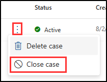

---
lab:
    title: 'Exercise 3 - Case investigation with eDiscovery (Premium)'
    module: 'Module 4 - Monitor and investigate data and activities by using Microsoft Purview'
---

# Lab 4 - Exercise 3 - Investigate a case with eDiscovery (Standard) and content search

You are Joni Sherman, the Compliance Administrator for Contoso Ltd. The company is currently involved in a legal investigation concerning potential intellectual property theft. As the Compliance Administrator, your responsibility is to ensure that all relevant electronic data is preserved and accessible to meet legal and internal review obligations. In this exercise, you'll use eDiscovery (Premium) to manage the case effectively, ensuring that Contoso Ltd. can provide the necessary electronic evidence for the investigation.

1. Create an eDiscovery (Premium) case
1. Add custodians to the case
1. Create and run a collection estimate
1. Commit the collection to a review set
1. Explore the review set
1. Export the search results
1. Close the eDiscovery (Premium) case

## Task 1 – Create an eDiscovery (Premium) case

First, you'll create an eDiscovery (Premium) case to begin your investigation. This case will be the central repository for all activities and data related to the intellectual property theft investigation.

1. Log into the Client 1 VM (SC-400-CL1) as the **SC-400-cl1\admin** account.

1. In **Microsoft Edge**, navigate to **`https://purview.microsoft.com`** and log into the Microsoft Purview portal as **Joni Sherman** `JoniS@WWLxZZZZZZ.onmicrosoft.com` (where ZZZZZZ is your unique tenant ID provided by your lab hosting provider).

1. On the left sidebar, select **Solutions** then select **eDiscovery**.

1. On the **eDiscovery** page, on the left sidebar, expand **Premium cases** then select **Cases**.

1. On the **eDiscovery (Premium)** page, select **+ Create a case**.

1. On the **Name your case** flyout panel on the right, enter:

   - **Name**: `Contoso IP Theft Investigation`
   - **Description**: `Case for the 2024 investigation into potential intellectual property theft involving relevant emails and documents.`
   - **Docket Number**: `2024-IP-INV-001`

1. Select **Next**.

1. On the **Add team members and configure settings** page, in the **Users** field search for `Joni`, then select **Joni Sherman**. Search for `Megan` and add **Megan Bowen** as a user to conduct the investigation with Joni.

1. Leave the other defaults, then select **Next**.

1. On the **Review your case** page, select **Submit**.

1. Once your case has been created, select **Done** on the **Your new case is ready** page.

You have successfully created a new eDiscovery case.

## Task 2 – Add custodians to the case

Now that your case is created, you need to add custodians. Custodians are individuals who might possess relevant information for the investigation.

1. You should still be logged into Microsoft Purview with Joni's account. You should be on the **Overview** page of the **Contoso IP Theft Investigation** case in eDiscovery (Premium).

   If not, navigate to `https://purview.microsoft.com`, and login as Joni Sherman. Select **Solutions** > **eDiscovery** > **Premium Cases** > **Contoso IP Theft Investigation**.

1. Select the **Data sources** tab from the top navigation bar, then select the dropdown for **Add data source** > **Add new custodians**.

1. On the **New custodian** flyout panel, under **Select custodian**, enter `Patti`, then select **Patti Fernandez**. In the field to add custodians, enter `Pradeep` then select **Pradeep Gupta** to add another custodian.

1. Select **Next**.

1. On the **Hold settings** page, ensure Patti and Pradeep are selected for a legal hold, then select **Next**.

1. On the **Review your custodians** page, select **Submit**.

1. Once your custodians have been selected, select **Done** on the **New custodians created** page.

1. Refresh the **Data sources** page until the **Source status**, **Indexing status**, and **Hold status** all indicate successful completions.

You have successfully added custodians to the **Contoso IP Theft Investigation** case.

## Task 3 – Create and run a collection estimate

With custodians added, you can now run a collection estimate to get an overview of the data volume and relevance.

1. You should still be logged into Microsoft Purview with Joni's account. You should be on the **Data sources** page of the **Contoso IP Theft Investigation** case in eDiscovery (Premium).  

   If not, navigate to `https://purview.microsoft.com`, and login as Joni Sherman. Select **Solutions** > **eDiscovery** > **Premium Cases** > **Contoso IP Theft Investigation**.

1. Select the **Collections** tab from the top navigation bar, then select **+ New collection**.

1. In the **New collection** configuration, on the **Name and description** page, enter:

   - **Name**: `IP Theft Data Collection`
   - **Description**: `Collecting emails and documents relevant to the 2024 investigation into potential intellectual property theft at Contoso Ltd.`

1. Select **Next**.

1. On the **Choose custodial data sources**, select **+ Select custodians**.

1. On the **Select custodians** flyout panel, select the checkboxes for **Pradeep Gupta** and **Patti Fernandez**, then select **Add** at the bottom of the panel.

1. Back on the **Choose custodial data sources** page, select **Next**.

1. On the **Choose non-custodial data sources**, select **Next**.

1. On the **Additional locations** set the status to **On** for these locations:

   - Exchange mailboxes
   - Exchange public folders

1. Select **Next**.

1. On the **Define your search query** page, select the option to use the **KQL editor**. In the KQL box, enter:

   `(Subject:"confidential" OR Subject:"intellectual property" OR ConversationBody:"confidential" OR ConversationBody:"intellectual property" OR ConversationBody:"trade secret" OR Subject:"trade secret") AND (From:"@contoso.com" OR To:"@contoso.com")`

1. Select **Next**.

1. On the **Review your collection and create it** page, select **Submit**.

1. Once your collection estimate has been created, select the, then select **Done** on the **New collection created** page.

1. Back on the **Collections** page, review the progress of your collection estimate. Use the **Refresh** button to refresh the page and check the status of the collection estimate. Once the status of your estimate updates to **Estimated**, and the **Preview status** updates to **Successful**, your collection estimate is complete.

    >**Tip**: Once your collection estimate is complete, feel free to experiment building different queries or using the KQL editor for more advanced searches. To do this, select the checkbox to the left of the collection estimate and select **Edit collection**. This will take you directly to the **Define your search query** page. You can modify your query and submit a new collection estimate to explore how your query changes your collection estimate.

1. Select the **IP Theft Data Collection** and explore the collection estimate.

   - **Summary tab**: Provides an overview of collection statistics, including items retrieved, locations with hits, and file types.
   - **Data sources tab**: Displays information about custodial and non-custodial data sources included in the collection.
   - **Search statistics tab**: Shows detailed statistics from the last collection estimate, including the number of items and data volume.
   - **Collection options tab**: Lists and explains the different options available when configuring a collection, such as including cloud attachments and conversation threads.

You have successfully created and reviewed the **IP Theft Data Collection** collection estimate.

## Task 4 – Commit the collection to a review set

Once the collection is satisfactory, commit it to a review set for detailed analysis.

1. You should still be on the **Collections** page of the **Contoso IP Theft Investigation** case.

   If not, navigate to `https://purview.microsoft.com`, and login as Joni Sherman. Select **Solutions** > **eDiscovery** > **Premium Cases** > **Contoso IP Theft Investigation** > **Collections**.

1. Select the **IP Theft Data Collection** collection.

1. On the **IP Theft Data Collection** flyout panel on the right, select **Commit collection**.

1. On the **Commit items to a review set** page, ensure the **Add to new review set** option is selected, and name it `Case2024 Data Breach Review`.

1. Leave the other defaults selected and select **Commit** to commit the collection to a review set.

You have successfully committed the collection to a review set.

## Task 5 – Explore the review set

After committing the collection to a review set, you'll now explore the review set to see what you can do with the collected items.

1. You should still be on the **Collections** page of the **Contoso IP Theft Investigation** case.

   If not, navigate to `https://purview.microsoft.com`, and login as Joni Sherman. Select **Solutions** > **eDiscovery** > **Premium Cases** > **Contoso IP Theft Investigation** > **Collections**.

1. Select the **Review sets** tab from the top navigation bar, then select the newly created **Case2024 Data Breach Review** review set.

1. On the **Case2024 Data Breach Review** flyout panel on the right, select **Open review set** at the bottom of the page.

1. Explore what you can do with items in your review set:

   - **Filters**: Allows you to apply conditions to narrow down the items displayed in the review set.
   - **Tag**: Enables you to label documents with specific tags for better organization and identification.
   - **Group**: Lets you organize review set content by related items such as families or conversations.
   - **View Source**: Provides a rich view of the selected document, displaying it in its original format.
   - **View Plain text**: Shows the extracted text of a document, ignoring embedded images and formatting.
   - **Annotate**: Allows users to apply markups, redactions, and other annotations on the document.
   - **View Metadata**: Displays various metadata associated with the selected document for detailed insights.

1. Once you've explored your review set, you can export items for further analysis.

You have successfully opened and reviewed your review set.

## Task 6 – Export the search results

To save your work and enable further analysis, you will export the search results.

1. You should still be in the **Case2024 Data Breach Review** review set in eDiscovery (Premium).

   If not, navigate to `https://purview.microsoft.com`, and login as Joni Sherman. Select **Solutions** > **eDiscovery** > **Premium Cases** > **Contoso IP Theft Investigation** > **Review sets** > **Case2024 Data Breach Review** > **Open review set**.

1. Select the dropdown for **Actions** (), then select **Export**.

1. On the **Export options** flyout panel on the right, enter:

   - **Export name**: `Case2024_DataBreach_Export`
   - **Description**: `Export of collected emails and documents for the 2024 data breach investigation case.`
   - **Export these documents**: All documents in the review set
   - **Output options**: Condensed directory structure

1. Select the **Export** button at the bottom of the flyout page.

1. You should get a notification stating **A job has been created** to export your review set. Select **OK** on this notification.

1. To check the job status, expand **Premium Cases** from the left sidebar, then select **Cases**. Select the **Contoso IP Theft Investigation** case then the **Jobs** tab from the top navigation.

   Here you'll see a list of all jobs run for the **Contoso IP Theft Investigation** case.

1. When the status for job **Prepare for export** updates to **Successful** your export is complete.

1. To access your exported review set, select the **Exports** tab from the top navigation.

1. Select the **Case2024_DataBreach_Export** export.

1. On the **Case2024_DataBreach_Export** flyout panel on the right, select the checkbox next to the left of each exported file and select **Download**. This will download a .csv summary and a zip file of exported items.

    >**Tip**: You might need to disable your pop-up blocker to successfully download exported files.

You have successfully exported the search results for review.

## Task 7 – Close the eDiscovery (Premium) case

In this final task, you'll close the eDiscovery case for the intellectual property theft investigation. This step shows that all necessary data collection and review tasks are complete.

1. You should still be logged in as Joni Sherman in eDiscovery in Microsoft Purview.

1. From the left sidebar, select **Premium Cases** then select **Cases**.

1. On the field of the **Contoso IP Theft Investigation** select the vertical ellipses, then select **Close case**.

   

1. Review the **Warning** dialogue notifying that closing the case release all hold which might result in data loss.

1. Select the **Yes** button on the warning message.

1. The status of the case updates to **Closing** until it's **Closed**.

1. In **Microsoft Edge**, the Microsoft Purview portal tab should still be open. Sign out of Joni's account by selecting the profile picture of Joni Sherman in the top right. Select **Sign out**, then close the browser window.

You have successfully closed the **Contoso IP Theft Investigation** case, indicating that all eDiscovery tasks are done, and the case is ready for any next steps.
